# 04 — Arquitetura Geral (Documento 100% Completo)

> Status: **Rascunho para validação.** Base técnica definitiva do projeto — escrita depois de Grow (doc 02), Med (doc 03) e da Auditoria Independente estarem concluídos, incorporando todas as correções aprovadas. Não define stack tecnológica (doc 13) nem código — define a forma da plataforma. Duas decisões estruturais já foram validadas com você antes deste documento: **(1)** banco único com **schema por módulo**, **(2)** cliente **online-first** no MVP (offline-first registrado como Versão 2 em [Ideias Futuras](ideias-futuras.md)).

---

## 1. Objetivos

- Traduzir tudo que foi especificado em Grow (doc 02) e Med (doc 03) em uma arquitetura técnica coerente, sem redesenhar o produto.
- Projetar uma plataforma capaz de crescer por **10 anos**: milhões de usuários, múltiplos países, novos aplicativos além de Grow/Med, múltiplas equipes de desenvolvimento trabalhando em paralelo sem pisar umas nas outras.
- Adotar **Modular Monolith** com **Clean Architecture**, **DDD** e **SOLID** — modularidade real de dia 1, com a porta aberta (não a obrigação) de extrair um módulo para microsserviço no futuro, se e quando a escala ou a organização de times exigir.
- Corrigir, na arquitetura, todos os problemas estruturais identificados na Auditoria Independente (ver seção 25).
- Tratar LGPD/consentimento, privacidade e exclusão/portabilidade de dados como **requisitos arquiteturais de primeira classe**, não como camada adicionada depois.

---

## 2. Problemas que Resolve

| Problema | Como esta arquitetura resolve |
|---|---|
| Docs 02/03 especificaram Comunidade e Motor de Privacidade "dentro" do Grow, criando dependência artificial do Med sobre o Grow | Comunidade e Motor de Privacidade passam a ser **capacidades do Core**, consumidas por Grow e Med igualmente (seção 12–13) |
| Nenhuma modelagem de consentimento/LGPD existia até a auditoria | Módulo de Consentimento & Conformidade, com fluxos arquiteturais de exclusão e portabilidade (seção 21) |
| Risco de reidentificação em insights agregados | Regra de tamanho mínimo de coorte embutida no Motor de Correlação (seção 14) |
| Modelo de Colheita rígido (1 ciclo → 1 colheita) não suporta colheita escalonada | Cardinalidade corrigida nesta arquitetura (seção 25) |
| Risco de acoplamento entre módulos ao longo dos anos (o clássico "monolito espaguete") | Regras de dependência explícitas + Clean Architecture por módulo + comunicação só via interface pública (seções 8–9) |
| Necessidade de evoluir Grow e Med em velocidades diferentes, com times diferentes, sem um travar o outro | Modularidade real (schema por módulo, contratos entre módulos, eventos de domínio) permite isso desde o dia 1 |

---

## 3. Escopo

**Incluído**: arquitetura lógica da plataforma inteira (Core, Grow, Med, Comunidade, IA, Notificações, Premium/Billing), princípios arquiteturais, modelo de comunicação entre módulos, autenticação/autorização, privacidade, segurança/LGPD, armazenamento (conceitual), escalabilidade, internacionalização, observabilidade.

**Fora de escopo deste documento**: stack tecnológica específica (linguagens, frameworks, provedores de nuvem — doc 13), schema físico de banco de dados (doc 08), contratos de API detalhados campo a campo (doc 09), estrutura de pastas/repositórios (doc 14), código.

---

## 4. Princípios Arquiteturais

| Princípio | Como se aplica na COSMARIA |
|---|---|
| **Clean Architecture (Ports & Adapters)** | Cada módulo é dividido em 4 camadas: Apresentação (API do módulo) → Aplicação (casos de uso) → Domínio (entidades, regras, eventos) → Infraestrutura (repositórios, adaptadores externos). Dependências sempre apontam para dentro — Domínio não conhece Infraestrutura nem Apresentação. |
| **Domain-Driven Design (DDD)** | Cada módulo (Grow, Med, Comunidade, IA, Billing) é um **Bounded Context** com sua própria linguagem ubíqua (já em português nos docs 02/03). Comunicação entre contexts é sempre via contratos explícitos (interfaces públicas ou eventos), nunca acesso direto a entidades internas de outro context. |
| **SOLID** | **SRP**: Aplicação orquestra, Domínio decide regra de negócio, Infraestrutura persiste — cada camada uma responsabilidade. **OCP**: novos tipos de conteúdo publicável na Comunidade se registram implementando um contrato, sem alterar o código da Comunidade. **LSP**: qualquer implementação de repositório é substituível sem quebrar o caso de uso. **ISP**: interfaces públicas entre módulos são estreitas e específicas (ex.: `ObterResumoDoLote`, não um `ObterTudoSobreLote` genérico). **DIP**: Aplicação depende de abstrações definidas no Domínio; Infraestrutura implementa essas abstrações. |
| **Cloud/Provider Agnostic (reforçado no doc 13)** | Toda integração externa de infraestrutura (nuvem, LLM, pagamento, storage, observabilidade) fica atrás de uma porta (interface) definida pelo Domínio/Aplicação — o adaptador concreto (ex.: GCP, Anthropic Claude) vive só na Infraestrutura. Trocar de provedor é sempre uma mudança de Infraestrutura, nunca de Domínio. |
| **Event-Driven Architecture (onde faz sentido)** | Efeitos colaterais entre módulos (recalcular insight, notificar, atualizar feed da comunidade) acontecem via **eventos de domínio** publicados num barramento in-process — nunca por um módulo chamando o "de dentro" do outro. Comandos que exigem resposta imediata (ex.: checar consentimento) continuam síncronos. Ver seção 9. |
| **Modular Monolith preparado para extração futura** | Um único artefato implantável hoje (simplicidade operacional), mas cada módulo já se comporta como se fosse remoto: schema próprio, comunicação só via contrato/evento, sem transação de banco cruzando módulos. Extrair um módulo para microsserviço no futuro é uma mudança de infraestrutura, não uma reescrita de regra de negócio. |

---

## 5. Decisão Estrutural: Modular Monolith

| Alternativa | Vantagens | Desvantagens |
|---|---|---|
| **Microsserviços desde o dia 1** | Escalabilidade independente por serviço; times totalmente autônomos | Complexidade operacional (deploy, observabilidade, transações distribuídas) desproporcional ao estágio atual do produto (MVP, um time); typical over-engineering antes de saber onde a carga real vai concentrar |
| **Monolito tradicional (não-modular)** | Mais simples e rápido de começar | Sem fronteiras internas, qualquer módulo pode acoplar-se a outro livremente; é exatamente o padrão que gerou os problemas apontados pela auditoria (Comunidade "dentro" do Grow) |
| **Modular Monolith (recomendado, já direcionado por você)** | Simplicidade operacional de um monolito (um deploy, um banco, transações locais fáceis) **com** disciplina de fronteiras de microsserviço (contratos, eventos, schema isolado) — o melhor dos dois mundos para o estágio atual | Exige disciplina de engenharia para não "vazar" as fronteiras (mitigado por testes de arquitetura — ver seção 26) |

**Decisão**: Modular Monolith, com métricas por módulo (seção 20) usadas para decidir, no futuro, **se e qual** módulo eventualmente vale a pena extrair (tipicamente o candidato mais óbvio a médio prazo é a IA, por ser o mais intensivo em CPU/custo de provedores externos — mas essa decisão só deve ser tomada com dados reais de uso, não antecipada agora).

---

## 6. Arquitetura Geral (Diagrama)

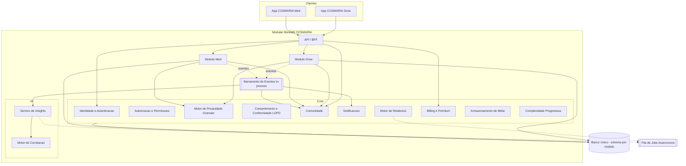

---

## 7. Divisão de Módulos e Responsabilidades

### 7.1 Core (plataforma compartilhada)

| Submódulo | Responsabilidade |
|---|---|
| Identidade e Autenticação | Conta única, login, tokens, sessões, biometria/2FA |
| Perfil Público por Contexto de Aplicativo | **(decidido no doc 06)** Uma Conta possui N Perfis Públicos independentes — um por contexto de app (Grow, Med, e futuros) — cada um com nome de exibição, avatar, biografia, estatísticas e reputação próprios. Vínculo entre perfis do mesmo usuário nunca é exposto publicamente, salvo opt-in explícito |
| Autorização e Permissões | RBAC + políticas de acesso (seção 11) |
| Motor de Privacidade Granular | Avaliação de visibilidade dimensão × escopo (seção 12) — **movido do Grow para o Core por decisão da auditoria** |
| Consentimento e Conformidade LGPD | Registro de consentimento, exclusão de conta, portabilidade (seção 21) — **novo módulo, exigido pela auditoria** |
| Comunidade | Grafo social, publicação, feed, busca, moderação (seção 13) — **já era Core no doc 00; esta arquitetura formaliza isso** |
| Motor de Relatórios | Renderização/exportação de documentos (PDF etc.) reutilizável por Grow e Med (unificação recomendada pela auditoria) — recebe o **conteúdo já compilado** (do Grow, do Med, ou do Motor de Relatórios da IA, doc 05) e só cuida do documento final, não da análise |
| Complexidade Progressiva | Preferência única de nível (essencial/avançado/especialista) por usuário — **entidade única, não duplicada por app** |
| Billing e Premium | Assinaturas, planos, gates de funcionalidade |
| Notificações | Despacho multi-canal orientado a eventos (seção 15) |
| Armazenamento de Mídia | Upload, versionamento e recuperação de fotos/anexos, usado por Grow e Med |

### 7.2 Módulo Grow
Genética, Ambiente (+ Módulo Outdoor plugável), Planta, Ciclo de Cultivo, Registro Ambiental, Manejo, Sanidade, Tarefas, Colheita/Secagem/Cura/Lote, Estatísticas — conforme doc 02. Consome Core (Privacidade, Comunidade, Complexidade, Relatórios, Billing) e IA (Motor de Correlação).

### 7.3 Módulo Med
Tratamento, Produto, Registro de Uso, Sessão Antes/Depois, Sintomas/Bem-estar, Efeitos, Evolução Clínica, Perfil de Dependente (se aprovado) — conforme doc 03. Consome os mesmos serviços de Core que o Grow, **pelos mesmos contratos** (não por dependência direta do módulo Grow).

### 7.4 Módulo IA
Motor de Correlação genérico (inspirado nas boas práticas do Bearable — ver seção 14) + Serviço de Insights que consome eventos de domínio de Grow e Med para gerar padrões, alertas, previsões e relatórios automáticos. **Detalhamento completo no doc 05**: a IA não é um serviço monolítico — é modelada como um conjunto de motores independentes (Correlação, Insights, Alertas, Recomendações, Explicabilidade, Relatórios analíticos, Aprendizado do Usuário), cada um com responsabilidade, entradas, saídas, dependências e eventos próprios.

---

## 8. Camadas por Módulo (Clean Architecture)

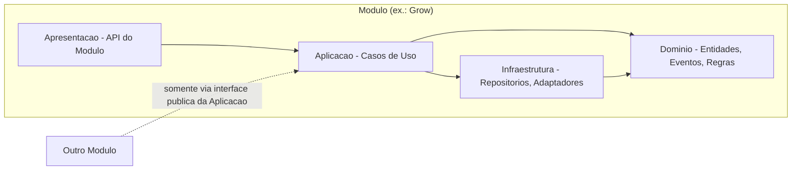

Regra inegociável: **nenhum módulo importa classes de Domínio ou Infraestrutura de outro módulo.** A única porta de entrada de um módulo para outro é a interface pública da sua camada de Aplicação (chamada direta) ou um evento de domínio publicado (reação assíncrona).

---

## 9. Comunicação entre Módulos

| Padrão | Quando usar | Exemplo |
|---|---|---|
| **Chamada síncrona via interface pública** | O chamador precisa de uma resposta imediata para continuar seu próprio caso de uso | Med chama `GrowFacade.ObterResumoDoLote(id)` ao exibir a Evolução Clínica |
| **Evento de domínio assíncrono** | Efeito colateral que não bloqueia a operação original | `ColheitaRegistrada` dispara recálculo de estatísticas na IA e possível notificação, sem atrasar a resposta ao usuário |

### 9.1 Correção arquitetural da auditoria — quem "dona" o conteúdo da Comunidade

A auditoria apontou que Comunidade "pertencia" ao Grow e era "emprestada" pelo Med — uma dependência de arquitetura incorreta. Três alternativas foram avaliadas:

| Opção | Descrição | Prós | Contras |
|---|---|---|---|
| A — Comunidade lê Grow/Med em tempo real | A cada exibição de feed, Comunidade chama Grow/Med para buscar o conteúdo compartilhável | Sempre atualizado | Cria dependência de runtime de Comunidade sobre Grow/Med (exatamente o problema que estamos corrigindo, só que invertido) e adiciona latência a cada leitura de feed |
| B — Comunidade guarda uma cópia integral ao publicar | Grow/Med enviam o conteúdo completo no momento da publicação | Leitura rápida, sem dependência de runtime | Sem mecanismo de atualização, a cópia fica desatualizada se o autor editar depois |
| **C — Projeção de leitura atualizada por eventos (recomendado)** | Grow/Med publicam um evento `ConteudoCompartilhadoAtualizado` (payload já filtrado pelo Motor de Privacidade) sempre que uma publicação ou sua configuração de privacidade muda; Comunidade mantém sua própria projeção de leitura, atualizada de forma assíncrona | Comunidade não depende de Grow/Med em tempo de leitura (só do contrato do evento); sempre eventualmente consistente; combina com o princípio de Event-Driven Architecture já adotado | Consistência eventual (pequeno atraso entre edição e atualização do feed) — aceitável para este tipo de conteúdo |

**Decisão**: Opção C. Formaliza Comunidade como **subdomínio genérico** (na linguagem de DDD) que não conhece as regras de negócio de Grow/Med, apenas um contrato de evento comum (`ConteudoCompartilhadoAtualizado`) que qualquer módulo futuro também pode publicar para ganhar presença na Comunidade "de graça".

---

## 10. Autenticação

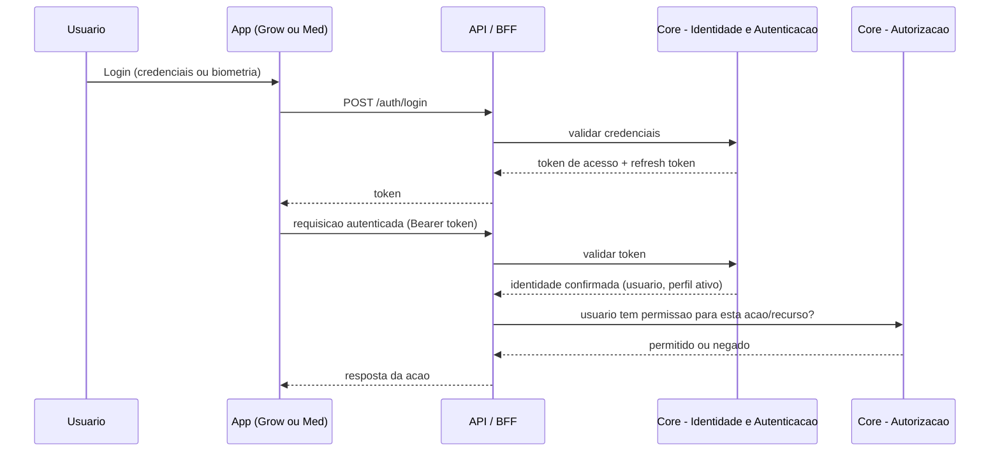

Conta única (doc 00) autentica em Grow e Med com o mesmo token — a troca de app não exige novo login. Autenticação reforçada (biometria/2FA) é obrigatória quando o **Modo Discreto** (doc 01) está ativo, corrigindo a ambiguidade apontada pela auditoria ("autenticação extra" vaga).

---

## 11. Autorização e Permissões

| Alternativa | Vantagens | Desvantagens |
|---|---|---|
| **RBAC puro** (papéis: Usuário, Dependente, Moderador, Admin, Suporte) | Simples de implementar e auditar | Não expressa regras finas como "só visível se a dimensão X estiver pública E o visualizador for seguidor" |
| **ABAC puro** (tudo por atributo/política) | Extremamente flexível | Complexo de depurar e explicar; risco de regras conflitantes difíceis de rastrear |
| **Híbrido (recomendado)** | RBAC para acesso grosso (o que um papel pode fazer em geral); política dedicada (o próprio Motor de Privacidade, seção 12) para decisões finas de visibilidade de conteúdo | Duas camadas para entender, mas cada uma simples isoladamente |

**Decisão**: Híbrido. RBAC resolve "este usuário pode acessar a funcionalidade X" (inclui gates de Premium — plano gratuito vs. assinante); o Motor de Privacidade resolve "este usuário pode ver este dado específico deste outro usuário". Cuidador/Dependente (proposta em aberto no doc 03) usaria um papel **Dependente** vinculado a um Usuário **Responsável**, com o Core validando que toda operação em nome de um dependente carrega a identidade de quem está autenticado — pré-requisito técnico caso essa funcionalidade seja aprovada.

---

## 12. Motor de Privacidade Granular (agora no Core)

Implementa exatamente o modelo de dimensão × escopo definido no doc 02 (§9.1) e reaproveitado no doc 03 (§9) — agora formalizado como serviço do Core, não mais "do Grow":

- **Entrada**: conteúdo a avaliar + dimensões configuradas pelo autor + identidade (ou ausência) do visualizador.
- **Saída**: uma visão filtrada do conteúdo, com as dimensões não autorizadas removidas antes mesmo de chegar à camada de apresentação.
- Grow e Med **registram seus próprios vocabulários de dimensão** (Grow: fotos, resultados, genética, localização, datas, equipamentos, parâmetros técnicos; Med: produto, dosagem, tratamento completo, sintomas, etc.) através de um contrato comum, em vez de o Core precisar conhecer os detalhes de cada app — resolve o gap identificado na auditoria (dimensões do Med nunca haviam sido de fato listadas).

---

## 13. Comunidade

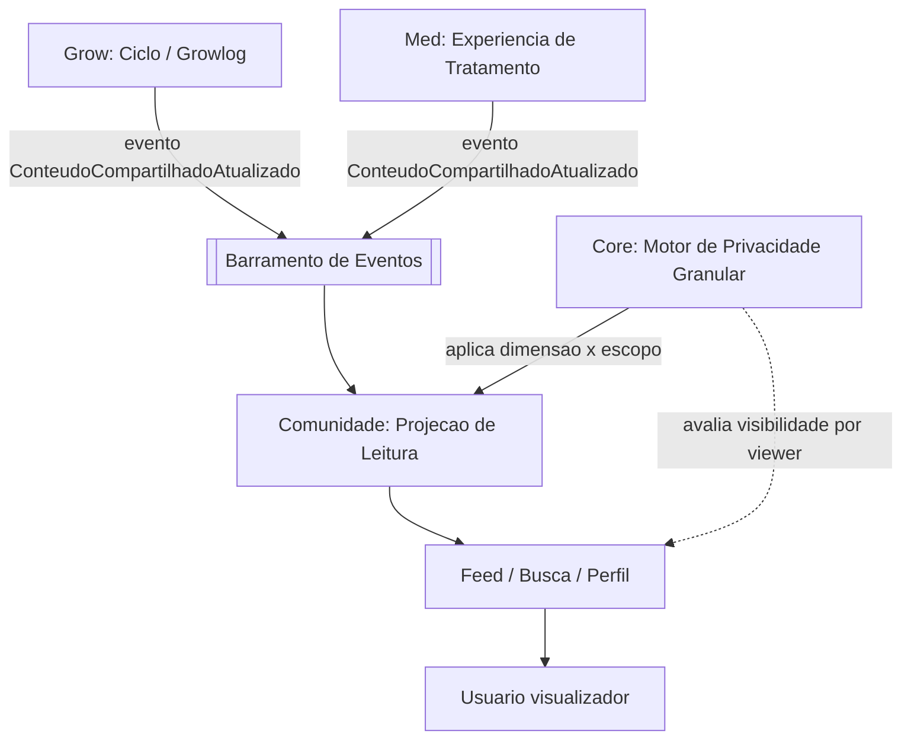

Comunidade é subdomínio genérico do Core (seção 9.1): grafo social (seguir/seguidor), publicação, feed, busca estruturada e moderação são serviços únicos consumidos por Grow (com "Fork") e Med (sem "Fork", conforme doc 03). Tipos de conteúdo publicável (Growlog, Experiência de Tratamento, e futuros) implementam o mesmo contrato de evento — nenhuma alteração na Comunidade é necessária para um novo módulo futuro passar a publicar nela (princípio Aberto/Fechado do SOLID).

---

## 14. Inteligência Artificial e Motor de Correlação

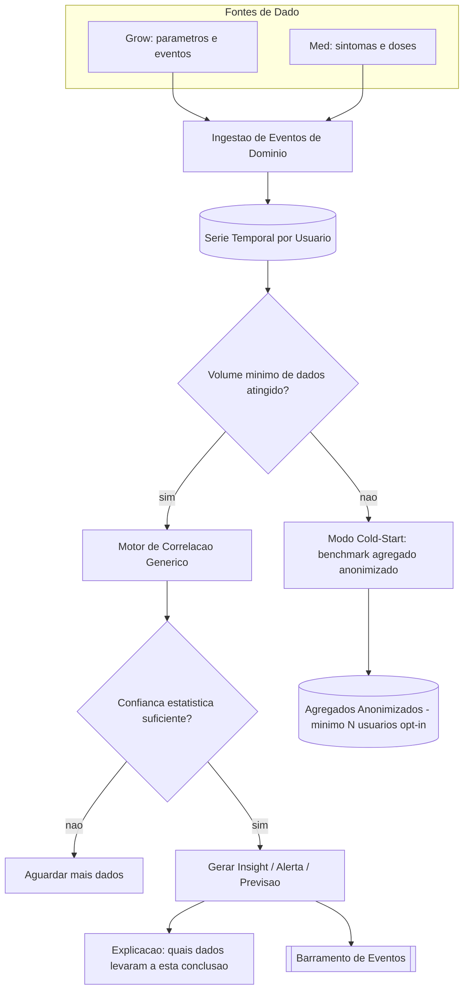

> **Nota de integração (doc 05)**: esta seção descreve a IA no nível de arquitetura da plataforma. O doc 05 detalha a IA como um conjunto de 7 motores independentes (Correlação, Insights, Alertas, Recomendações, Explicabilidade, Relatórios analíticos, Aprendizado do Usuário) — o "Motor de Correlação" e o "Serviço de Insights" abaixo continuam válidos como visão geral, mas o doc 05 é a referência detalhada.

### 14.1 Motor de Correlação genérico (boas práticas do Bearable incorporadas)

Em vez de Grow e Med implementarem cada um sua própria lógica estatística (redundância apontada pela auditoria), o Core expõe um **Motor de Correlação genérico**: dado qualquer par (fator, resultado) ao longo do tempo — seja "EC × rendimento" no Grow ou "dose de produto X × intensidade de dor" no Med — o motor calcula força de correlação, exige um **volume mínimo de dados antes de exibir qualquer correlação** (padrão observado no Bearable: dados insuficientes não geram conclusão) e **explicita o nível de confiança**, evitando a promessa de previsões precisas cedo demais.

### 14.2 Cold-start
Novo usuário sem histórico próprio recebe **benchmarks agregados anonimizados** (nunca dados individuais de terceiros) até acumular dado suficiente — resolve a lacuna identificada na auditoria.

### 14.3 Regra de anonimização mínima (correção obrigatória da auditoria)
Nenhum insight agregado é exibido com base em menos de **N usuários opt-in** no mesmo recorte. **Decidido no doc 05** (com pesquisa de boas práticas de k-anonimidade): N é uma `PoliticaDeAgregacao` configurável, não hardcoded — valores iniciais Grow = 30, Med = 50. Essa regra vive dentro do próprio Motor de Correlação, não pode ser contornada por nenhum módulo consumidor.

### 14.4 Síncrono vs. assíncrono
Consultas simples (correlação já computada e em cache) respondem de forma síncrona; cálculos pesados (previsão de rendimento, relatório automático, correlação Grow↔Med) rodam como **jobs assíncronos** via fila, notificando o usuário quando o insight estiver pronto — evita bloquear a experiência do app em cálculos custosos.

---

## 15. Notificações

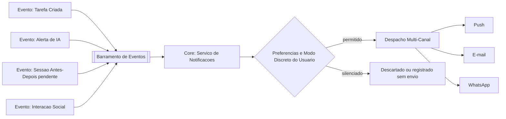

Serviço único do Core, alimentado por eventos de domínio de qualquer módulo — nenhum módulo dispara notificação diretamente, todos publicam eventos e o Core decide (com base em preferências, Modo Discreto e limites de spam) o que efetivamente é enviado, e por qual canal. Central de preferências por categoria e horário de silêncio (melhoria recomendada pela auditoria) vive aqui.

---

## 16. Armazenamento

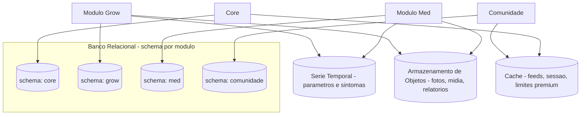

**Decisão validada com você**: banco único, **schema por módulo** — cada módulo só lê/escreve no próprio schema; acesso cruzado é sempre via interface pública do módulo dono (nunca `JOIN` entre schemas). Isso preserva a possibilidade real de extrair um módulo para um banco/serviço próprio no futuro, sem reescrever regra de negócio — só trocar a infraestrutura de acesso a dado.

Dados de série temporal (parâmetros ambientais do Grow, sintomas diários do Med) são tratados como uma categoria de armazenamento à parte (volume alto, padrão de escrita append-only), não como tabelas relacionais comuns — decisão técnica a refinar no doc 08, mas já sinalizada aqui para não ser esquecida.

---

## 17. Sincronização

**Decisão validada com você**: cliente **online-first** no MVP — toda escrita exige conexão ativa. Simplifica significativamente o cliente (sem fila local, sem resolução de conflito) e a primeira versão do backend.

**Risco assumido conscientemente** (ver seção 24): perda de registro em conectividade ruim (cultivo em ambiente sem sinal, paciente sem internet no momento do sintoma).

**Decisão validada com você (2026-07-08)**: mesmo em online-first, o cliente implementa um **rascunho local simples** — se o usuário estiver preenchendo um registro (check-in, dose, etc.) e o app fechar/travar acidentalmente, o texto já digitado não se perde. É proteção contra perda de dado durante a edição, **não** sincronização offline: o rascunho só existe localmente até o envio bem-sucedido (que ainda exige conexão); não há fila de sincronização nem resolução de conflito. Offline-first completo continua registrado como **Versão 2** em [Ideias Futuras](ideias-futuras.md).

---

## 18. Escalabilidade

- **Aplicação sem estado (stateless)**: qualquer instância do monolito pode atender qualquer requisição — autenticação via token, não sessão fixada em uma instância — permitindo rodar múltiplas réplicas atrás de um balanceador de carga mesmo sendo "um" artefato implantável.
- **Cache** para leituras frequentes (feed da Comunidade, limites de Premium, preferências de usuário).
- **Filas de jobs assíncronos** para trabalho pesado (IA, geração de relatório, despacho de notificação em massa) — evita que picos de uso degradem a experiência de escrita/leitura simples.
- **Réplicas de leitura** do banco para consultas analíticas (estatísticas, evolução clínica) sem competir com a carga de escrita transacional.
- **Métricas por módulo** (seção 20) identificam qual módulo precisa escalar (ou ser extraído) primeiro — decisão orientada por dado real de uso, não suposição.

---

## 19. Internacionalização

- Nenhuma string de interface hardcoded — sempre por chave de tradução, mesmo com só português no MVP (já direcionado no doc 00).
- Domínio armazena valores em unidades canônicas (ex.: temperatura sempre em Celsius, datas sempre em UTC); conversão para unidade/fuso local acontece **só na camada de apresentação** — permite suportar unidades imperiais no futuro sem tocar em regra de negócio.
- Configuração regional (idioma, moeda, formato de data, unidade) é um atributo de perfil de usuário no Core, não uma decisão de build por país.
- Variação regulatória entre países (cultivo/uso medicinal — já sinalizada no doc 00) é modelada como **parâmetro de configuração por região**, não uma bifurcação binária Brasil-vs-resto-do-mundo (melhoria recomendada pela auditoria).

---

## 20. Observabilidade

- **Logging estruturado** com um **ID de correlação** por ação do usuário, propagado através de chamadas síncronas e eventos assíncronos — permite reconstruir o caminho completo de uma ação (ex.: check-in → evento → insight → notificação) mesmo estando em módulos desacoplados.
- **Log de auditoria de consentimento e privacidade** (quem viu o quê, quando um consentimento foi dado/revogado) — exigido pela LGPD e recomendado pela auditoria.
- **Métricas por módulo** (latência, volume, erro) desde o início, mesmo dentro do monolito — são o dado que vai, no futuro, justificar (ou não) a extração de um módulo para microsserviço.

---

## 21. Segurança e Conformidade LGPD

Seção que resolve diretamente as melhorias obrigatórias da auditoria.

### 21.1 Consentimento
Módulo de Consentimento (Core) mantém um registro **versionado e revogável** por tipo de consentimento (vínculo Grow↔Med, participação em insights agregados, participação na comunidade, termos de uso). Nenhum fluxo opt-in do produto (docs 02/03) é implementado sem antes checar/criar esse registro.

### 21.2 Exclusão de conta (direito ao esquecimento)
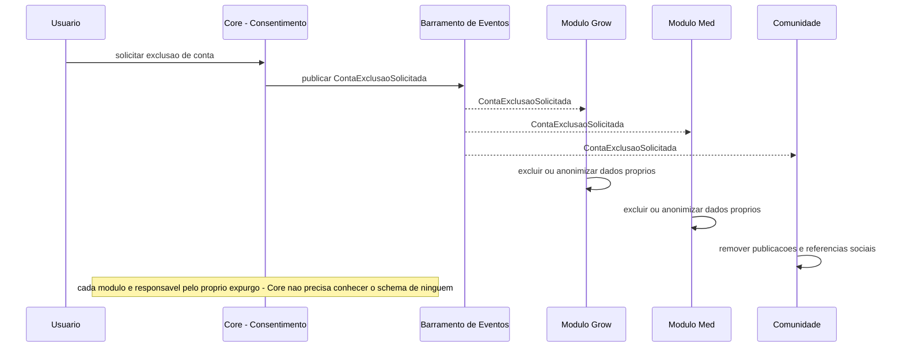
Cada módulo reage de forma independente ao evento — preserva a regra de "nenhum módulo conhece detalhes internos de outro", inclusive para exclusão.

### 21.3 Exportação e portabilidade
Mesmo padrão de evento (`ExportacaoDadosSolicitada`): cada módulo contribui sua fatia dos dados do usuário para um pacote de exportação compilado pelo Core — atende ao direito de portabilidade da LGPD (Art. 18).

### 21.4 Anonimização mínima
Regra de tamanho mínimo de coorte (seção 14.3) é reforçada aqui como requisito de conformidade, não só de qualidade estatística.

### 21.5 Criptografia e autenticação reforçada
Dados de saúde (Med) e localização (Grow outdoor) exigem criptografia em repouso; Modo Discreto exige autenticação reforçada (biometria/2FA) — requisito técnico explícito para o doc 13.

---

## 22. Fluxo de Dados (Ponta a Ponta)

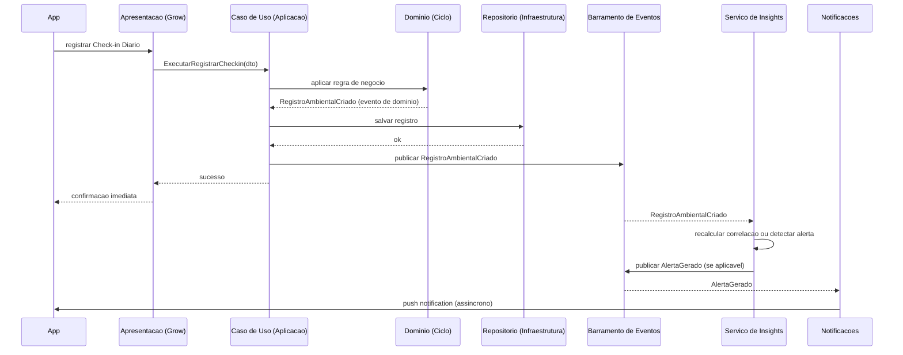

---

## 23. Integração Grow ↔ Med

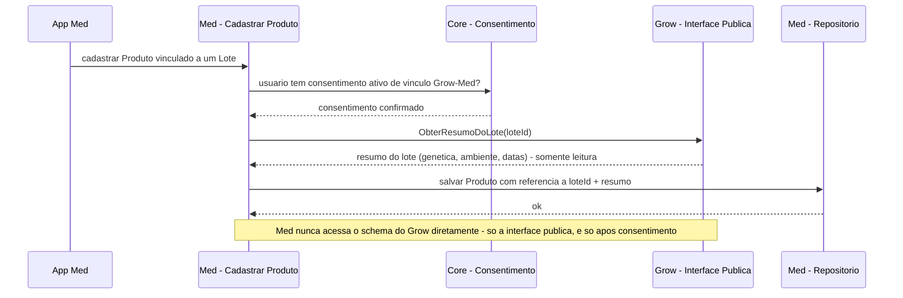

A referência é **por identificador + resumo somente leitura obtido no momento do vínculo** (não uma cópia viva sincronizada) — mais simples que manter os dois lados sempre atualizados, com a contrapartida de que uma alteração posterior no Lote do Grow não se propaga automaticamente ao resumo já salvo no Med (aceitável, dado que o vínculo documenta "a origem daquele produto", um fato histórico, não um dado vivo).

---

## 24. Dependências entre Módulos

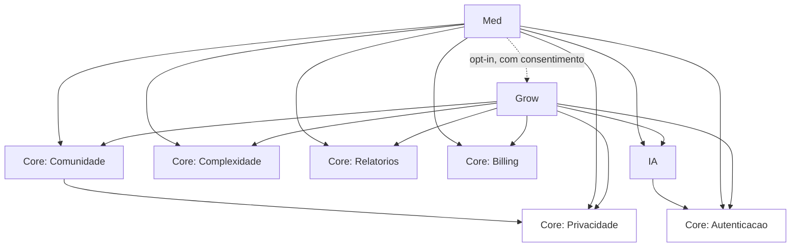

Nenhuma seta aponta "de volta" do Core para Grow/Med, nem de Grow para Med (exceto a referência opt-in explícita, sempre com consentimento verificado) — dependência sempre em uma direção, condição necessária para qualquer extração futura para microsserviços.

---

## 25. Correção dos Problemas Apontados pela Auditoria

| Achado da auditoria | Correção nesta arquitetura |
|---|---|
| Motor de Privacidade "do Grow" | Movido para o Core (seção 12) |
| Comunidade sem dono arquitetural claro | Formalizada como subdomínio genérico do Core, com projeção via eventos (seção 9.1, 13) |
| Ausência de modelagem de consentimento LGPD | Módulo de Consentimento & Conformidade (seção 21.1) |
| Risco de reidentificação em insights agregados | Regra de coorte mínima no Motor de Correlação (seção 14.3, 21.4) |
| Ausência de exclusão de conta / portabilidade | Fluxos arquiteturais dedicados via eventos (seção 21.2, 21.3) |
| IA de "detecção de efeito adverso" perto de orientação médica | Toda saída do Motor de Correlação carrega explicação e nível de confiança (seção 14.1) — o enquadramento textual/legal exato do disclaimer é uma decisão de conteúdo, não de arquitetura, e fica registrada como pendente para o doc 05 |
| Cardinalidade Ciclo→Colheita rígida (1—1) | Corrigida: uma **Colheita** passa a referenciar um subconjunto de Plantas de um Ciclo (não o Ciclo inteiro), permitindo colheita escalonada — o doc 08 deve modelar `Colheita` como 0—N por Ciclo, vinculada a N Plantas |
| Preferência de Complexidade e Configuração de Compartilhamento duplicadas em Grow e Med | Formalizadas como entidades únicas do Core (seção 7.1), referenciadas, nunca redeclaradas |
| Falta de central de notificações unificada | Serviço único do Core com preferências por categoria (seção 15) |
| Falta de autenticação reforçada explícita para Modo Discreto | Requisito explícito na seção 10 |
| Bearable ausente do benchmark do Med | Não é uma correção de arquitetura, mas o Motor de Correlação genérico (seção 14.1) já incorpora a boa prática identificada (volume mínimo de dados, correlação fator × resultado) |

---

## 26. Boas Práticas

- **Testes de arquitetura automatizados** (ex.: verificar que nenhum módulo importa classes internas de outro) devem existir desde o primeiro commit — é o que impede a disciplina desta seção de se perder ao longo dos anos.
- Todo novo tipo de evento de domínio é documentado (nome, payload, quem publica, quem consome) num catálogo único, evitando eventos "órfãos" ou duplicados.
- Nenhuma regra de negócio vive na camada de Apresentação ou Infraestrutura — só no Domínio.
- Toda decisão de extrair um módulo para microsserviço deve ser justificada por métrica real (seção 20), nunca por preferência tecnológica.

---

## 27. Riscos

| Risco | Categoria | Observação |
|---|---|---|
| Perda de registro em conectividade ruim (decisão online-first) | Produto | Risco assumido conscientemente; mitigar com rascunho local mínimo (seção 17) e reavaliar offline-first como V2 |
| Disciplina de fronteiras entre módulos se degradar com o tempo/pressão de prazo | Técnico | Mitigado por testes de arquitetura automatizados (seção 26) |
| Volume de eventos crescer sem observabilidade suficiente para depurar | Técnico | Mitigado por ID de correlação e catálogo de eventos (seção 20, 26) |
| Definição exata de "N mínimo" para anonimização ainda não decidida | Legal/Estatístico | Ver Perguntas Estratégicas |
| Extração prematura de um módulo por modismo, não por necessidade real | Organizacional | Mitigado pela regra explícita da seção 26 |

---

## 28. Sugestões de Melhorias

- Considerar, já no doc 05 (IA), um formato padrão de "explicação" anexado a todo insight — vira um componente de UI reutilizável (doc 11) além de decisão de arquitetura.
- Avaliar, no doc 08, se séries temporais merecem um motor de armazenamento diferente do banco relacional principal desde o MVP ou só a partir de um volume real observado.

---

## 29. Classificação de Escopo (MVP / V2 / V3 / Futuro / Pesquisa)

| Item | Classificação | Observação |
|---|---|---|
| Modular Monolith, schema por módulo, Clean Architecture/DDD/SOLID | **MVP** | Fundação, não pode ser adiada |
| Motor de Privacidade e Comunidade no Core | **MVP** | Correção da auditoria, não pode ser adiada |
| Consentimento/exclusão/portabilidade (LGPD) | **MVP** | Obrigatório antes de qualquer usuário real |
| Motor de Correlação genérico com regra de coorte mínima | **MVP** (versão simples) / **Versão 2** (refinamento estatístico) | |
| Offline-first completo | **Versão 2** | Decisão validada: online-first no MVP |
| Extração de qualquer módulo para microsserviço | **Futuro** | Só com dado real de uso (seção 5, 20) |
| Réplicas de leitura, cache avançado | **Versão 2** | MVP pode operar com uma instância de banco única bem dimensionada |

---

## Decisões Consolidadas (validado com o usuário em 2026-07-08, algumas resolvidas durante o doc 05)

| # | Tema | Decisão |
|---|---|---|
| 1 | Tamanho mínimo de coorte | Resolvido no doc 05 — `PoliticaDeAgregacao` configurável, Grow = 30, Med = 50 |
| 2 | Cuidador/Dependente | **Versão 2**, não entra no MVP do Med (doc 03 atualizado) — mas o papel Dependente/Responsável na autorização (seção 11) permanece modelado, arquitetura já preparada |
| 3 | Disclaimer legal da IA | Redigido e aprovado no doc 05, marcado como "Pendente de Revisão Jurídica" |
| 4 | Rascunho local em online-first | Confirmado — proteção simples contra perda de dado durante edição (seção 17), sem fila de sincronização |

Este documento está **concluído**. Seguimos para o **Documento 05 — Inteligência Artificial** (já escrito e aprovado) e, agora, para o **Documento 06 — Comunidade**.

---

## Artefatos para Implementação

> Artefatos no nível de plataforma/arquitetura — complementam (não substituem) os artefatos já registrados nos docs 02 e 03 por módulo de produto.

### Checklist Técnico
- [ ] Configurar banco único com schema isolado por módulo (core, grow, med, comunidade)
- [ ] Implementar Barramento de Eventos in-process com contrato de evento documentado
- [ ] Implementar Motor de Privacidade Granular no Core (movido do Grow)
- [ ] Implementar Módulo de Consentimento & Conformidade LGPD (novo)
- [ ] Implementar fluxo de exclusão de conta orientado a eventos (saga por módulo)
- [ ] Implementar fluxo de exportação/portabilidade de dados orientado a eventos
- [ ] Implementar Motor de Correlação genérico com regra de coorte mínima
- [ ] Implementar Motor de Relatórios único no Core (substituindo as duas implementações previstas em Grow/Med)
- [ ] Implementar Complexidade Progressiva como entidade única do Core
- [ ] Corrigir cardinalidade Colheita (0—N por Ciclo, vinculada a subconjunto de Plantas)
- [ ] Configurar testes de arquitetura (verificação automática de fronteiras entre módulos)
- [ ] Configurar logging estruturado com ID de correlação propagado por eventos

### Lista de Módulos (nível arquitetura)
Core (Identidade/Autenticação, Autorização, Motor de Privacidade, Consentimento/LGPD, Comunidade, Motor de Relatórios, Complexidade Progressiva, Billing/Premium, Notificações, Armazenamento de Mídia) · IA (Motor de Correlação, Serviço de Insights) · Grow · Med

### Lista de Componentes Reutilizáveis (nível arquitetura)
- Barramento de Eventos in-process (abstração substituível por broker externo no futuro)
- Cliente de interface pública entre módulos (facade/contrato)
- Motor de Privacidade Granular (dimensão × escopo)
- Motor de Correlação genérico (fator × resultado, com regra de coorte mínima)
- Motor de Relatórios genérico (template por domínio)
- Middleware de autenticação/autorização (RBAC + política)
- Middleware de ID de correlação (observabilidade)

### Lista de Entidades do Banco (nível Core, conceitual)
Usuário · PerfilDependente · ConsentimentoRegistro · PreferênciaDeComplexidade (única) · ConfiguraçãoDeCompartilhamento (única, com vocabulário de dimensão por módulo) · RegistroDeAuditoriaDePrivacidade · AssinaturaPremium · PreferênciaDeNotificação · CatálogoDeEventosDeDomínio (documentação, não necessariamente uma tabela)

### Lista de APIs Necessárias (nível arquitetura)
- `POST /auth/login`, `POST /auth/refresh`
- `GET /autorizacao/verificar` (checagem de permissão/política)
- `POST /privacidade/avaliar` (uso interno entre módulos, não exposto ao cliente)
- `POST /consentimento`, `DELETE /consentimento/{tipo}`
- `POST /conta/excluir`, `POST /conta/exportar`
- `GET /grow/lotes/{id}/resumo` (interface pública consumida pelo Med)
- `POST /eventos` (publicação interna no barramento — não é uma API pública de cliente)

### Lista de Permissões (nível arquitetura)
- Escopo de token por módulo (um token não concede acesso irrestrito a todos os módulos sem checagem de autorização)
- Papel Dependente restrito a operar somente em nome do Responsável autenticado

### Eventos de Domínio (catálogo inicial, nível plataforma)
`ContaExclusaoSolicitada` · `ExportacaoDadosSolicitada` · `ConsentimentoAlterado` · `ConteudoCompartilhadoAtualizado` · `ColheitaRegistrada` · `AlertaGerado` · `LimitePremiumAtingido` — cada evento com payload versionado e documentado no catálogo único (seção 26)

### Notificações (nível arquitetura)
Central única no Core (seção 15), consumindo o catálogo de eventos acima — nenhuma notificação é disparada diretamente por Grow, Med ou IA.

### Casos de Teste (nível arquitetura)
- Nenhum módulo consegue importar/instanciar classes de Domínio ou Infraestrutura de outro módulo (teste de arquitetura automatizado)
- Exclusão de conta remove/anonimiza dados em todos os módulos, mesmo que um módulo esteja temporariamente indisponível (reentrega do evento)
- Insight agregado nunca é exibido abaixo do N mínimo de coorte, mesmo em ambiente de teste com poucos usuários
- Vínculo Grow↔Med só é criado se houver consentimento ativo — tentativa sem consentimento é bloqueada
- Alteração de privacidade de uma publicação já existente atualiza a projeção da Comunidade de forma assíncrona, sem exigir leitura em tempo real do Grow/Med

### Dependências com Outros Módulos
Documentadas explicitamente na seção 24 (diagrama de dependências) — regra permanente: nunca circular, nunca "de volta" do Core para os apps.

### Riscos Técnicos
- Consistência eventual entre publicação e projeção da Comunidade (seção 9.1) pode gerar um pequeno atraso perceptível — aceitável, mas deve ser comunicado na UX (doc 10) para não parecer bug
- Reentrega de eventos (ex.: em exclusão de conta) precisa de idempotência em cada módulo consumidor
- Métricas por módulo (seção 20) precisam existir desde o MVP, não podem ser adicionadas só quando a decisão de extração já for urgente
