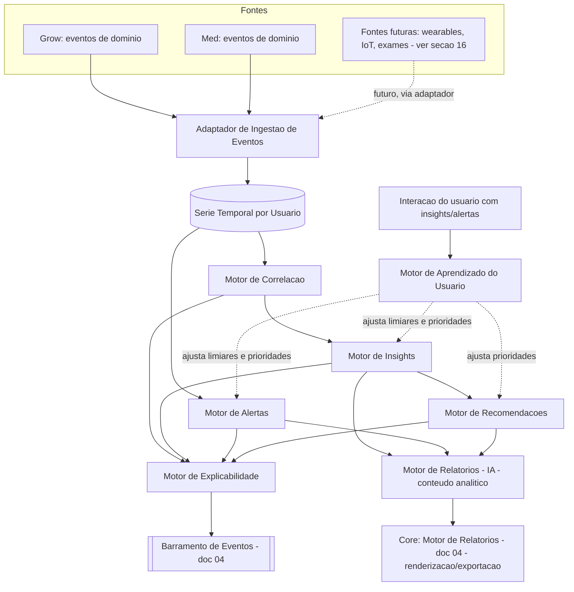
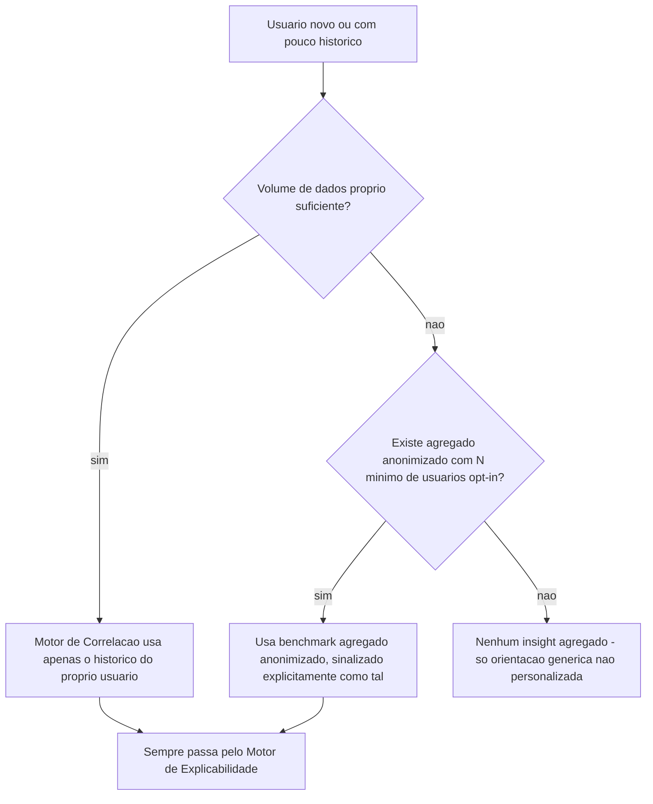
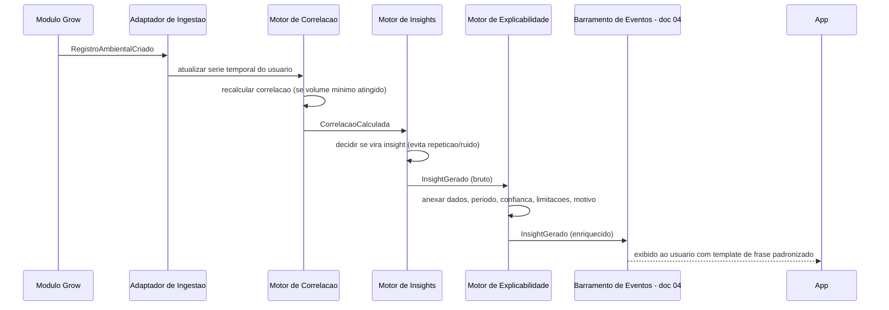
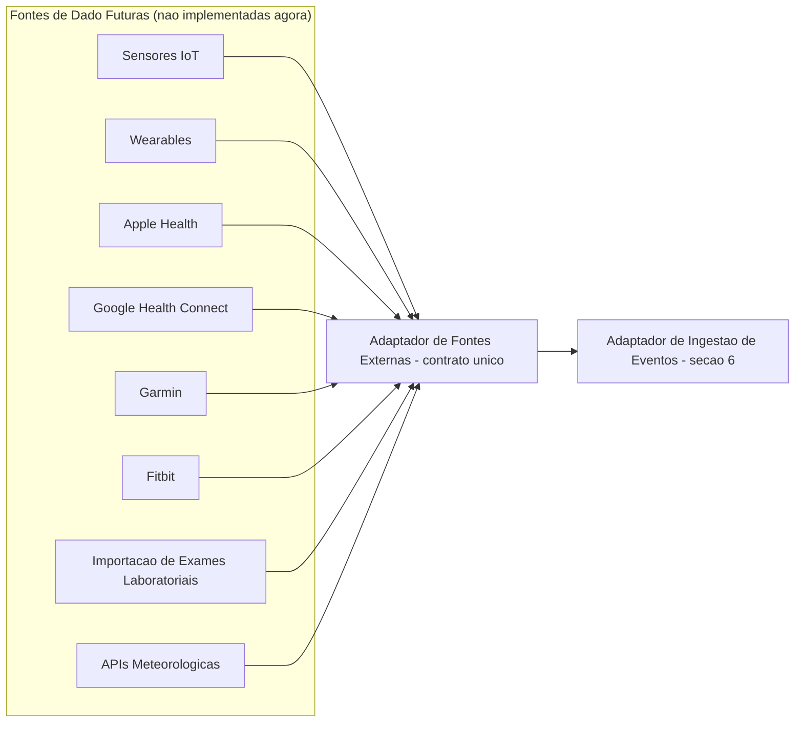

# 05 — Inteligência Artificial (Documento 100% Completo)

> Status: **Rascunho para validação.** Depende dos docs [02](02-cosmaria-grow.md) §8, [03](03-cosmaria-med.md) §8 e [04](04-arquitetura-geral.md) §14/§21 (arquitetura geral, barramento de eventos, fila de jobs assíncronos, regra de coorte mínima). Não escolhe provedor de IA/LLM (doc 13) — define a forma funcional da camada de IA.

---

## 1. Objetivos

- Modelar a IA da COSMARIA como um **conjunto de motores independentes**, não um serviço monolítico — cada um substituível e evoluível sem afetar os demais.
- Garantir **explicabilidade máxima**: nenhum insight é uma caixa preta. Todo resultado é rastreável até os dados que o originaram.
- Formalizar como **princípio permanente da plataforma**: a IA sempre prioriza o histórico do próprio usuário; dados agregados de terceiros só entram quando o histórico próprio é insuficiente, sempre anonimizados e sempre com consentimento.
- Preparar a arquitetura (sem implementar agora) para receber fontes de dado futuras: sensores IoT, wearables, Apple Health, Google Health Connect, Garmin, Fitbit, exames laboratoriais, APIs meteorológicas.

---

## 2. Problemas que Resolve

| Problema | Como esta arquitetura resolve |
|---|---|
| Docs 02/03 prometeram capacidades de IA (previsão, correlação, alertas, recomendações) sem uma arquitetura unificada por trás | Sete motores independentes, cada um com contrato claro (seção 6) |
| Apps concorrentes (Whoop, Oura) calculam índices proprietários e opacos — o usuário não entende por que o número é o que é | Motor de Explicabilidade dedicado (seção 7), que torna essa opacidade estruturalmente impossível na COSMARIA |
| Risco de reidentificação em insights agregados (achado da auditoria) | Pesquisa de boas práticas de coorte mínima (seção 9), parametrizável, nunca hardcoded |
| Risco de a IA soar como orientação médica no Med | Disclaimer explícito, rascunho para revisão jurídica (seção 10) |
| Nenhum plano para integrações futuras de dado (wearables, IoT, exames) | Padrão de adaptador de fontes externas desenhado desde já (seção 16), sem implementá-las agora |

---

## 3. Escopo

**Incluído**: os sete motores de IA, modelo de explicabilidade, princípio de priorização do histórico próprio, cold-start, pesquisa e recomendação sobre coorte mínima, disclaimer, arquitetura de extensibilidade para fontes de dado futuras.

**Fora de escopo**: provedor de LLM/modelo estatístico específico (doc 13), schema físico de armazenamento de série temporal (doc 08), UX de apresentação do insight na tela (doc 10).

---

## 4. Princípio Permanente — IA Centrada no Histórico do Usuário

> Este princípio é permanente e se aplica a toda capacidade de IA da plataforma, presente ou futura.

1. A IA **sempre prioriza o histórico do próprio usuário** como fonte primária de qualquer correlação, insight, alerta ou recomendação.
2. Dados agregados de outros usuários só são usados **quando o histórico próprio for insuficiente** (cold-start, seção 8) — nunca como substituto de um histórico já suficiente.
3. Dados agregados são **sempre anonimizados** e **sempre com consentimento explícito** (doc 04, §21.1) do usuário cujo dado compõe o agregado.
4. **Nunca** dados individuais de terceiros são expostos a outro usuário, em nenhuma circunstância.
5. **Nunca** há venda de dados — este princípio já era uma decisão de negócio (doc 00); aqui se torna também uma restrição técnica: o Motor de Correlação não expõe interface alguma de exportação de dado bruto agregado para consumo externo.
6. **Nunca linguagem de certeza absoluta** (validado 2026-07-08): nenhuma saída de IA afirma algo como fato garantido. Toda saída indica nível de confiança e limitações explicitamente (reforça o template da seção 7.1) — regra permanente, não só uma preferência de redação.

---

## 5. Benchmark

### 5.1 Cannabis (já coberto nos docs 02/03/auditoria)
Grow with Jane, GrowDiaries, Strainprint, Jointly, Bearable — não repetido aqui; ver doc 02 §4, doc 03 §4 e a Auditoria.

### 5.2 Sistemas gerais de dados pessoais, sintomas, produtividade e performance

| Sistema | O que fazem | Lição para a COSMARIA |
|---|---|---|
| **Exist.io** | Correlaciona qualquer dado pessoal rastreado (humor, sono, atividade, clima, produtividade) e apresenta correlações como explicação de padrões passados e previsão de comportamento futuro | É o analógo mais direto de um "Motor de Correlação genérico" — valida a ideia de um motor central de correlação reutilizável entre domínios (Grow e Med são, para este motor, só duas fontes de série temporal a mais) |
| **Whoop (Recovery Score)** e **Oura (Readiness Score)** | Combinam múltiplos sinais biométricos (HRV, frequência cardíaca em repouso, sono, temperatura) num único índice, com **pesos proprietários não divulgados** | **Lição por contraste**: é exatamente o padrão que a COSMARIA rejeita — dois usuários podem ter o mesmo índice calculado de formas totalmente diferentes e opacas. Reforça por que o Motor de Explicabilidade (seção 7) é um diferencial deliberado, não um "nice to have" |
| **Welltory** | Correlaciona HRV com hábitos (cafeína, sono, exercício) e mostra a força da correlação de forma acessível ao usuário leigo | Valida o formato de apresentação "correlação + força + o que isso significa na prática" que adotamos na seção 7 |
| **MyFitnessPal / Cronometer** | Log diário simples + relatórios de tendência ao longo do tempo | Reforça a importância do check-in essencial (já decidido nos docs 02/03) como fonte primária de dado para qualquer IA — sem dado consistente, não há correlação possível |
| **RescueTime** | Correlaciona hábitos de uso do tempo com produtividade percebida, com relatórios semanais automáticos | Valida o padrão de "Relatório Semanal Automático" já presente no doc 02 (Grow) e doc 03 (Med), aqui formalizado como saída do Motor de Relatórios da IA (seção 6.6) |

**Conclusão do benchmark**: a explicabilidade máxima exigida pelo usuário não é apenas uma preferência de UX — é um posicionamento competitivo real. A categoria inteira de wearables/apps de saúde caminha para índices cada vez mais opacos (Whoop, Oura); a COSMARIA vai na direção oposta deliberadamente.

---

## 6. Arquitetura: Conjunto de Motores Independentes

### 6.1 Motor de Correlação

| Aspecto | Definição |
|---|---|
| Responsabilidade | Calcular força, direção e confiança da correlação entre um fator e um resultado ao longo do tempo, dentro do histórico do usuário (ou de um agregado anonimizado, quando aplicável) |
| Entradas | Séries temporais/eventos de domínio já ingeridos (Grow: parâmetros ambientais, eventos de manejo/sanidade; Med: sintomas diários, doses, efeitos); parâmetros de configuração (janela de tempo, volume mínimo de dados, N mínimo de coorte quando agregado) |
| Saídas | `CorrelacaoCalculada` (força, direção, nível de confiança, tamanho da amostra, período analisado) |
| Dependências | Armazenamento de série temporal (doc 04, §16), Barramento de Eventos |
| Eventos | Consome: `RegistroAmbientalCriado`, `RegistroDeSintomaDiarioCriado`, `RegistroDeUsoCriado`, etc. Publica: `CorrelacaoCalculada` |
| Evolução futura | Modelos estatísticos mais sofisticados (regressão multivariada, controle de fatores confundidores, séries de fontes wearable) sem alterar o contrato de saída |

### 6.2 Motor de Insights

| Aspecto | Definição |
|---|---|
| Responsabilidade | Interpretar `CorrelacaoCalculada` (e outros sinais) e decidir se e como isso vira um insight relevante — prioriza, filtra ruído, evita repetição |
| Entradas | `CorrelacaoCalculada`, histórico de insights já apresentados ao usuário |
| Saídas | `InsightGerado` |
| Dependências | Motor de Correlação, Motor de Explicabilidade |
| Eventos | Consome `CorrelacaoCalculada`; publica `InsightGerado` |
| Evolução futura | Priorização por relevância aprendida (integração com Motor de Aprendizado do Usuário, seção 6.7) |

### 6.3 Motor de Alertas

| Aspecto | Definição |
|---|---|
| Responsabilidade | Monitorar continuamente parâmetros/sintomas em busca de desvios que exigem atenção imediata — mais urgente e mais determinístico que um Insight |
| Entradas | Eventos de registro em tempo real + faixas de referência (ex.: faixa saudável de VPD por fase, já prevista no doc 02 §12) |
| Saídas | `AlertaGerado` (com sugestão de ação, podendo originar uma Tarefa no Grow — doc 02 §8) |
| Dependências | Motor de Correlação (para desvios estatísticos), regras determinísticas simples (fora de faixa não depende de correlação) |
| Eventos | Publica `AlertaGerado`, consumido por Notificações (doc 04, §15) |
| Evolução futura | Alertas preditivos (antecipar antes do desvio ocorrer, não só reagir) |

### 6.4 Motor de Recomendações

| Aspecto | Definição |
|---|---|
| Responsabilidade | Sugerir uma ação (não apenas apontar um problema) com base em padrões do próprio histórico e, quando aplicável e autorizado, em agregados anonimizados |
| Entradas | `InsightGerado`, agregados anonimizados (respeitando N mínimo — seção 9), preferências do usuário |
| Saídas | `RecomendacaoGerada` |
| Dependências | Motor de Insights, Motor de Correlação, regra de coorte mínima |
| Eventos | Consome `InsightGerado`; publica `RecomendacaoGerada` |
| Evolução futura | Personalização mais fina via Motor de Aprendizado do Usuário |

### 6.5 Motor de Explicabilidade

| Aspecto | Definição |
|---|---|
| Responsabilidade | Transversal: garante que toda saída de qualquer outro motor carregue a estrutura completa de explicação (seção 7) antes de chegar ao usuário — não gera conclusões, só as torna compreensíveis e rastreáveis |
| Entradas | `CorrelacaoCalculada`, `InsightGerado`, `AlertaGerado`, `RecomendacaoGerada` (versão "bruta") |
| Saídas | Versão enriquecida de cada um, pronta para apresentação (inclui dados de gráfico simples quando aplicável) |
| Dependências | Nenhuma funcional — atua como um decorator sobre as saídas dos outros motores |
| Eventos | Intercepta antes de qualquer evento de saída ser exposto à camada de apresentação |
| Evolução futura | Geração automática de visualização gráfica por tipo de insight (hoje: estrutura de dados; futuro: componente de gráfico pronto) |

### 6.6 Motor de Relatórios (IA)

| Aspecto | Definição |
|---|---|
| Responsabilidade | Compilar periodicamente (ou sob demanda) um **digest analítico** reunindo insights/alertas/recomendações relevantes do período — é o **conteúdo**, não o documento final |
| Entradas | Histórico de `InsightGerado`/`AlertaGerado`/`RecomendacaoGerada` do período |
| Saídas | `DigestAnaliticoGerado`, entregue ao **Motor de Relatórios do Core** (doc 04, §7.1) para virar um documento exportável — **os dois motores de mesmo nome têm responsabilidades diferentes e complementares**: este produz o conteúdo analítico, o do Core renderiza/exporta qualquer conteúdo (deste motor, do Grow ou do Med) |
| Dependências | Motor de Insights, Motor de Alertas, Motor de Recomendações, Core: Motor de Relatórios |
| Eventos | Disparado por job agendado (semanal, conforme docs 02/03) ou sob demanda; publica `DigestAnaliticoGerado` |
| Evolução futura | Formato do digest personalizável por perfil de usuário |

### 6.7 Motor de Aprendizado do Usuário

| Aspecto | Definição |
|---|---|
| Responsabilidade | Aprender, a partir da interação do próprio usuário com insights/alertas (abriu, ignorou, marcou como útil), a calibrar prioridade e sensibilidade dos demais motores **para aquele usuário especificamente** — aprendizado individual, nunca um modelo global treinado com dado de terceiros sem consentimento (reforça o princípio da seção 4) |
| Entradas | Eventos de interação da UI (`InsightMarcadoUtil`, `AlertaIgnorado`, `RecomendacaoAceita`, etc.) |
| Saídas | `PerfilDeAprendizadoAtualizado` (ex.: limiares individuais ajustados, frequência de notificação preferida) |
| Dependências | Consome sinais de todos os outros motores; não é consumido por eles diretamente, apenas ajusta parâmetros |
| Eventos | Consome eventos de interação; publica `PerfilDeAprendizadoAtualizado` |
| Evolução futura | É o motor mais aberto a evoluir — no MVP pode ser tão simples quanto contagem de engajamento; evolui para personalização mais sofisticada com volume de uso |

---

## 7. Explicabilidade Máxima

Toda saída de IA exposta ao usuário — sem exceção — carrega:

1. **Quais dados foram utilizados** (ex.: "registros de EC e temperatura")
2. **Período analisado**
3. **Quantidade de registros**
4. **Nível de confiança**
5. **Limitações da análise** (ex.: "poucos dados ainda", "outras variáveis podem ter mudado no período")
6. **Motivo da conclusão**

### 7.1 Template de frase obrigatório

Nenhuma saída usa linguagem do tipo *"a IA acredita que..."*. O padrão obrigatório é:

> "Com base em **[quantidade]** registros coletados entre **[data inicial]** e **[data final]**, foi observada uma correlação de aproximadamente **[força]%**, com nível de confiança **[nível]**. Limitação: **[limitação relevante, se houver]**."

Sempre que possível, a saída é acompanhada de um **gráfico simples** (o próprio par fator × resultado ao longo do tempo) — responsabilidade do Motor de Explicabilidade (seção 6.5) preparar os dados desse gráfico, a implementação visual em si é do doc 11 (Design System).

### 7.2 Rastreabilidade
Toda conclusão (`CorrelacaoCalculada`, `InsightGerado`, `AlertaGerado`, `RecomendacaoGerada`) carrega uma referência aos IDs dos registros brutos que a originaram — o usuário (ou um desenvolvedor investigando um bug) sempre consegue "descer" da conclusão até o dado original.

---

## 8. Cold-Start e Priorização do Histórico Próprio

Quando um insight usa dado agregado (por cold-start), o Motor de Explicabilidade **é obrigado a sinalizar isso explicitamente** ("baseado em dados de outros usuários, não no seu próprio histórico ainda") — nunca apresentar um insight agregado como se fosse pessoal.

---

## 9. N Mínimo de Coorte — Pesquisa de Boas Práticas (decisão pendente)

Pesquisa em literatura de anonimização (k-anonimidade) e prática de mercado:

| Valor (N) | Base/precedente | Vantagens | Desvantagens |
|---|---|---|---|
| **20** | Pesquisa acadêmica indica que o risco de reidentificação já fica baixo e estável a partir de k≈20 | Insights agregados aparecem mais cedo — importante numa base de usuários ainda pequena (fase de crescimento no Brasil) | Menor margem de segurança em recortes muito específicos (ex.: sintoma raro + genética específica + região pequena) |
| **30** | Convenção estatística geral (regra prática de "n≥30" para aproximação normal em estatística, não é uma norma de privacidade específica) | Fácil de justificar estatisticamente | Não tem base específica em pesquisa de anonimização — é emprestado de outra área |
| **50** | Padrão adotado pelo Google no Privacy Sandbox (FLEDGE) para agregações de dado de usuário | Validado por um player de peso em privacidade de dado agregado; bom equilíbrio | Em recortes muito específicos, pode demorar bem mais para atingir o mínimo, atrasando o valor percebido do insight agregado |
| **100+** | Observado em frameworks de analytics de coorte em saúde mais conservadores | Maior margem de segurança para dado de saúde (Med), que é mais sensível que dado de cultivo (Grow) | Na fase inicial (poucos usuários, só Brasil), pode significar que nenhum insight agregado apareça por muito tempo — esvazia essa promessa do produto no curto prazo |

**Decisão validada com você (2026-07-08)**: N mínimo é uma **Política de Agregação totalmente configurável** (nunca hardcoded na regra de negócio), lida pelo Motor de Correlação em tempo de execução, com valores iniciais diferentes por sensibilidade de domínio:

- **Grow**: N mínimo = **30** usuários opt-in.
- **Med**: N mínimo = **50** usuários opt-in (dado de saúde, mais sensível).

Esses valores podem ser alterados no futuro **sem necessidade de novo desenvolvimento** — são configuração (`PoliticaDeAgregacao`, por módulo), não constante de código. Geração de baseline sintético para coortes pequenas (técnica observada na pesquisa) permanece registrada como melhoria futura (seção 15), não MVP.

---

## 10. Disclaimer Legal (rascunho para revisão jurídica futura)

> **Este texto é um rascunho de produto, não uma peça jurídica validada — deve passar por revisão jurídica formal antes do lançamento.**

> "As análises, correlações e sugestões apresentadas pela COSMARIA são geradas a partir do seu próprio histórico de registros e, quando indicado, de dados agregados e anonimizados de outros usuários que autorizaram o compartilhamento. Elas têm o objetivo de ajudar você a **interpretar padrões já existentes no seu próprio histórico** — não constituem diagnóstico médico, prescrição, aconselhamento profissional de saúde ou orientação agronômica certificada, e não substituem a avaliação de um médico, agrônomo ou outro profissional habilitado. Toda análise indica seu **nível de confiança** e suas **limitações** — nenhuma conclusão é apresentada como certeza absoluta. Consulte sempre um profissional antes de tomar decisões de tratamento ou de cultivo com base nessas informações."

Exibido de forma clara no primeiro uso de qualquer funcionalidade de IA, e acessível a qualquer momento nas configurações. **Status: aprovado como direção de conteúdo, permanece "Pendente de Revisão Jurídica" até validação formal antes do lançamento.**

---

## 11. Fluxos

---

## 12. Estrutura Modular

Já detalhada no diagrama da seção 6 — reforço aqui do princípio: cada motor é um Bounded Context pequeno dentro do módulo IA (doc 04, §7.4), comunicando-se só por eventos de domínio, podendo evoluir, ser testado e (no limite) ser extraído isoladamente sem impacto nos demais.

---

## 13. Casos de Uso

- Cultivador registra parâmetros ao longo de um ciclo → Motor de Alertas identifica VPD fora da faixa → tarefa corretiva sugerida (doc 02, §8).
- Paciente usa um produto e registra sintomas antes/depois repetidamente → Motor de Correlação identifica associação dose×alívio → Motor de Insights apresenta com explicação completa.
- Usuário novo sem histórico suficiente → Motor de Correlação usa benchmark agregado anonimizado (sinalizado como tal) até acumular dado próprio.
- Usuário ignora repetidamente um tipo de alerta → Motor de Aprendizado do Usuário reduz a prioridade/frequência desse tipo de alerta especificamente para ele.

---

## 14. Boas Práticas

- Nenhum motor gera texto de conclusão sem passar pelo Motor de Explicabilidade — regra de arquitetura, não de estilo.
- Nenhuma correlação é exibida abaixo do volume mínimo de dados definido (mesmo que estatisticamente calculável) — evita conclusão precipitada.
- Todo evento de domínio consumido/publicado pelos motores é documentado no catálogo único de eventos (doc 04, §26).

---

## 15. Escalabilidade Futura (Horizonte de 10 anos)

- Modelos estatísticos do Motor de Correlação podem evoluir (regressão multivariada, controle de fatores confundidores) sem alterar o contrato de saída dos demais motores — isolamento por design.
- Geração de baseline sintético para coortes pequenas (seção 9) — melhoria futura de privacidade/utilidade.
- Motor de Aprendizado do Usuário é o motor com maior espaço de evolução (de contagem simples de engajamento até personalização sofisticada) sem exigir mudança de contrato com os demais.

---

## 16. Possíveis Integrações (Futuras — não implementadas agora)

Cada fonte futura implementa o mesmo **contrato de adaptador** (traduzir seu formato nativo para os eventos de domínio já consumidos pelo Motor de Correlação) — nenhum motor de IA precisa mudar para receber uma nova fonte. Isso é o próprio princípio Aberto/Fechado (SOLID, doc 04 §4) aplicado à ingestão de dado. Todas essas integrações são classificadas como **Futuro** ou **Pesquisa** (seção 20) — nenhuma entra no MVP, mas nenhuma decisão deste documento as impede.

---

## 17. Oportunidades de Monetização

Consistente com docs 02/03/00: capacidades avançadas de IA (previsão de rendimento refinada, correlações agregadas do Motor de Recomendações, digests analíticos completos do Motor de Relatórios) são candidatas naturais ao Premium — detalhamento fino ainda pendente do doc 07.

---

## 18. Riscos

| Risco | Categoria | Observação |
|---|---|---|
| N mínimo de coorte ainda não decidido | Legal/Estatístico | Ver Perguntas Estratégicas |
| Disclaimer ainda não validado juridicamente | Legal | Marcado explicitamente como rascunho (seção 10) |
| Cold-start pode entregar pouco valor de IA nos primeiros meses de um usuário/da plataforma | Produto | Mitigado por sinalização clara de "poucos dados ainda" em vez de silêncio total |
| Explicabilidade máxima pode tornar a interface mais densa de informação | UX | Fica para o doc 10/11 balancear densidade de informação vs. clareza visual |

---

## 19. Sugestões de Melhorias

- Considerar, no doc 10, um "modo resumido" de explicabilidade (frase curta) com opção de expandir para o detalhe completo — atende tanto quem quer a resposta rápida quanto quem quer rastrear tudo.
- Avaliar parceria futura com bases de dados científicas sobre cannabis (uso medicinal) para enriquecer o Motor de Recomendações com conhecimento geral, sempre deixando claro o que é conhecimento geral vs. o que é o histórico pessoal do usuário.

---

## 20. Classificação de Escopo (MVP / V2 / V3 / Futuro / Pesquisa)

| Item | Classificação | Observação |
|---|---|---|
| Motor de Correlação (versão básica) | **MVP** | Fundação de tudo mais |
| Motor de Insights, Motor de Alertas | **MVP** | Já previstos em docs 02/03 |
| Motor de Explicabilidade (template de frase, dados/período/confiança/limitações) | **MVP** | Não-negociável, é o diferencial central |
| Motor de Recomendações | **MVP** (básico, histórico próprio) / **Versão 2** (agregados anonimizados) | Depende de massa crítica de usuários opt-in |
| Motor de Relatórios (IA) | **MVP** | Já previsto como relatório automático em docs 02/03 |
| Motor de Aprendizado do Usuário | **Versão 2** | MVP pode funcionar sem personalização de limiares |
| Geração de baseline sintético para coorte pequena | **Futuro** | Ver seção 9 |
| Integrações com wearables/IoT/Apple Health/Google Health Connect/Garmin/Fitbit/exames/clima | **Futuro** / **Pesquisa** | Arquitetura já preparada (seção 16), implementação não |

Itens não-MVP foram adicionados ao [Ideias Futuras](ideias-futuras.md).

---

## Decisões Consolidadas (validado com o usuário em 2026-07-08)

| # | Tema | Decisão |
|---|---|---|
| 1 | N mínimo de coorte | `PoliticaDeAgregacao` configurável — Grow = 30, Med = 50 (valores iniciais, ajustáveis sem novo desenvolvimento) |
| 2 | Disclaimer | Aprovado, com adição: nunca linguagem de certeza absoluta, sempre confiança + limitações. Permanece **Pendente de Revisão Jurídica** |
| 3 | Motor de Aprendizado do Usuário | Confirmado como Versão 2, não bloqueia o MVP — os demais 6 motores funcionam plenamente sem ele |

Este documento está **concluído**. Seguimos para o **Documento 06 — Comunidade**, já com a revisão cruzada de documentos anteriores exigida pelo novo processo de documentação integrada.

---

## Artefatos para Implementação

### Checklist Técnico
- [ ] Implementar Adaptador de Ingestão de Eventos (contrato único para Grow, Med e futuras fontes externas)
- [ ] Implementar Motor de Correlação com volume mínimo de dados e leitura de `PoliticaDeAgregacao` (N configurável, nunca hardcoded)
- [ ] Implementar Motor de Insights (deduplicação/priorização básica)
- [ ] Implementar Motor de Alertas (regras determinísticas de faixa + desvio estatístico)
- [ ] Implementar Motor de Recomendações (básico: histórico próprio)
- [ ] Implementar Motor de Explicabilidade como decorator obrigatório sobre as saídas dos demais motores
- [ ] Implementar Motor de Relatórios (IA) gerando `DigestAnaliticoGerado`, integrado ao Core: Motor de Relatórios (doc 04) para renderização
- [ ] Implementar Motor de Aprendizado do Usuário (versão simples: contagem de engajamento)
- [ ] Implementar fluxo de cold-start com sinalização explícita de uso de agregado
- [ ] Exibir disclaimer (seção 10) no primeiro uso de qualquer funcionalidade de IA

### Lista de Módulos
Adaptador de Ingestão · Motor de Correlação · Motor de Insights · Motor de Alertas · Motor de Recomendações · Motor de Explicabilidade · Motor de Relatórios (IA) · Motor de Aprendizado do Usuário

### Lista de Telas
- Tela de Insight (com dados, período, confiança, limitações, motivo, gráfico simples)
- Tela de Alerta (com sugestão de ação)
- Tela de Recomendação
- Tela de Digest Analítico (relatório periódico)
- Modal de Disclaimer (primeiro uso)
- Configurações de IA (frequência, tipos de alerta, participação em agregados anonimizados)

### Lista de Componentes Reutilizáveis
- Card de Insight/Alerta/Recomendação com template de explicabilidade padronizado
- Gráfico simples fator × resultado (reutiliza o componente de série temporal já previsto nos docs 02/03)
- Indicador de nível de confiança
- Selo "baseado em dados agregados" (cold-start)

### Lista de Entidades do Banco (conceitual)
`PoliticaDeAgregacao` (N mínimo, configurável, por módulo/categoria) · `CorrelacaoCalculada` · `InsightGerado` · `AlertaGerado` · `RecomendacaoGerada` · `DigestAnaliticoGerado` · `PerfilDeAprendizadoDoUsuario` · `RegistroDeConsentimentoParaAgregados` (referência ao Core, doc 04 §21.1)

### Lista de APIs Necessárias
- `GET /ia/insights`, `GET /ia/alertas`, `GET /ia/recomendacoes`
- `GET /ia/digest?periodo=...`
- `POST /ia/feedback` (usuário marca insight como útil/inútil — alimenta o Motor de Aprendizado)
- `GET/PUT /ia/politica-agregacao` (uso administrativo/interno, não exposto ao usuário final)

### Lista de Permissões
Nenhuma permissão de dispositivo adicional além das já previstas (notificações, já cobertas no Core) — futuras integrações (seção 16) exigirão permissões próprias quando implementadas (ex.: acesso a HealthKit/Health Connect).

### Eventos (domínio/analytics)
`CorrelacaoCalculada` · `InsightGerado` · `AlertaGerado` · `RecomendacaoGerada` · `DigestAnaliticoGerado` · `PerfilDeAprendizadoAtualizado` · `InsightMarcadoUtil` · `AlertaIgnorado` · `RecomendacaoAceita`

### Notificações
Alertas e digests periódicos são publicados como eventos consumidos pela central de Notificações do Core (doc 04, §15) — a IA não dispara notificação diretamente.

### Casos de Teste
- Nenhuma correlação é exibida abaixo do volume mínimo de dados definido
- Nenhum insight agregado é exibido abaixo do N mínimo de coorte configurado em `PoliticaDeAgregacao`
- Todo `InsightGerado`/`AlertaGerado`/`RecomendacaoGerada` exposto ao usuário passa pelo Motor de Explicabilidade antes de chegar à API
- Insight originado de cold-start é sinalizado explicitamente como baseado em agregado, nunca apresentado como pessoal
- Alterar `PoliticaDeAgregacao` (N mínimo) não exige alteração de código, só configuração

### Dependências com Outros Módulos
- Core: Barramento de Eventos, Consentimento (doc 04 §9, §21)
- Core: Motor de Relatórios (renderização final do digest analítico)
- Grow e Med (fontes de eventos de domínio)
- Notificações do Core (despacho de alertas/digests)

### Riscos Técnicos
- Recalcular correlação a cada novo evento pode ficar custoso em volume alto — considerar recomputação incremental/periódica em vez de a cada registro (decisão de implementação, doc 13)
- Motor de Aprendizado do Usuário mal calibrado pode suprimir alertas importantes — exige limite mínimo de severidade que nunca é suprimido, independentemente do aprendizado (ex.: alertas de segurança/saúde críticos sempre passam)
