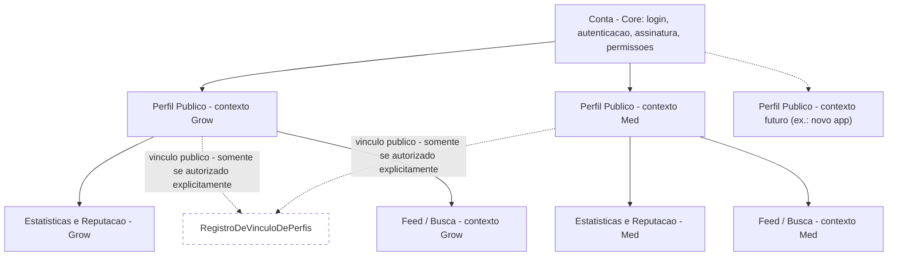
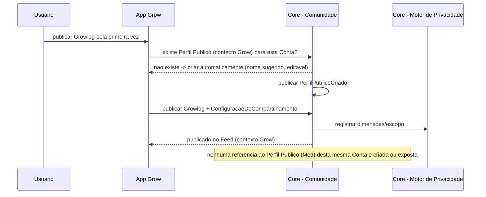

# 06 — Comunidade (Documento 100% Completo)

> Status: **Rascunho para validação.** Depende dos docs [02](02-cosmaria-grow.md) §9, [03](03-cosmaria-med.md) §9 e [04](04-arquitetura-geral.md) §9.1/§12/§13 (Comunidade como subdomínio genérico do Core, Motor de Privacidade Granular, projeção via eventos). Consulte o [Catálogo de Domínio](catalogo-de-dominio.md) antes de qualquer alteração de entidade/evento.

---

## 1. Objetivos

- Especificar a Comunidade como **subdomínio genérico do Core** (doc 04), servindo Grow e Med com a mesma infraestrutura social, sem que um dependa do outro.
- Implementar a decisão central deste documento: **uma única Conta, com Perfis Públicos independentes por contexto de aplicativo** — o usuário nunca é obrigado a revelar no Grow que também usa o Med, nem vice-versa.
- Preservar privacidade como diferencial competitivo (já estabelecido nos docs 02/03): todo conteúdo nasce privado, compartilhamento é granular.
- Manter a arquitetura pronta para novos contextos de aplicativo (futuros produtos da COSMARIA) sem redesenho.

---

## 2. Problemas que Resolve

| Problema | Como a Comunidade resolve |
|---|---|
| Um paciente do Med pode não querer que sua rede de cultivo (Grow) saiba que ele trata uma condição de saúde | Perfis Públicos totalmente independentes por contexto — ver seção 4 |
| Duplicar conta por app geraria fricção (dois logins, duas assinaturas) e contradiz a decisão de conta única (doc 00) | Uma Conta, múltiplos Perfis Públicos — nunca duplicação de conta |
| Conhecimento de cultivo/tratamento disperso em grupos sem estrutura pesquisável (doc 00, §2) | Busca estruturada por parâmetro técnico (genética, produto, sintoma), não só texto livre |
| Risco de vazamento de identidade entre contextos por descuido de arquitetura | Isolamento por construção: Seguimento, feed e busca são sempre escopados a um único contexto — não é apenas uma regra de privacidade, é uma partição de dados |

---

## 3. Escopo

**Incluído**: modelo de identidade (Conta × Perfil Público), grafo social (seguir, curtir, comentar, salvar), publicação e feed, busca estruturada, "Fork" (Grow), moderação, reputação por perfil.

**Fora de escopo**: UX visual de telas (doc 10/11), moderação automatizada por IA em detalhe de modelo (mencionada como integração possível, doc 00 §10 — requisitos de produto completos ficam para uma futura revisão se necessário), qualquer schema físico (doc 08).

---

## 4. Decisão Estrutural: Conta Única, Perfis Públicos Independentes por Contexto

**Decidido por você**: uma Conta (login, autenticação, assinatura, permissões — já modelada no Core, doc 04) pode ter **N Perfis Públicos**, um por contexto de aplicativo:

- **Perfil Público (Grow)**: nome de exibição, avatar, biografia, links, estatísticas próprias, reputação própria.
- **Perfil Público (Med)**: nome, avatar e biografia **opcionais** — o usuário pode permanecer completamente anônimo. Identidade totalmente independente do Perfil Grow.
- **Futuros contextos** (novos aplicativos da COSMARIA): mesma regra, sem exceção — um novo Perfil Público nasce automaticamente quando o usuário primeiro interage com a Comunidade daquele novo contexto.

Os dois (ou mais) perfis **compartilham apenas o que o usuário autorizar explicitamente** — por padrão, nenhuma ligação entre eles é visível a terceiros.

### Alternativas consideradas (para registro, já que a decisão foi tomada por você)

| Alternativa | Por que não foi escolhida |
|---|---|
| Identidade única em toda a plataforma (um só perfil social para Grow e Med) | Exporia o uso do Med a qualquer seguidor do Grow (e vice-versa) — inaceitável dado o estigma já mapeado no doc 01/03 |
| Contas totalmente separadas por app | Contradiz a decisão de conta única do doc 00 (duplicaria login, assinatura, autenticação) |
| **Conta única + Perfis Públicos independentes por contexto (escolhida)** | Resolve os dois problemas ao mesmo tempo: uma conta, zero vazamento de identidade entre contextos |

### Precedente de mercado
O padrão mais próximo já validado em produto real é o do **Discord**: uma única conta, mas apelido e avatar podem ser diferentes em cada servidor — a presença em um servidor não revela automaticamente a presença em outro. A COSMARIA aplica a mesma lógica, trocando "servidor" por "contexto de aplicativo" (Grow, Med, futuros).

---

## 5. Modelo de Identidade (Diagrama)



Por padrão, `RegistroDeVinculoDePerfis` **não existe** para nenhuma Conta — só é criado se o usuário decidir, explicitamente, revelar que dois perfis pertencem à mesma pessoa (ex.: um cultivador orgulhoso que também quer divulgar seu perfil medicinal). Nenhum sistema interno (busca, recomendação, feed) infere ou expõe essa ligação sozinho.

---

## 6. Benchmark

Referência principal já registrada na seção 4 (Discord). Reforçando o que já foi levantado nos docs 02/03/auditoria: nenhum concorrente de cannabis (Grow with Jane, GrowDiaries, Strainprint, Jointly) modela identidade multi-contexto — é um espaço de diferenciação real, não só de privacidade, mas de arquitetura de produto.

---

## 7. Funcionalidades

### 7.1 Comuns a Grow e Med (infraestrutura única do Core)
- Publicar conteúdo (Growlog no Grow; Experiência de Tratamento no Med) com privacidade granular (dimensão × escopo, doc 02 §9.1).
- Seguir, curtir, comentar, salvar — sempre entre dois Perfis Públicos do **mesmo contexto**.
- Busca estruturada por parâmetro técnico (genética/fertilizante/equipamento no Grow; produto/sintoma/concentração no Med).
- Reputação por perfil (não por conta) — ex.: selo "ciclo validado" (Grow, Versão 2) conta só para a reputação do Perfil Grow.

### 7.2 Exclusiva do Grow
- **"Fork"**: copiar a configuração de um Growlog compartilhado como modelo de um novo ciclo (doc 02 §9.2).

### 7.3 Exclusiva do Med
- Participação totalmente anônima possível (nome/avatar/biografia opcionais) — não existe equivalente no Grow, onde algum nome de exibição é esperado (ainda que possa ser um apelido, nunca dado real obrigatório).

### 7.4 Vínculo entre Perfis (opt-in)
- Usuário pode, a qualquer momento, criar um `RegistroDeVinculoDePerfis` que passa a exibir publicamente (em ambos os perfis, ou só em um, conforme escolha) que eles pertencem à mesma pessoa. Reversível — o usuário pode desfazer esse vínculo público a qualquer momento.

---

## 8. Estrutura Modular

```
Comunidade (Core)
│
├── Identidade Social
│   ├── Perfil Publico (por contexto)
│   └── Registro de Vinculo de Perfis (opt-in)
├── Grafo Social (Seguimento, escopado por contexto)
├── Publicacao (projecao de leitura alimentada por eventos - doc 04 §9.1)
├── Feed e Busca (escopados por contexto)
├── Interacao (Comentario, Curtida)
├── Reputacao (por perfil, por contexto)
├── Fork (exclusivo do contexto Grow)
└── Moderacao
```

Grow e Med **fornecem conteúdo** (via evento `ConteudoCompartilhadoAtualizado`, já definido no doc 04 §9.1) — nunca implementam sua própria lógica de feed/busca/seguimento.

---

## 9. Fluxos



Criação de perfil é **automática e discreta** (não exige um formulário obrigatório antes de poder participar) — reduz fricção, consistente com o princípio de retenção (doc 02 §4: "como simplificar a experiência?").

---

## 10. Requisitos de Inteligência Artificial

Nenhum motor novo — a Comunidade consome `InsightGerado`/`RecomendacaoGerada` do doc 05 quando aplicável (ex.: insights agregados anonimizados devolvidos à comunidade, já previstos em docs 02 §8/03 §8), sem nunca vincular um insight agregado a um Perfil Público específico de forma identificável.

**Esclarecimento da revisão arquitetural 00-09**: a checagem de `PoliticaDeAgregacao` (N mínimo de coorte, Grow=30/Med=50) é feita **exclusivamente pela IA**, no momento em que o insight é gerado (doc 05 §9) — a Comunidade nunca reimplementa essa verificação, apenas exibe insights que a IA já validou. Evita duas fontes de verdade para a mesma regra, que poderiam divergir se `PoliticaDeAgregacao` mudasse e só um dos lados fosse atualizado.

---

## 11. Requisitos de Sistema Premium

- Estatísticas avançadas de perfil (ex.: quem visitou, alcance de publicações) como possível funcionalidade Premium — a validar em profundidade no doc 07.
- Princípio duro mantido: participação básica na Comunidade (publicar, seguir, comentar) nunca é paga.

---

## 12. Modelo de Dados Lógico

> Ver [Catálogo de Domínio](catalogo-de-dominio.md) para a lista consolidada — resumo das relações novas/alteradas por este documento:

- **Usuário (Conta)** 1—N **PerfilPúblico** (um por contexto: Grow, Med, futuros)
- **PerfilPúblico** 0—1 **RegistroDeVinculoDePerfis** (opt-in, pode envolver 2+ perfis da mesma Conta)
- **PerfilPúblico** 1—N **Seguimento** (como seguidor e como seguido) — **restrito ao mesmo contexto**
- **PerfilPúblico** 1—N **PublicaçãoComunidade** (referenciando conteúdo de Grow ou Med via evento)
- **PerfilPúblico** 1—1 **ReputaçãoDoPerfil** (por contexto — não agregada entre contextos)
- **PublicaçãoComunidade** 1—1 **ConfiguraçãoDeCompartilhamento** (já modelada no Core, doc 04)

---

## 13. Boas Práticas

- Nenhuma consulta de banco (nem mesmo administrativa/analytics) deve fazer `JOIN` entre Perfis Públicos de contextos diferentes da mesma Conta sem passar por uma checagem explícita de `RegistroDeVinculoDePerfis` — essa é a garantia técnica concreta do princípio de privacidade desta seção.
- **Regra do nome padrão do Perfil Médico (confirmada 2026-07-08, texto definitivo pendente dos docs 10/11)**: o identificador sugerido automaticamente nunca usa dado real do usuário, nunca gera algo que revele informação pessoal, e é sempre um identificador neutro. Esta é a regra arquitetural fixa; a redação exata (ex.: formato do identificador) é decisão de conteúdo/UX, feita nos docs 10 (Fluxos do Usuário) e 11 (Design System).
- **Moderação totalmente separada por contexto (confirmado 2026-07-08)**: Grow e Med são tratados como ambientes de moderação completamente independentes — filas, políticas e ações de moderação isoladas por contexto, mesmo que hoje o mesmo time humano opere ambos. Um usuário banido no contexto Med não é automaticamente banido no Grow. Essa separação arquitetural (não apenas operacional) é o que permite, no futuro, políticas específicas por comunidade sem refatoração.

---

## 14. Escalabilidade Futura

- Adicionar um novo contexto de aplicativo (ex.: um futuro "COSMARIA Business") não exige alteração no modelo — só o registro de um novo tipo de contexto e a implementação do evento `ConteudoCompartilhadoAtualizado` pelo novo módulo.
- Reputação por perfil pode evoluir para níveis/badges mais sofisticados sem alterar a partição por contexto.

---

## 15. Possíveis Integrações

- Moderação assistida por IA (doc 00 §10) — a ser detalhada se/quando o volume de conteúdo exigir, não é MVP.
- Login social (doc 00 §10) — autentica a Conta, nunca os Perfis Públicos individualmente.

---

## 16. Oportunidades de Monetização

Ver seção 11. Nenhuma nova além do já mapeado nos docs 00/02/03/07 (pendente).

---

## 17. Riscos

| Risco | Categoria | Observação |
|---|---|---|
| Vazamento acidental de vínculo entre Perfis Públicos por erro de implementação (ex.: analytics interno cruzando dados por engano) | Segurança/Privacidade | Mitigado pela regra da seção 13 — deve virar um teste de arquitetura automatizado (doc 04 §26) |
| Nome de exibição sugerido automaticamente revelar algo sensível sem querer | Privacidade | Regra explícita de neutralidade (seção 13) |
| Moderação por contexto duplica esforço operacional (duas filas, dois times ou o mesmo time trabalhando em dobro) | Operacional | Aceitável no estágio atual; reavaliar se volume justificar ferramenta unificada de moderação (ainda respeitando a partição de dados) |

---

## 18. Sugestões de Melhorias

- Permitir ao usuário escolher, no momento de criar o `RegistroDeVinculoDePerfis`, se o vínculo aparece nos dois perfis ou só em um (ex.: revelar no Med que "também cultivo" sem necessariamente expor o inverso no Grow).
- Selo discreto de "perfil vinculado" em vez de exibir o nome do outro perfil diretamente, para quem quiser uma revelação parcial.

---

## 19. Classificação de Escopo (MVP / V2 / V3 / Futuro / Pesquisa)

| Item | Classificação | Observação |
|---|---|---|
| Perfil Público por contexto (Grow, Med), criação automática | **MVP** | Fundação da decisão deste documento |
| Anonimato total no Perfil Médico | **MVP** | Não pode ser adiado — é central ao princípio de discrição |
| Seguimento, curtida, comentário, busca estruturada (por contexto) | **MVP** | Já previstos nos docs 02/03 |
| Fork (Grow) | **MVP** | Já aprovado no doc 02 |
| Vínculo opt-in entre perfis (`RegistroDeVinculoDePerfis`) | **Versão 2 (confirmado 2026-07-08)** | Modelo de dados nasce pronto desde o MVP; a funcionalidade em si fica **desabilitada por feature flag** até a Versão 2 — decisão deliberada de lançar primeiro uma comunidade simples, sólida e segura, e só depois adicionar recursos sociais mais avançados |
| Reputação/selos avançados | **Versão 2** | Ligado ao selo "ciclo validado", já classificado como V2 no doc 02 |
| Moderação assistida por IA | **Futuro** | Ver seção 15 |
| Estatísticas avançadas de perfil (Premium) | **Versão 2** | Depende do doc 07 |

---

## Decisões Consolidadas (validado com o usuário em 2026-07-08)

| # | Tema | Decisão |
|---|---|---|
| 1 | Vínculo entre Perfis | Versão 2 confirmado. Modelo de dados pronto desde o MVP; funcionalidade desabilitada por feature flag até a V2 — lançamento inicial prioriza uma comunidade simples, sólida e segura |
| 2 | Nome padrão do Perfil Médico | Regra fixa documentada (seção 13): nunca dado real, nunca revela informação pessoal, sempre identificador neutro. Texto definitivo fica para os docs 10/11 |
| 3 | Moderação | Confirmada como totalmente separada por contexto — decisão arquitetural, não só operacional (seção 13) |

## Revisão Final de Arquitetura (nova diretriz permanente, aplicada a este documento)

- **Dificulta futuras integrações?** Não identificado — o modelo de Perfil Público por contexto (seção 5) já foi desenhado para acomodar contextos futuros sem redesenho.
- **Dificulta internacionalização?** Nenhuma limitação arquitetural; único lembrete: o identificador neutro do Perfil Médico (seção 13) precisará de localização por idioma quando o texto definitivo for escrito (docs 10/11) — não bloqueia nada agora.
- **Dificulta escalabilidade?** Não identificado — a partição de dados por contexto (seção 13) na verdade favorece escalabilidade: Grow e Med podem ser otimizados/escalados de forma independente no futuro, se necessário.
- **Dificulta integração com novos aplicativos futuros da COSMARIA?** Não identificado — é exatamente o caso de uso que motivou este modelo (seção 14).

Nenhuma limitação arquitetural relevante encontrada nesta revisão. Este documento está **concluído**. Seguimos para o **Documento 07 — Sistema Premium**.

---

## Artefatos para Implementação

### Checklist Técnico
- [ ] Implementar `PerfilPúblico` como entidade do Core, com criação automática (lazy) por contexto na primeira publicação
- [ ] Implementar `RegistroDeVinculoDePerfis` (opt-in, reversível)
- [ ] Implementar `Seguimento` escopado por contexto (impedir, por construção, seguir entre contextos diferentes)
- [ ] Implementar projeção de leitura da Comunidade consumindo `ConteudoCompartilhadoAtualizado` (doc 04 §9.1)
- [ ] Implementar busca estruturada por parâmetro técnico, escopada por contexto
- [ ] Implementar `ReputaçãoDoPerfil` calculada por contexto, nunca agregada entre contextos
- [ ] Implementar teste de arquitetura que impede qualquer consulta cruzando Perfis Públicos de contextos diferentes sem checagem explícita de `RegistroDeVinculoDePerfis`
- [ ] Implementar moderação por contexto (filas/ações independentes)

### Lista de Módulos
Identidade Social (Perfil Público, Vínculo de Perfis) · Grafo Social (Seguimento) · Publicação/Projeção de Leitura · Feed e Busca · Interação (Comentário, Curtida) · Reputação · Fork (Grow) · Moderação

### Lista de Telas
- Perfil Público (Grow) — visualização e edição
- Perfil Público (Med) — visualização e edição, com opção de manter todos os campos vazios/anônimos
- Configuração de Vínculo de Perfis (opt-in, reversível)
- Feed (contexto Grow) / Feed (contexto Med)
- Busca estruturada (por contexto)
- Tela de Publicação (com Matriz de Privacidade Granular, já prevista no doc 02)
- Tela de Moderação (interna/admin, por contexto)

### Lista de Componentes Reutilizáveis
- Card de Perfil Público (parametrizável por contexto — Grow mostra estatísticas de cultivo, Med mostra estatísticas de tratamento ou nada, se anônimo)
- Componente de Feed (genérico, reutilizado por Grow e Med)
- Componente de Busca Estruturada (filtros configuráveis por contexto)
- Selo de Vínculo de Perfis (discreto, opcional)

### Lista de Entidades do Banco
Ver [Catálogo de Domínio](catalogo-de-dominio.md) — novas nesta versão: `PerfilPúblico`, `RegistroDeVinculoDePerfis`, `Seguimento` (generalizado), `ReputaçãoDoPerfil`.

### Lista de APIs Necessárias
- `POST /comunidade/perfis` (criação implícita), `GET/PUT /comunidade/perfis/{contexto}`
- `POST /comunidade/vinculo-perfis`, `DELETE /comunidade/vinculo-perfis/{id}`
- `POST /comunidade/seguir/{perfilId}`, `DELETE /comunidade/seguir/{perfilId}`
- `GET /comunidade/feed?contexto=grow|med`
- `GET /comunidade/busca?contexto=...&filtro=...`
- `POST /comunidade/publicacoes/{id}/comentarios`, `POST /comunidade/publicacoes/{id}/curtir`

### Lista de Permissões
Nenhuma permissão de dispositivo nova além das já previstas (Core).

### Eventos (ver Catálogo de Domínio para a lista completa)
`PerfilPublicoCriado` · `VinculoDePerfisAutorizado` · `ConteudoCompartilhadoAtualizado` (consumido) · `GrowlogPublicado` (consumido) · `PublicacaoComunidadeMedCriada` (consumido)

### Notificações
Interação social (novo seguidor, comentário, curtida) — sempre referenciando o **Perfil Público do contexto correto**, nunca misturando notificações de Grow e Med numa mesma mensagem que revele os dois perfis juntos.

### Casos de Teste
- Seguir um Perfil Público do Grow não aparece de nenhuma forma na comunidade do Med, mesmo que seja a mesma Conta
- Perfil Público do Med criado sem nenhum dado preenchido permanece funcional e anônimo (nome padrão neutro)
- `RegistroDeVinculoDePerfis` só é visível a terceiros após criação explícita, e desaparece imediatamente após remoção
- Consulta administrativa que tentar cruzar Perfis Públicos de contextos diferentes sem `RegistroDeVinculoDePerfis` falha ou retorna vazio (teste de arquitetura)
- Reputação de um perfil não é afetada por ações no outro perfil da mesma Conta

### Dependências com Outros Módulos
- Core: Identidade/Autenticação (Conta), Consentimento, Motor de Privacidade Granular
- Grow e Med (fornecem conteúdo via eventos, nunca implementam feed/busca próprios)
- IA (doc 05) — insights agregados devolvidos à comunidade, respeitando `PoliticaDeAgregacao`

### Riscos Técnicos
- Criação automática de Perfil Público precisa ser idempotente (evitar duplicar perfil se o evento de criação for reentregue)
- Partição de dados por contexto precisa ser reforçada em todas as camadas (não só na API) — inclusive em índices de busca e caches, para não vazar por um caminho lateral
