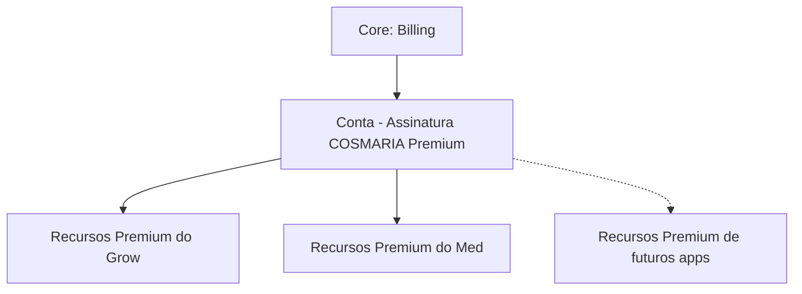

# 07 — Sistema Premium (Documento 100% Completo)

> Status: **Rascunho para validação.** Depende dos docs [00](00-visao-geral-da-plataforma.md) §11, [02](02-cosmaria-grow.md) §10, [03](03-cosmaria-med.md) §10, [04](04-arquitetura-geral.md) §7.1 (Billing no Core) e [06](06-comunidade.md) §11. Decisão estrutural já validada: **assinatura única da plataforma**, pertencente à Conta, não aos aplicativos.

---

## 1. Objetivos

- Traduzir em modelo de negócio concreto o princípio já estabelecido desde o doc 00: o gratuito continua extremamente útil; o Premium existe para **entregar mais valor**, nunca para **capar valor básico**.
- Definir uma **Assinatura COSMARIA Premium única**, da Conta, que desbloqueia automaticamente os recursos avançados de Grow, Med e futuros aplicativos — nunca assinaturas separadas por app.
- Propor no mínimo 3 estratégias de monetização (compromisso assumido no doc 02), comparadas por retenção, conversão, LTV, confiança, simplicidade de comunicação, expansão internacional e custo operacional.
- Propor uma estratégia de evolução do Premium (MVP → V2 → V3 → longo prazo).
- Classificar toda funcionalidade Premium por categoria (IA, Produtividade, Relatórios, Automação, Comunidade, Personalização, Armazenamento, Profissional).

---

## 2. Problemas que Resolve

| Problema | Como este documento resolve |
|---|---|
| Docs 02/03 prometeram Premium sem definir limites nem estratégia de negócio | Estratégias comparadas (seção 6) e limites propostos (seção 9) |
| Risco de "paywall agressivo" comum em apps de assinatura | Princípio de valor-primeiro (seção 4) e critério explícito: nada básico é capado |
| B2B mencionado de forma fragmentada em docs 00/02/03 | Unificado como "COSMARIA Business" (seção 11) |
| Usuário híbrido (Grow+Med) poderia ser penalizado por duas cobranças | Resolvido pela assinatura única (decisão já validada) |

---

## 3. Escopo

**Incluído**: modelo de assinatura única, estratégias de monetização comparadas, limites do plano gratuito, classificação de funcionalidades Premium por categoria, estratégia de evolução, benchmark de monetização fora do setor cannabis, B2B unificado.

**Fora de escopo**: gateway de pagamento específico (doc 13), schema de billing (doc 08), UX de tela de upgrade/paywall (doc 10).

---

## 4. Princípio Central — Valor Primeiro, Monetização Depois

O Premium deve existir porque **economiza tempo, entrega inteligência e melhora a experiência** — nunca porque uma funcionalidade básica foi artificialmente limitada. Este princípio é o critério de aceite de qualquer item que entrar na lista de funcionalidades Premium (seção 8): se a resposta para "isso é uma funcionalidade que deveria existir de qualquer forma, mesmo grátis?" for sim, ela não pode virar Premium.

Consequência prática: **dado de saúde e dado de cultivo já registrados nunca ficam presos atrás de um paywall** — histórico, mesmo longo, permanece acessível no plano gratuito (ver seção 9). O que se paga é profundidade analítica, conveniência e capacidade, não acesso ao que o próprio usuário já criou.

---

## 5. Modelo de Assinatura (Decisão Estrutural Já Validada)

**Decidido por você**: existe uma única **Assinatura COSMARIA Premium**, pertencente à **Conta** (doc 04/06), não a Grow nem a Med individualmente. Ao assinar, o usuário desbloqueia automaticamente todos os recursos Premium de todos os aplicativos que usa — Grow, Med, e qualquer aplicativo futuro da plataforma — sem cobrança adicional por app.

Isso reforça o ecossistema como um todo (objetivo explícito seu) e simplifica radicalmente o billing (uma única cobrança, um único ciclo de renovação, um único ponto de suporte ao cliente).

---

## 6. Estratégias de Monetização Comparadas

### Estratégia 1 — Camada Única de Valor ("Freemium Clássico")
Um único plano Premium, um preço, desbloqueia tudo que é Premium em todos os apps.

### Estratégia 2 — Base + Add-on de IA Separado
Uma assinatura Premium "base" (armazenamento, relatórios, personalização) e um add-on opcional de "IA Avançada" vendido à parte, para quem quer só a inteligência mais profunda sem pagar por outras conveniências (inspirado em GitHub Copilot/Notion AI como camada separada da assinatura principal).

### Estratégia 3 — Camadas Progressivas (Free → Plus → Premium)
Um plano intermediário "Plus" (armazenamento ampliado, sem IA avançada) entre o gratuito e o Premium completo — padrão comum em SaaS maduro.

### Comparação

| Critério | Estratégia 1 (Camada Única) | Estratégia 2 (Base + Add-on IA) | Estratégia 3 (Free → Plus → Premium) |
|---|---|---|---|
| **Vantagens** | Simples de entender e vender; sem fricção de decisão | Captura mais valor de usuários avançados de IA; permite pagar só pelo que se quer | Caminho de conversão gradual; atende a orçamentos diferentes |
| **Desvantagens** | Não diferencia quem quer só armazenamento de quem quer IA pesada | Dois SKUs para explicar e cobrar; risco de parecer "querem vender mais uma coisa" | Mais complexo de comunicar; risco de tabela de preços confusa se mal desenhada |
| **Impacto em retenção** | Alto — uma vez assinante, tem tudo, sem atrito de re-decisão | Médio — decisão recorrente sobre manter o add-on | Médio-alto — caminho natural de upgrade mantém engajamento |
| **Impacto em conversão** | Médio — "tudo ou nada" pode afastar quem só quer um recurso | Alto potencial em usuários avançados, baixo em iniciantes | Alto — plano de entrada barato reduz barreira inicial |
| **Comparação com concorrentes** | Bearable (correlação + histórico >30 dias, um único paywall), Duolingo Super | GitHub (Copilot separado do plano Team/Enterprise), Notion AI | MyFitnessPal (Premium único, mas testou camadas), Canva (Free/Pro/Teams) |
| **Maior retenção** | ✅ | | |
| **Maior LTV** | | ✅ (com o tempo, mais pontos de upsell) | ✅ (empatado — mais pontos de conversão) |
| **Maior confiança do usuário** | ✅ (mais transparente, "um preço, tudo incluso") | | |
| **Mais simples de comunicar** | ✅ | | |
| **Facilita expansão internacional** | ✅ (um preço para localizar) | | ✅ (padrão universalmente reconhecido) |
| **Menor custo operacional** | ✅ (um único plano para manter) | | |

**Recomendação**: começar pela **Estratégia 1** no MVP — é a que melhor atende ao seu princípio de "evitar qualquer sensação de paywall agressivo" e à prioridade de simplicidade e confiança antes de otimizar receita. As Estratégias 2 e 3 não são descartadas — viram parte da **estratégia de evolução** (seção 7), introduzidas depois, com dado real de uso, não como suposição.

---

## 7. Estratégia de Evolução do Premium

| Etapa | O que entra |
|---|---|
| **MVP** | Estratégia 1 (camada única). Categorias Relatórios, Armazenamento e Personalização básicas (seção 8) já disponíveis. IA avançada básica (previsão simples, relatório automático completo). |
| **Versão 2** | Avaliar introduzir a **Estratégia 3** (plano "Plus" intermediário) se o dado de uso mostrar demanda por um ponto de entrada mais barato. Vínculo de Perfis (doc 06) e Cuidador/Dependente (doc 03), quando lançados, entram como funcionalidades incluídas no Premium existente, não como novo produto. Estatísticas avançadas de perfil (Comunidade, doc 06 §11). |
| **Versão 3** | Avaliar introduzir a **Estratégia 2** (add-on de IA separado) especificamente para o Motor de Recomendações e Motor de Aprendizado do Usuário (doc 05), quando esses motores estiverem maduros o bastante para justificar um preço à parte — só se o dado mostrar que há usuários dispostos a pagar mais por IA especificamente, sem forçar isso em todos. |
| **Longo Prazo** | COSMARIA Business (B2B, seção 11) plenamente consolidado como produto/preço à parte da assinatura individual. Personalização visual avançada (temas, marca própria para uso profissional). |

Nenhuma dessas evoluções é decidida em detalhe agora — ficam registradas no [Ideias Futuras](ideias-futuras.md) com a classificação correspondente.

---

## 8. Funcionalidades Premium por Categoria

| Categoria | Funcionalidades |
|---|---|
| **IA** | Previsão de rendimento refinada (Grow), correlações agregadas do Motor de Recomendações, Digest Analítico completo (doc 05), correlação Grow↔Med (quando o vínculo opt-in, hoje Versão 2, estiver disponível) |
| **Produtividade** | Automação de criação de tarefas a partir de alertas refinados; templates avançados de ciclo/tratamento (`ModeloDeCiclo`/`ModeloDeTratamento`, entidades formalizadas na revisão 00-09, doc 08/09) |
| **Relatórios** | Relatório clínico customizável/múltiplos formatos (Med), exportação completa de dados do cultivo (Grow) |
| **Automação** | Lembretes inteligentes calibrados pelo Motor de Aprendizado do Usuário (doc 05, quando disponível) |
| **Comunidade** | Estatísticas avançadas de perfil (quem visitou, alcance de publicações — `VisualizacaoDePerfil`, entidade formalizada na revisão 00-09), selos de destaque |
| **Personalização** | Modo Especialista com customização adicional, preferências avançadas de notificação |
| **Armazenamento** | Fotos/mídia em alta resolução sem limite, anexar exames laboratoriais (Med) — ambos usam a entidade `Mídia`, agora do Core (reclassificada na revisão 00-09 para ser compartilhada entre Grow e Med), histórico de mídia ampliado |
| **Profissional** | COSMARIA Business — múltiplos usuários gerenciados, relatórios agregados institucionais (seção 11) |

*(Nota: esta classificação é sobre **o que é Premium**, independente de **quando** é lançado — não confundir com a linha do tempo MVP/V2/V3 da seção 7, que é um eixo diferente.)*

---

## 9. Limites do Plano Gratuito (Proposta)

| App | Gratuito | Premium |
|---|---|---|
| **Grow** | Até **2 ambientes simultâneos**; ciclos e histórico **ilimitados** (nunca capar histórico); parâmetros essenciais e avançados completos; IA básica (comparação, alertas, relatório automático básico); armazenamento de fotos em resolução padrão | Ambientes/ciclos simultâneos ilimitados; IA avançada completa; fotos em alta resolução sem limite; exportação completa |
| **Med** | Tratamentos **ilimitados**; sessões antes/depois **ilimitadas**; histórico clínico **completo e sempre acessível** (nunca capar dado de saúde já registrado); relatório básico exportável | Relatórios customizáveis/múltiplos formatos; anexar exames; IA avançada (correlações profundas) |

Princípio explícito: **dado de saúde (Med) nunca tem histórico limitado no gratuito** — capar o próprio histórico clínico seria eticamente problemático e contraria o próprio objetivo do produto (ajudar o paciente a levar informação completa ao médico). No Grow, o limite recai sobre **capacidade simultânea** (número de ambientes) e **qualidade de mídia**, nunca sobre histórico.

**Decisão validada com você (2026-07-08)**: "2 ambientes simultâneos" é confirmado como valor **inicial**, mas vive como `LimiteDePlano` **totalmente configurável** (nunca hardcoded na regra de negócio) — deve ser revisado após análise de dados reais de uso, sem exigir novo desenvolvimento para ajustar. O histórico permanece **sempre ilimitado**: nenhum dado que o usuário já registrou é limitado ou ocultado por causa do plano — o limite recai exclusivamente sobre capacidade simultânea futura, nunca sobre o passado.

### 9.1 Preparação Arquitetural para Cobrança — Arquitetura vs. Negócio vs. Comercial

Aplicando a nova diretriz permanente (separar sempre estas três camadas em qualquer decisão envolvendo dinheiro):

| Camada | O que significa aqui | Decidido neste documento? |
|---|---|---|
| **Arquitetura** | O sistema deve ser **capaz de suportar** múltiplas moedas, diferentes impostos por jurisdição, múltiplos planos, promoções/cupons, períodos gratuitos (trial), desconto por ciclo anual, e preço regional por país — tudo como configuração, nunca hardcoded | ✅ Sim — é este documento que garante que nenhuma dessas capacidades fique arquiteturalmente impossível depois |
| **Negócio** | Quais moedas de fato lançar, se/quando ativar trial, em quais países aplicar preço regional, estratégia de desconto anual | ❌ Não — fica para decisão próxima ao lançamento (doc 12, Roadmap, ou fora da sequência de documentação) |
| **Comercial** | Valores exatos de preço, duração e regras de campanhas promocionais específicas, parcerias de cupom | ❌ Não — tática de mercado, decidida por você quando for a hora, não é matéria de arquitetura |

Este documento garante apenas a **camada de Arquitetura**: a entidade `AssinaturaPremium` (Core) é desenhada desde já para suportar moeda, jurisdição fiscal, plano, cupom/promoção aplicada e ciclo de cobrança como atributos configuráveis — nenhum desses conceitos é adicionado depois via retrabalho estrutural.

---

## 10. Benchmark de Monetização (Fora do Setor Cannabis)

| Empresa | Princípio de monetização observado | Adaptação para a COSMARIA |
|---|---|---|
| **Notion** | Gratuito generoso para uso individual (drive adoção/efeito de rede); monetiza na fronteira de colaboração/equipe; IA como add-on separado | Reforça: não capar uso individual; COSMARIA Business como a "fronteira de equipe" equivalente |
| **GitHub** | Gratuito robusto (inclusive privado); monetiza recursos de organização/compliance; Copilot (IA) vendido à parte do plano principal | Valida a Estratégia 2 (add-on de IA) como evolução futura, não como ponto de partida |
| **Duolingo** | Núcleo de aprendizado sempre grátis; Premium remove fricção (sem anúncios, tolerância a erro), nunca bloqueia o conteúdo central | Reforça o princípio da seção 4: o "core loop" (check-in, registro) nunca é Premium |
| **Strava** | Rastreamento e social básico grátis; Premium monetiza analytics avançado e recursos de segurança | Paralelo direto com IA avançada (Grow/Med) como categoria paga, core tracking sempre grátis |
| **Bearable** | Rastreamento ilimitado grátis; Premium monetiza correlações e histórico longo | Contraponto importante: a COSMARIA **não** vai capar histórico (decisão da seção 9) — aqui a COSMARIA é deliberadamente mais generosa que o Bearable, por tratar isso como princípio ético, não só estratégico |
| **MyFitnessPal** | Log básico grátis; Premium remove anúncios e destrava granularidade nutricional | Reforça: nenhum plano de anúncios na COSMARIA (nunca esteve no roadmap de monetização, doc 00) — a ausência de ads já é, por si, um diferencial de confiança |
| **Canva** | Ferramenta central sempre utilizável grátis; Premium monetiza conteúdo/ativos premium e produtividade de equipe | Paralelo com a categoria "Profissional" (COSMARIA Business) como a fronteira de monetização de equipe |

**Conclusão do benchmark**: o padrão comum entre todos esses produtos sustentáveis é **nunca cobrar pelo loop central de uso** (o que, para a COSMARIA, é registrar e consultar seu próprio histórico) — a monetização mora sempre em profundidade analítica, conveniência/capacidade, ou na fronteira de uso profissional/em equipe. A Estratégia 1 (seção 6) já nasce alinhada a esse padrão.

---

## 11. COSMARIA Business (B2B Unificado)

Unifica as menções separadas de B2B nos docs 00/02/03 (recomendação da auditoria): uma única oferta para associações de cultivo, clínicas e grow shops gerenciando múltiplos usuários — inclui relatórios agregados institucionais, gestão de múltiplos perfis vinculados a uma organização. Detalhamento completo fica para quando houver validação de demanda real (classificado na seção 12 como Versão 2/Futuro) — este documento apenas formaliza que é **uma** oferta, não três.

---

## 12. Classificação de Escopo (MVP / V2 / V3 / Futuro / Pesquisa)

| Item | Classificação |
|---|---|
| Assinatura única (Estratégia 1), categorias IA/Relatórios/Armazenamento/Personalização básicas | **MVP** |
| Limites do plano gratuito propostos na seção 9 | **MVP** (valores ajustáveis) |
| Plano "Plus" intermediário (Estratégia 3) | **Versão 2** |
| Estatísticas avançadas de perfil (Comunidade) | **Versão 2** |
| Add-on de IA separado (Estratégia 2) | **Versão 3** |
| COSMARIA Business plenamente detalhado | **Futuro** |

---

## 13. Riscos

| Risco | Observação |
|---|---|
| Assinatura única pode "deixar dinheiro na mesa" de usuários que só usam um app intensamente | Aceito conscientemente — prioriza fortalecimento do ecossistema sobre maximização de receita de curto prazo |
| Limites de free tier (seção 9) são estimativa sem dado de uso real | Ajustável — não é hardcoded (mesmo princípio já aplicado à `PoliticaDeAgregacao`, doc 05) |
| Introduzir Estratégia 2 ou 3 depois pode confundir usuários já acostumados com a Estratégia 1 | Mitigável com comunicação clara e "legado" preservado para assinantes existentes |

---

## Revisão Final de Arquitetura

- **Dificulta futuras integrações?** Não identificado.
- **Dificulta internacionalização?** Não identificado — preço único por conta é, se algo, mais fácil de localizar do que múltiplos SKUs.
- **Dificulta escalabilidade?** Não identificado.
- **Dificulta integração com novos aplicativos futuros da COSMARIA?** Não identificado — pelo contrário, a assinatura única (seção 5) já foi desenhada para absorver novos apps automaticamente, sem novo produto de billing.

Nenhuma limitação arquitetural relevante encontrada.

---

## Decisões Consolidadas (validado com o usuário em 2026-07-08)

| # | Tema | Decisão |
|---|---|---|
| 1 | Limite do plano gratuito (Grow) | 2 ambientes simultâneos, valor inicial configurável (`LimiteDePlano`), revisável com dado real de uso. Histórico sempre ilimitado. |
| 2 | Precificação | Nenhum valor monetário definido agora. Arquitetura preparada para múltiplas moedas, impostos, planos, promoções/cupons, trial, desconto anual, preço regional (seção 9.1) — valores reais ficam para decisão de negócio/comercial próxima ao lançamento. |

## Revisão Final de Arquitetura (atualizada)

Reforçando a seção anterior: nenhuma limitação identificada para integrações futuras, internacionalização (a preparação de moeda/imposto/preço regional da seção 9.1 é, em si, uma resposta direta a esse critério), escalabilidade, ou novos aplicativos futuros.

Este documento está **concluído**. Seguimos para o **Documento 08 — Banco de Dados**.

---

## Artefatos para Implementação

### Checklist Técnico
- [ ] Implementar `AssinaturaPremium` como entidade única da Conta (Core), consumida por Grow, Med e futuros apps
- [ ] Implementar gates de feature por categoria (seção 8), configuráveis, não hardcoded
- [ ] Implementar limites de plano gratuito (seção 9) como configuração, não constante de código
- [ ] Implementar feature flags para introduzir Estratégias 2/3 no futuro sem migração de dado

### Lista de Módulos
Core: Billing e Premium (já definido no doc 04) — este documento detalha as regras de negócio consumidas por esse módulo.

### Lista de Telas
- Tela de Upgrade/Paywall (unificada, não uma por app)
- Comparação Free vs. Premium
- Gestão de Assinatura (Conta)

### Lista de Componentes Reutilizáveis
- Componente de Paywall/Upsell (já referenciado nos docs 02/03/06, reutilizado aqui como o mesmo componente em todo lugar)
- Badge de categoria Premium (IA, Relatórios, etc.)

### Lista de Entidades do Banco
`AssinaturaPremium` (Core, única — atributos preparados para moeda, jurisdição fiscal, ciclo de cobrança mensal/anual, plano) · `LimiteDePlano` (configuração, por app/categoria) · `CupomOuPromocao` (configurável, regras de elegibilidade/validade) · `PeriodoGratuitoConfiguracao` (trial, duração configurável) · `PrecoRegional` (por país/moeda) — ver [Catálogo de Domínio](catalogo-de-dominio.md)

### Lista de APIs Necessárias
- `GET /usuario/assinatura`, `POST /usuario/assinatura/upgrade`, `POST /usuario/assinatura/cancelar`
- `GET /usuario/limites` (retorna limites vigentes por app/categoria)

### Lista de Permissões
Nenhuma nova.

### Eventos
`AssinaturaIniciada` · `AssinaturaCancelada` · `LimitePremiumAtingido` (já no catálogo, doc 04)

### Notificações
Aviso próximo à renovação, aviso ao atingir limite do plano gratuito (nunca de forma agressiva — tom alinhado ao doc 01).

### Casos de Teste
- Assinar Premium desbloqueia recursos em Grow e Med simultaneamente, sem ação adicional do usuário
- Cancelar Premium reverte para limites do gratuito sem perda de dado histórico
- Usuário no gratuito nunca perde acesso ao próprio histórico (Grow ou Med), mesmo excedendo limites de capacidade

### Dependências com Outros Módulos
Core: Billing (doc 04), Autenticação/Conta — Grow, Med e Comunidade consomem gates de feature, nunca implementam sua própria lógica de cobrança.

### Riscos Técnicos
Gate de feature mal implementado pode acidentalmente capar funcionalidade básica — checklist de revisão deve validar cada gate contra o princípio da seção 4 antes de ir a produção.
