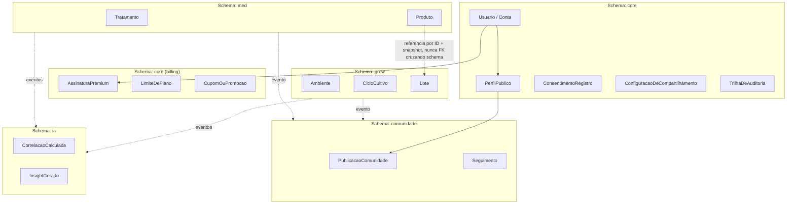
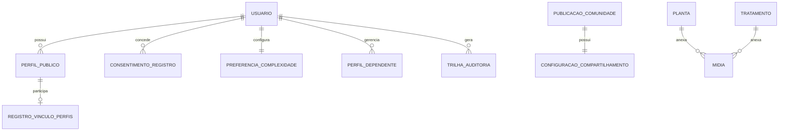
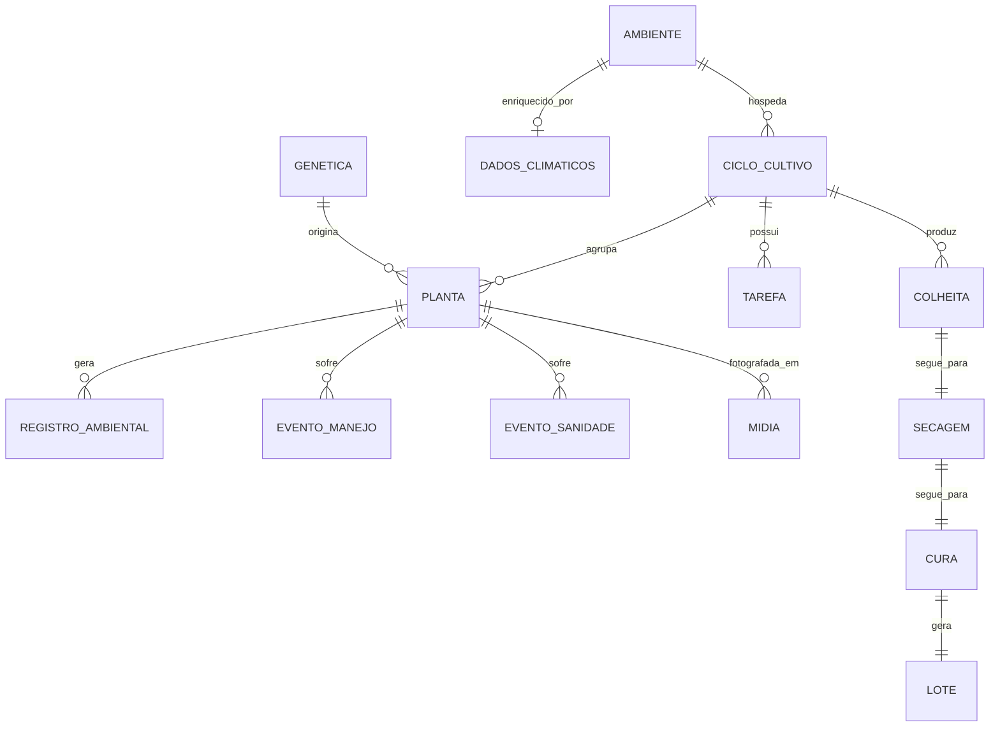
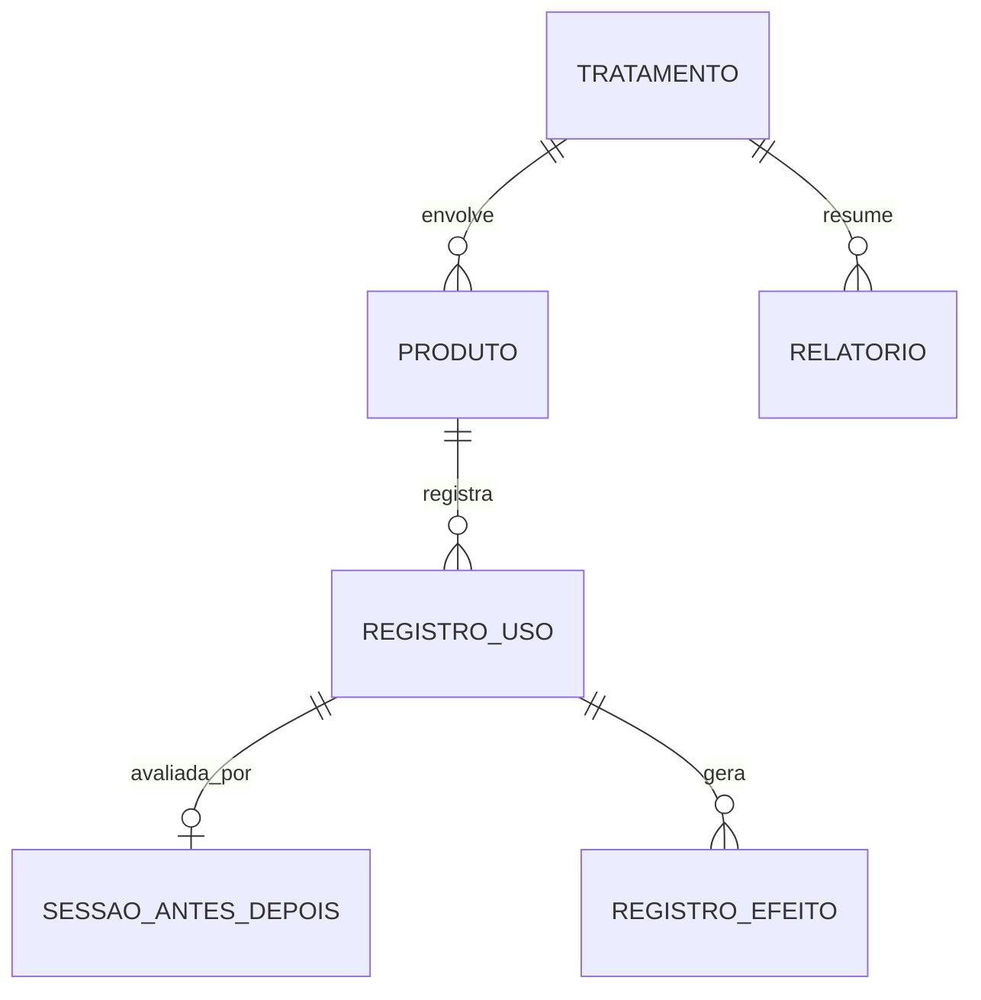
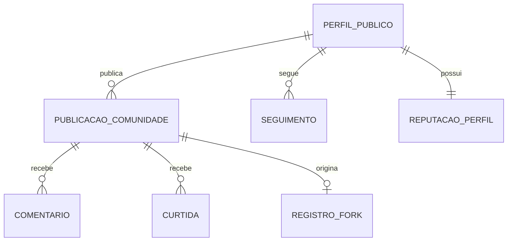
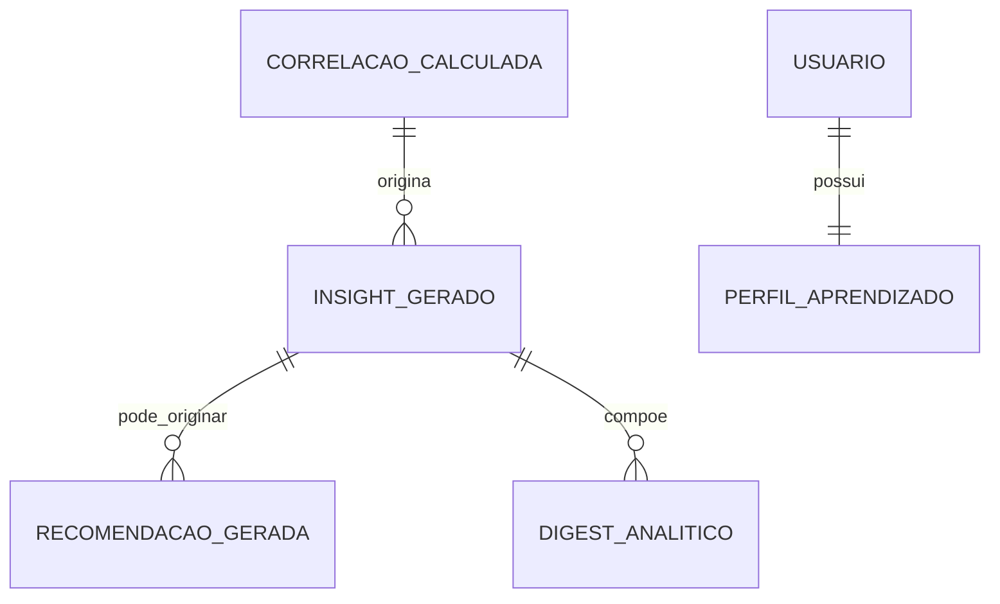
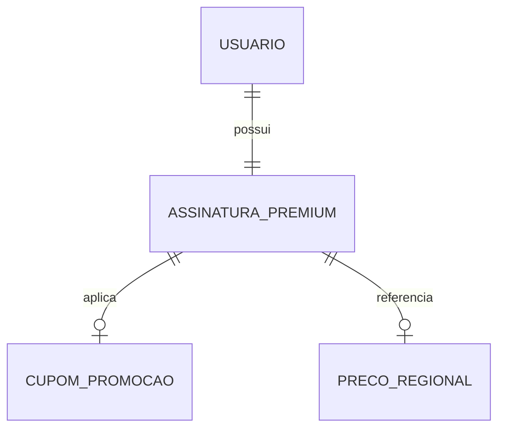
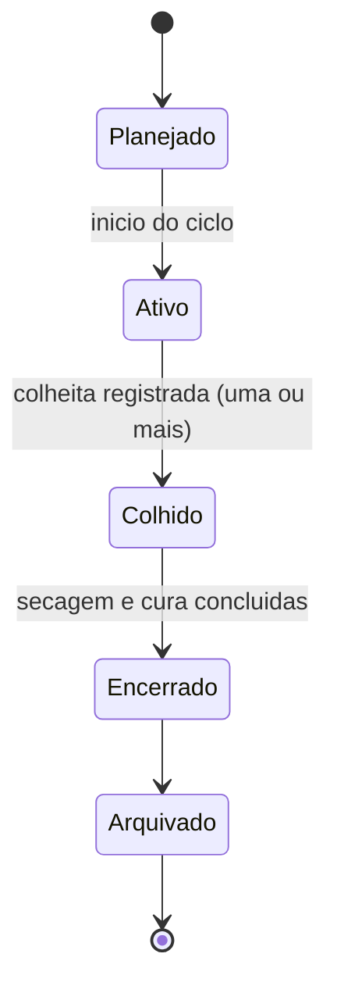
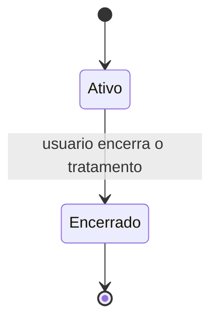
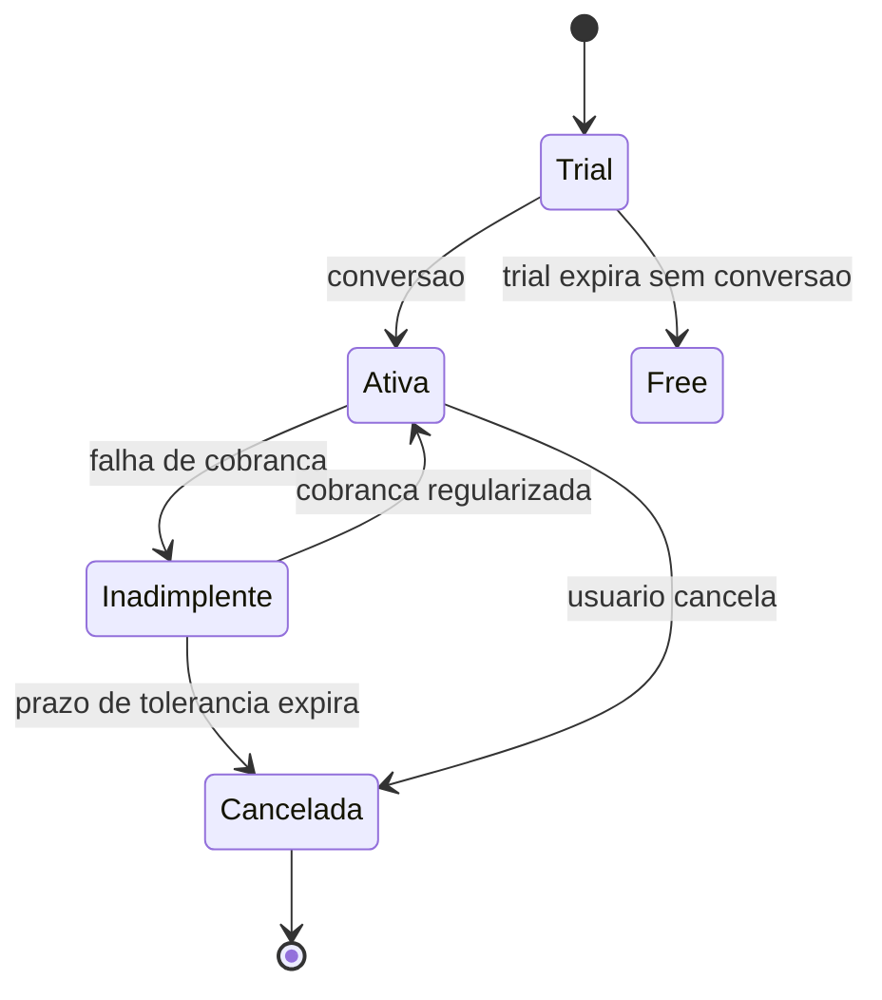

# 08 — Banco de Dados (Documento 100% Completo)

> Status: **Rascunho para validação.** Modelo **lógico** completo — o que existe, como se relaciona, quais regras governam cada entidade. Tipos físicos de dado (UUID, VARCHAR, TIMESTAMPTZ, JSONB...), índices reais e otimizações de motor específico ficam **exclusivamente para o doc 13** (decisão sua, registrada nesta conversa). Depende de todos os docs anteriores e do [Catálogo de Domínio](catalogo-de-dominio.md), que é atualizado a partir deste documento.

---

## 1. Objetivos

- Traduzir todos os modelos lógicos já especificados (docs 02, 03, 04, 05, 06, 07) num modelo de dados único, completo e implementável, organizado por módulo (Core, Grow, Med, Comunidade, IA, Premium).
- Detalhar cada entidade com profundidade suficiente para servir de referência direta de implementação: descrição, responsabilidade, módulo, atributos, relacionamentos, regras, índices conceituais, estratégia de crescimento/exclusão/versionamento.
- Aplicar, pela primeira vez de forma explícita e completa, os novos princípios permanentes de modelagem de dados (seção 4).
- Preparar o modelo para internacionalização, auditoria, LGPD, versionamento e futura integração com novos aplicativos — sem implementar nada disso agora, apenas sem bloquear.

---

## 2. Problemas que Resolve

| Problema | Como este documento resolve |
|---|---|
| Entidades já definidas em docs 02–07 estavam descritas em nível conceitual, insuficiente para implementação direta | Detalhamento completo por entidade (seção 12) |
| Risco de duplicar comportamento (crescimento/exclusão/versionamento) descrito entidade por entidade | Sistema de **arquétipos** (seção 5) — comportamento comum descrito uma vez, herdado por composição |
| Risco de enums/catálogos internos (fases, tipos de efeito, etc.) travarem a internacionalização | Padrão de código + tradução, aplicado desde já (seção 8) |
| Referências entre módulos com schema isolado (doc 04) podem gerar inconsistência se um lado for excluído | Padrão de referência cross-módulo formalizado (seção 11) |

---

## 3. Escopo

**Incluído**: modelo lógico completo de todas as entidades, diagramas ER, classificação por módulo e por natureza do dado (crítica/imutável/histórica/temporária/configuração), estratégia conceitual de séries temporais/auditoria/internacionalização/multi-tenancy.

**Fora de escopo**: tipos físicos de coluna, motor de banco, índices reais, particionamento físico, sharding — tudo isso é o doc 13.

---

## 4. Princípios Permanentes de Modelagem de Dados (novos, validados 2026-07-08)

> Aplicam-se a partir de agora a **toda** entidade da plataforma, presente ou futura — não só às deste documento.

1. Nenhuma entidade nasce pensando apenas no MVP.
2. Toda entidade permite evolução sem migração destrutiva (campos novos são sempre aditivos/opcionais, nunca exigem reescrever dado existente).
3. Evitar duplicação de dado entre entidades — preferir referência.
4. Evitar dependências circulares entre módulos (reforça a regra do doc 04 §24: nenhuma seta "de volta" ao Core).
5. Privilegiar composição em vez de duplicação (ver sistema de arquétipos, seção 5).
6. Separar claramente dado **operacional**, **histórico**, **analítico** e **de configuração** (framework da seção 5).
7. Preparar para internacionalização, múltiplos idiomas, múltiplas moedas, diferentes fusos horários.
8. Preparar para auditoria e para LGPD.
9. Preparar para versionamento.
10. Preparar para futura integração com novos aplicativos da plataforma.

*(Canonical: doc 00, §16.)*

---

## 5. Classificação de Dados e Sistema de Arquétipos

### 5.1 Quatro naturezas de dado

| Natureza | Definição | Exemplos |
|---|---|---|
| **Operacional** | Estado atual de algo que o usuário está fazendo agora; mutável, alta frequência de leitura | `CicloCultivo` ativo, `Tratamento` em curso |
| **Histórico** | Registro de evento passado; imutável após criado, append-only | `RegistroAmbiental`, `Colheita`, `RegistroDeUso` |
| **Analítico** | Derivado/calculado a partir de dado histórico; regenerável, não é fonte de verdade | `CorrelacaoCalculada`, `InsightGerado` |
| **Configuração** | Parâmetro que rege comportamento do sistema; muda raramente, sempre versionado | `PoliticaDeAgregacao`, `LimiteDePlano` |

### 5.2 Arquétipos (comportamento comum, evita repetição campo a campo em cada entidade)

Para não duplicar 48 vezes a mesma descrição de índice/crescimento/exclusão/versionamento, cada entidade abaixo referencia um destes arquétipos — só as regras **específicas** daquela entidade são descritas individualmente (aplicação direta do princípio 5 desta seção).

| Arquétipo | Natureza | Crescimento | Exclusão | Versionamento | Índice conceitual padrão |
|---|---|---|---|---|---|
| **A — Operacional Principal** | Operacional | Moderado (1 registro por instância ativa) | Soft-delete (nunca hard-delete imediato); hard-delete só via fluxo de exclusão de conta (doc 04 §21.2) | Não versionado linha-a-linha; mudanças relevantes geram entrada na Trilha de Auditoria (seção 7) | Por usuário/dono + status |
| **B — Histórico Imutável (Append-Only)** | Histórico | Alto/rápido — candidato primário a particionamento temporal (seção 6) | Só via fluxo de exclusão de conta/portabilidade (doc 04 §21); usuário nunca edita/apaga um registro individual (correção = novo registro compensatório) | N/A (imutável por definição) | Por (entidade-pai, timestamp) |
| **C — Saída Analítica da IA** | Analítico | Alto, mas com retenção mais curta possível (regenerável) | Pode ser expurgada agressivamente sem perda real de informação | Cada saída carrega a versão do modelo/algoritmo que a gerou (doc 05 §7.2) | Por (usuário, tipo de insight, data) |
| **D — Configuração** | Configuração | Baixo (poucas linhas) | Raramente excluída — apenas desativada (flag) | **Sempre versionado** — mudança gera nova versão datada, nunca sobrescreve silenciosamente | Por (chave de configuração, vigência) |
| **E — Interação Social Leve** | Operacional | Alto, proporcional a engajamento | Hard-delete permitido quando o próprio usuário remove (ex.: descurtir) | N/A | Por (publicação, autor da interação) |

---

## 6. Estratégia Conceitual de Séries Temporais

Aplica-se a todas as entidades do Arquétipo B ligadas a medições contínuas (`RegistroAmbiental`, `RegistroDeSintomaDiario`, e futuramente qualquer fonte externa — doc 05 §16).

- Modelo **append-only**: nenhuma escrita é um `UPDATE`, sempre um novo registro com timestamp.
- Preparado para **particionamento temporal** (conceitual: dado é naturalmente divisível por janelas de tempo — dia/semana/mês — sem depender de qual motor implementará isso).
- Toda entidade de série temporal carrega, desde o MVP, um campo **origem do registro** (`manual` | `sensor` | `importado`) — mesmo que hoje só `manual` seja usado — para que futuras integrações (IoT, wearables, doc 05 §16) não exijam migração de schema, apenas passem a popular um valor diferente.
- Crescimento de longo prazo é responsabilidade do doc 13 (estratégia de arquivamento/agregação física), mas o modelo lógico já assume que dado bruto antigo pode ser agregado/resumido sem perda do dado analítico já derivado (Arquétipo C não depende do dado bruto permanecer acessível indefinidamente, só das conclusões já calculadas).

---

## 7. Estratégia Conceitual de Auditoria e Rastreabilidade

Generaliza o que o doc 04 §21 já previa para privacidade: existe um padrão único de **Trilha de Auditoria**, aplicado a qualquer entidade crítica (seção 14) — não apenas privacidade.

- **TrilhaDeAuditoria** (nova entidade, Core): entidade afetada, tipo de mudança, quem, quando, valor anterior/novo (resumido). `RegistroDeAuditoriaDePrivacidade` (doc 04) passa a ser o caso de uso específico deste padrão geral aplicado a `ConfiguraçãoDeCompartilhamento`/`ConsentimentoRegistro` — não é uma entidade paralela, é uma instância do mesmo mecanismo.
- Aplicada a: `ConsentimentoRegistro`, `ConfiguraçãoDeCompartilhamento`, `AssinaturaPremium`, `RegistroDeVinculoDePerfis` — qualquer entidade cuja mudança tenha implicação legal, financeira ou de privacidade.
- Todo texto legal aceito pelo usuário (disclaimer de IA, doc 05 §10; termos de uso) referencia uma **versão** desse texto — nunca "o usuário aceitou os termos", sempre "o usuário aceitou os termos **versão X**, em tal data".

---

## 8. Estratégia de Internacionalização de Dados

- **Idiomas**: qualquer catálogo/enum interno da plataforma (fases de vida, tipos de efeito adverso, tipos de evento de sanidade, vias de administração, tipos de ambiente) é armazenado como um **código estável**, nunca como texto em português diretamente na linha — o texto exibido vem de uma tabela de tradução por idioma, chaveada pelo código. *(Achado da auditoria de consistência, seção 17 — aplicado retroativamente às entidades que descreviam esses catálogos em texto livre nos docs 02/03.)*
- **Moedas**: já preparado no doc 07 (`AssinaturaPremium`, `PrecoRegional`).
- **Fusos horários**: todo timestamp é armazenado em UTC; conversão para fuso local acontece na camada de apresentação (já um princípio do doc 04 §19).
- Dado gerado pelo próprio usuário (nome de planta, biografia, texto livre) nunca precisa de tradução — só os catálogos/enums do sistema.

---

## 9. Preparação para Multi-Tenancy Futuro (COSMARIA Business)

**Não modelado agora** (confirmado por você) — apenas garantindo que nada bloqueia depois:

- `Usuário` e `AssinaturaPremium` são desenhados para receber, no futuro, uma referência **opcional e aditiva** a uma entidade `Organizacao` (ainda inexistente) — adicionar essa coluna/relacionamento depois é uma migração aditiva, não destrutiva (princípio 2, seção 4).
- Nenhuma regra de negócio atual assume "um usuário = uma pessoa física isolada" de forma que impeça agrupamento futuro por organização.

---

## 10. Diagrama Geral por Módulo

---

## 11. Padrão de Referência Cross-Módulo (regra geral, não só Grow↔Med)

> Generaliza a decisão já tomada no doc 04 §23 especificamente para Lote↔Produto — aqui vira regra para **qualquer** referência entre módulos com schema isolado.

Toda referência de uma entidade de um módulo a uma entidade de outro módulo é:
1. **Por identificador (ID)**, nunca uma chave estrangeira de banco cruzando schemas (doc 04 §16).
2. Acompanhada de um **snapshot resumido, somente leitura**, capturado no momento da referência — garante que a experiência de leitura não quebre se o registro de origem for depois alterado ou excluído.
3. Resolvida em tempo de escrita **através da interface pública de aplicação** do módulo dono (nunca lendo o schema do outro módulo diretamente), conforme doc 04 §9.

Isso é o que torna o modelo consistente mesmo sem integridade referencial garantida pelo banco entre schemas — **achado da auditoria de consistência (seção 17)**, agora formalizado como regra permanente.

---

## 12. Catálogo Detalhado de Entidades

> Notação de cardinalidade nos diagramas ER usa nomes sem acento (identificadores Mermaid); a prosa usa os nomes acentuados já consolidados no [Catálogo de Domínio](catalogo-de-dominio.md).

### 12.1 Core — Identidade, Privacidade, Consentimento

*(`Mídia` é Core — ver nota da revisão 00-09 abaixo — referenciada por `Planta` (Grow) e `Tratamento` (Med) sem duplicação de capacidade.)*

**Usuário (Conta)** — entidade crítica, tratamento individual completo (não usa arquétipo padrão, dada sua centralidade):
- Descrição: a conta de login da plataforma — um humano, um cadastro.
- Responsabilidade: identidade, autenticação, ponto único de assinatura (doc 07 §5) e permissões.
- Módulo: Core.
- Atributos principais: identificador, e-mail/credencial, data de criação, status (ativo/suspenso/em exclusão), preferências regionais (idioma, fuso, moeda).
- Relacionamentos: 1—N `PerfilPúblico`; 1—1 `AssinaturaPremium`; 1—N `ConsentimentoRegistro`; 1—N `PerfilDependente` (Versão 2); 1—1 `PreferênciaDeComplexidade`; 1—1 `PreferênciaDeNotificação`.
- Regras importantes: nunca exposta diretamente à Comunidade (só via `PerfilPúblico`); exclusão dispara `ContaExclusaoSolicitada` (doc 04 §21.2), nunca um `DELETE` direto.
- Índices conceituais: por credencial (login), por status.
- Crescimento: 1 linha por usuário registrado — baixo crescimento relativo (comparado a dados históricos).
- Exclusão: nunca imediata — sempre via fluxo de exclusão orientado a evento, com janela de confirmação.
- Versionamento: N/A diretamente, mas mudanças de e-mail/credencial geram `TrilhaDeAuditoria`.

**PerfilPúblico** *(Arquétipo A, com regra específica adicional)*:
- Descrição: identidade pública de uma Conta num contexto de aplicativo (Grow, Med, futuros — doc 06).
- Atributos principais: contexto (grow/med/futuro), nome de exibição (opcional no Med), avatar (opcional), biografia (opcional), estatísticas agregadas (contadores denormalizados — ver seção 17).
- Relacionamentos: N—1 `Usuário`; 1—N `Seguimento` (como seguidor e como seguido, escopado ao mesmo contexto); 1—N `PublicaçãoComunidade`; 0—1 `RegistroDeVinculoDePerfis`.
- Regra específica: **nunca** uma consulta pode retornar `PerfilPúblico` de contextos diferentes da mesma Conta juntos, salvo checagem explícita de `RegistroDeVinculoDePerfis` (doc 06 §13) — regra de nível de acesso a dado, não só de aplicação.

**ConsentimentoRegistro** *(não usa arquétipo D puro — é o próprio mecanismo de versionamento)*:
- Descrição: registro de consentimento do usuário para um propósito específico (vínculo Grow↔Med, participação em agregados, termos de uso).
- Atributos principais: tipo de consentimento, versão do texto aceito, concedido em, revogado em (nulo se ainda vigente).
- Relacionamentos: N—1 `Usuário`.
- Regra importante: nunca é sobrescrito — revogar cria um novo estado (`revogado_em` preenchido), o histórico completo de consentimento permanece.
- Índices conceituais: por (usuário, tipo, vigência).

**ConfiguraçãoDeCompartilhamento** *(Arquétipo D, com auditoria obrigatória)*:
- Descrição: entidade única do Core (doc 04) com os flags de dimensão × escopo de uma publicação — vocabulário de dimensão registrado por módulo (Grow ≠ Med).
- Atributos principais: dimensões habilitadas (lista, vocabulário por módulo), escopo de visibilidade (seguidores/amigos*/link*/público).
- Relacionamentos: 1—1 `PublicaçãoComunidade`.
- Regra importante: toda alteração gera `TrilhaDeAuditoria` — é o tipo de dado mais sensível a erro silencioso da plataforma (doc 02 §16).

**PreferênciaDeComplexidade**, **PreferênciaDeNotificação** *(Arquétipo D)*: uma linha por Usuário, leitura frequente, mudança rara.

**PerfilDependente** *(Arquétipo A — Versão 2, doc 03 §18)*:
- Descrição: perfil gerenciado por um Usuário Responsável, sem exigir conta própria do dependente.
- Relacionamentos: N—1 `Usuário` (o Responsável); herda a mesma árvore de entidades do Med (Tratamento, Produto, etc.) por dependente.
- Regra importante: toda operação em nome de um dependente carrega a identidade do Responsável autenticado (doc 04 §11) — nunca um acesso anônimo a dado de dependente.

**RegistroDeVinculoDePerfis** *(Arquétipo A — Versão 2, doc 06)*:
- Descrição: vínculo público opt-in entre dois ou mais `PerfilPúblico` da mesma Conta.
- Regra importante: reversível a qualquer momento; sua simples existência (ou ausência) já é a resposta à pergunta "estes dois perfis são a mesma pessoa?" — por isso não pode ser inferido, só criado explicitamente.

**TrilhaDeAuditoria** *(Arquétipo B — Histórico Imutável)*:
- Descrição: mecanismo geral de auditoria (seção 7), aplicado a entidades críticas.
- Atributos principais: entidade afetada, tipo de mudança, ator, timestamp, resumo do valor anterior/novo.

**Mídia** *(Arquétipo B — reclassificada do Grow para o Core na revisão arquitetural 00–09)*:
- Descrição: arquivo de mídia (foto, documento) anexado a uma entidade de qualquer módulo.
- Responsabilidade: upload, versionamento e recuperação de mídia — capacidade genérica, não exclusiva de um app.
- Módulo: Core (doc 04 §7.1, "Armazenamento de Mídia").
- Relacionamentos: 0—N com `Planta` (Grow) **e** 0—N com `Tratamento`/`RegistroDeUso` (Med, para exames/documentos) — referência polimórfica por (tipo de entidade, ID), seguindo o mesmo espírito do Padrão de Referência Cross-Módulo (seção 11), só que dentro do próprio Core.
- Regra importante: nenhuma lógica de armazenamento é duplicada entre Grow e Med — ambos consomem a mesma capacidade.
- Achado da revisão: modelar `Mídia` como "do Grow" foi o mesmo tipo de erro já cometido (e corrigido) com Comunidade/Motor de Privacidade no doc 04 — um sinal de que vale a pena, ao introduzir qualquer entidade nova, perguntar explicitamente "isso é exclusivo deste app, ou outro módulo vai precisar da mesma coisa depois?".

---

### 12.2 Grow

**Ambiente** *(Arquétipo A)*: tipo (indoor/outdoor/estufa), dimensões, capacidade. Relacionamentos: N—1 Usuário; 1—N `CicloCultivo`; 0—1 `DadosClimáticos` (só outdoor, Módulo Outdoor desacoplado — doc 02 §6).

**Genética** *(Arquétipo A — praticamente estática após criada)*: nome, tipo (fotoperiódica/autoflorescente), linhagem. Relacionamentos: 1—N `Planta`.

**CicloCultivo** *(Arquétipo A, entidade central do Grow)*:
- Atributos principais: fase atual, data de início, data de encerramento (nulo se ativo), ambiente associado.
- Relacionamentos: N—1 `Ambiente`; 1—N `Planta`; 1—N `Tarefa`; 1—N `Colheita` (**0—N, corrigido no doc 04 §25** — nunca 1—1); 0—1 `PublicaçãoComunidade`.
- Regra importante: transição de fase é sempre registrada com timestamp (base para métricas de duração de fase, doc 02 §5.12).

**Planta** *(Arquétipo A)*: fase de vida (código, ver seção 8), data de germinação. Relacionamentos: N—1 `Genética`; N—1 `CicloCultivo`; 1—N `RegistroAmbiental`, `EventoManejo`, `EventoSanidade`, `Mídia`.

**RegistroAmbiental** *(Arquétipo B — série temporal)*: pH, EC, temperatura, umidade, VPD/PPFD/DLI calculados, origem do registro (manual/sensor/importado — seção 6).

**EventoManejo**, **EventoSanidade** *(Arquétipo B)*: tipo (código), severidade (Sanidade), observações, timestamp.

*(`Mídia` deixou de ser exclusiva do Grow — ver seção 12.1, Core. Aqui, `Planta` apenas referencia `Mídia` do Core.)*

**ModeloDeCiclo** *(Arquétipo A, novo — Premium, revisão 00-09)*:
- Descrição: template nomeado e reutilizável de configuração de ciclo (ambiente/genética/rotina padrão), distinto de simplesmente clonar o último ciclo (doc 02 §7).
- Relacionamentos: N—1 Usuário; pode ser criado a partir de um `CicloCultivo` existente ou do zero.
- Dá suporte de banco à funcionalidade Premium "templates avançados de ciclo" (doc 07 §8), que antes não tinha entidade correspondente.

**Tarefa** *(Arquétipo A)*: tipo, recorrência, status (pendente/concluída), origem (manual ou gerada por `AlertaGerado` da IA).

**Colheita** *(Arquétipo B, corrigida)*: subconjunto de plantas colhidas, peso úmido, data — **0—N por `CicloCultivo`**, cada uma vinculada a um subconjunto de `Planta` (correção do doc 04 §25, permite colheita escalonada).

**Secagem**, **Cura** *(Arquétipo B)*: duração, condições. 1—1 com a `Colheita`/`Secagem` anterior na cadeia.

**Lote** *(entidade crítica, tratamento individual — é o ponto de ponte com o Med)*:
- Descrição: unidade final de um processo de colheita/secagem/cura, potencialmente referenciada pelo Med.
- Relacionamentos: N—1 `Cura`; **0—N referência opt-in a `Produto` (Med)** — seguindo o Padrão de Referência Cross-Módulo (seção 11): por ID + snapshot, nunca FK direta.
- Regra importante: mesmo que o `CicloCultivo`/`Planta` de origem seja modificado depois, o snapshot capturado no momento do vínculo permanece estável no lado do Med.

---

### 12.3 Med

**Tratamento** *(Arquétipo A)*: condição/motivo, data de início/fim, objetivo terapêutico. Relacionamentos: N—1 Usuário (ou `PerfilDependente`, Versão 2); 1—N `Produto`; 1—N `Relatorio`.

**Produto** *(Arquétipo A)*: nome, tipo, concentração CBD/THC. Relacionamentos: N—1 `Tratamento`; 1—N `RegistroDeUso`; 0—1 referência opt-in a `Lote` (Grow, ver seção 11).

**RegistroDeUso** *(Arquétipo B)*: quantidade, horário, via de administração (código). Relacionamentos: N—1 `Produto`; 0—1 `SessãoAntesDepois`; 1—N `RegistroDeEfeito`.

**SessãoAntesDepois** *(Arquétipo B, com regra de tempo)*: intensidade antes, intensidade depois, intervalo configurável entre as duas medições (doc 03 §5.4). Regra importante: o registro "depois" depende de notificação confiável (risco técnico já identificado no doc 03, Artefatos).

**RegistroDeSintomaDiario** *(Arquétipo B — linha de base, independente de uso)*: humor, ansiedade, dor, sono, apetite — escala simples, timestamp diário.

**RegistroDeEfeito** *(Arquétipo B)*: tipo (positivo/adverso, código), intensidade, duração.

**Relatorio** *(Arquétipo C — é conteúdo compilado, não fonte primária)*: período coberto, conteúdo compilado (via Motor de Relatórios da IA, doc 05 §6.6, renderizado pelo Core, doc 04 §7.1).

**ModeloDeTratamento** *(Arquétipo A, novo — Premium, revisão 00-09)*: mesmo conceito de `ModeloDeCiclo`, aplicado ao Med — template nomeado de tratamento/produtos.

*(Anexos/exames do Med usam `Mídia`, agora Core — ver seção 12.1. `Tratamento`/`RegistroDeUso` referenciam `Mídia` do mesmo modo que `Planta` no Grow.)*

---

### 12.4 Comunidade (Core, aplicada por contexto — Grow/Med)

**PublicaçãoComunidade** *(Arquétipo A, projeção de leitura — doc 04 §9.1)*: referência ao conteúdo de origem (Growlog/Experiência) por ID + snapshot filtrado pelo Motor de Privacidade, contexto (herdado do `PerfilPúblico` autor). Atualizada de forma assíncrona via `ConteudoCompartilhadoAtualizado`.

**Comentário**, **Curtida** *(Arquétipo E)*: **achado de escalabilidade (seção 17)** — `PublicaçãoComunidade` mantém um **contador denormalizado** de curtidas/comentários, nunca calculado por `COUNT()` em tempo de leitura.

**Seguimento** *(Arquétipo E, com restrição estrutural)*: relação entre dois `PerfilPúblico` — **restrita ao mesmo contexto** (impossível seguir através de contextos diferentes, doc 06 §13, reforçando isolamento por partição, não só por regra de aplicação).

**RegistroDeFork** *(Arquétipo B — exclusivo do contexto Grow)*: referência à publicação de origem + Ciclo criado a partir dela.

**ReputaçãoDoPerfil** *(Arquétipo C — derivada, recalculável)*: pontuação/selos por contexto — nunca agregada entre contextos (doc 06 §12).

**VisualizacaoDePerfil** *(novo, Premium — revisão 00-09, variante do Arquétipo B com retenção curta)*: dá suporte de banco à funcionalidade "estatísticas avançadas de perfil (quem visitou, alcance)" do doc 06 §11/doc 07 §8, antes prometida sem entidade correspondente. Regra importante de minimização de dado: **não** é um log individual permanente — agregado em contador após uma janela curta de retenção, para não virar, em si, um novo risco de privacidade (saber quem visitou o perfil de quem, indefinidamente).

---

### 12.5 Inteligência Artificial

Todas as entidades desta seção seguem o **Arquétipo C** (analítico, derivado, versão do algoritmo registrada) — ver doc 05 §6 para responsabilidade/entradas/saídas de cada motor; aqui, apenas o registro de dado correspondente a cada saída.

**CorrelacaoCalculada**: fator, resultado, força, direção, confiança, tamanho da amostra, período. **InsightGerado**: referência à correlação de origem + texto/estrutura de explicabilidade completa (doc 05 §7). **AlertaGerado**: severidade, sugestão de ação vinculável a `Tarefa` (Grow). **RecomendacaoGerada**: referência a insight(s) de origem. **DigestAnaliticoGerado**: período, lista de insights/alertas/recomendações incluídos.

**PerfilDeAprendizadoDoUsuario** *(Arquétipo D — configuração que evolui por aprendizado, não por ação manual do usuário)*: limiares individuais ajustados, frequência de notificação preferida — 1—1 com `Usuário`.

---

### 12.6 Premium (Billing — Core)

**AssinaturaPremium** *(entidade crítica, tratamento individual)*:
- Atributos principais: status (trial/ativa/inadimplente/cancelada), moeda, ciclo de cobrança (mensal/anual), plano.
- Relacionamentos: 1—1 `Usuário`; 0—1 `CupomOuPromocao` aplicado; 0—1 `PrecoRegional`.
- Regra importante: mudança de status sempre gera `TrilhaDeAuditoria` (implicação financeira).

**LimiteDePlano** *(Arquétipo D)*: chave (ex.: `grow.ambientes_simultaneos`), valor (ex.: 2), vigência — nunca lido como constante de código (doc 07 §9).

**CupomOuPromocao**, **PeriodoGratuitoConfiguracao**, **PrecoRegional** *(Arquétipo D)*: regras de elegibilidade/validade, moeda/país. Nenhum valor monetário real definido neste documento (decisão comercial, não arquitetural — doc 07 §9.1).

---

## 13. Fluxo de Vida das Principais Entidades

*(CicloCultivo)*

*(Tratamento — histórico permanece acessível mesmo Encerrado, doc 07 §9)*

*(AssinaturaPremium)*

---

## 14. Identificação de Entidades por Característica

| Característica | Entidades |
|---|---|
| **Críticas** (falha/corrupção tem alto impacto) | `Usuário`, `AssinaturaPremium`, `ConsentimentoRegistro`, `ConfiguraçãoDeCompartilhamento`, `Lote` (ponte Grow↔Med) |
| **Imutáveis** (Arquétipo B, nunca editadas) | `RegistroAmbiental`, `EventoManejo`, `EventoSanidade`, `Colheita`, `RegistroDeUso`, `SessãoAntesDepois`, `RegistroDeSintomaDiario`, `RegistroDeEfeito`, `RegistroDeFork`, `TrilhaDeAuditoria` |
| **Históricas** (consulta de longo prazo, além das imutáveis acima) | `Relatorio`, `DigestAnaliticoGerado` |
| **Temporárias** (vida curta, alta rotatividade) | Sessão/token de autenticação (Core — formalizada nesta seção, ver nota abaixo) |
| **De Configuração** | `PoliticaDeAgregacao`, `LimiteDePlano`, `PrecoRegional`, `PeriodoGratuitoConfiguracao`, `PreferênciaDeComplexidade`, `PreferênciaDeNotificação`, `CupomOuPromocao` |

**Nota**: o fluxo de autenticação (doc 04 §10) já mencionava token de acesso/refresh token, mas nunca havia sido formalizado como entidade catalogada — corrigido aqui e refletido no Catálogo de Domínio como `SessaoDeAutenticacao` (Arquétipo E-like: vida curta, exclusão/expiração natural, sem necessidade de retenção histórica).

---

## 15. Boas Práticas

- Nenhuma entidade nova, em qualquer documento futuro, deve ser criada sem primeiro checar o [Catálogo de Domínio](catalogo-de-dominio.md) e se enquadrar em um arquétipo (seção 5) — ou justificar explicitamente por que precisa de tratamento individual (como `Usuário`, `AssinaturaPremium` e `Lote` aqui).
- Contadores denormalizados (curtidas, comentários, estatísticas de perfil) são sempre atualizados de forma incremental (evento), nunca recalculados por varredura completa em tempo de leitura.
- Toda referência cross-módulo segue o padrão da seção 11, sem exceção.

---

## 16. Riscos

| Risco | Observação |
|---|---|
| Ausência de integridade referencial garantida pelo banco entre schemas (decisão do doc 04) | Mitigado pelo padrão de referência cross-módulo (seção 11), mas exige disciplina de aplicação — reforçar com testes automatizados |
| Volume de dado histórico (Arquétipo B) crescendo indefinidamente | Estratégia de particionamento conceitual definida (seção 6); decisão física fica para o doc 13 |
| Catálogos/enums ainda não migrados para o padrão código+tradução em nenhum documento anterior | Ver seção 17 — já sinalizado como correção a aplicar |

---

## 17. Auditoria de Consistência do Modelo (obrigatória antes de finalizar este documento)

> Conforme solicitado: o documento só é considerado concluído depois desta auditoria e das correções aplicadas.

| Verificação | Achado | Correção aplicada |
|---|---|---|
| **Redundâncias** | `RegistroDeAuditoriaDePrivacidade` (doc 04) e a necessidade de auditoria mais ampla (Premium, Consentimento) poderiam virar dois mecanismos paralelos | Generalizado em um único `TrilhaDeAuditoria` (seção 7); `RegistroDeAuditoriaDePrivacidade` passa a ser um caso de uso desse mecanismo, não uma entidade paralela |
| **Escalabilidade** | Contagem de curtidas/comentários por `COUNT()` em tempo de leitura não escala para publicações populares | Adotado contador denormalizado, atualizado por evento (seção 12.4, seção 15) |
| **Riscos de performance** | Recalcular `CorrelacaoCalculada` a cada novo evento (já sinalizado como risco no doc 05) | Nenhuma correção nova necessária aqui — risco já reconhecido e endereçado no doc 05 (recomputação incremental/periódica), apenas confirmado como consistente com o Arquétipo C |
| **Riscos de consistência** | Referências cross-módulo (Lote↔Produto e outras futuras) sem integridade referencial de banco | Formalizado como regra geral (seção 11), não só uma exceção do Grow↔Med |
| **Riscos de internacionalização** | Catálogos internos (fase de vida, tipo de efeito, via de administração, tipo de evento de sanidade) descritos como texto livre em português nos docs 02/03 | Adotado padrão código + tabela de tradução (seção 8) — aplicável a todos esses catálogos a partir de agora |
| **Riscos para futuras integrações** | Entidades de série temporal não distinguiam a origem do dado (manual vs. futura fonte externa) | Adicionado campo conceitual "origem do registro" desde o MVP (seção 6) |

**Conclusão da auditoria**: modelo consistente após as correções acima — todas já incorporadas ao restante deste documento (não ficam como pendência para depois).

---

## 18. Sugestões de Melhorias

- Ao chegar no doc 13, avaliar se séries temporais (Arquétipo B ligado a medição contínua) justificam um motor de armazenamento diferente do banco relacional principal desde o MVP, ou só a partir de volume real observado (mesma reflexão já registrada no doc 04 §28).
- Avaliar, no doc 09, expor o padrão código+tradução (seção 8) como um endpoint genérico de catálogo, reutilizável por Grow e Med.

---

## 19. Classificação de Escopo (MVP / V2 / V3 / Futuro / Pesquisa)

| Item | Classificação |
|---|---|
| Modelo lógico completo de Core/Grow/Med/Comunidade/IA/Premium | **MVP** |
| `PerfilDependente`, `RegistroDeVinculoDePerfis` (modelo de dado pronto, feature desligada) | **Versão 2** (já definido em docs 03/06) |
| Padrão código+tradução para catálogos internos | **MVP** (estrutura), tradução para outros idiomas além do português é **Futuro** |
| `Organizacao` (multi-tenancy B2B) | **Futuro** — apenas não bloqueado (seção 9) |
| Particionamento físico de série temporal | Decisão de **doc 13** |

---

## 20. Revisão Final de Arquitetura

- **Dificulta futuras integrações?** Não — origem do registro (seção 6) e padrão de referência cross-módulo (seção 11) foram desenhados exatamente para isso.
- **Dificulta internacionalização?** Não — corrigido nesta própria auditoria (seção 17), catálogos agora código+tradução.
- **Dificulta escalabilidade?** Não — contadores denormalizados corrigidos (seção 17); estratégia de série temporal preparada (seção 6).
- **Dificulta integração com novos aplicativos futuros da COSMARIA?** Não — todo o modelo do Core (Perfil Público, Configuração de Compartilhamento, Assinatura) já foi desenhado nos docs 04/06/07 para acomodar novos contextos sem redesenho; este documento não introduz nenhuma exceção a isso.

Nenhuma limitação arquitetural relevante encontrada após as correções da seção 17.

---

## Decisões Consolidadas (validado com o usuário em 2026-07-08)

| # | Tema | Decisão |
|---|---|---|
| 1 | `SessaoDeAutenticacao` | Confirmada como entidade oficial do Core |
| 2 | `TrilhaDeAuditoria` | Confirmada como mecanismo único de auditoria da plataforma — toda entidade crítica deve utilizá-la, nunca mecanismos paralelos |

Este documento está **concluído**. Seguimos para o **Documento 09 — APIs**.

---

## Artefatos para Implementação

### Checklist Técnico
- [ ] Modelar todas as entidades desta seção 12 no schema físico correspondente (doc 13 define o motor)
- [ ] Implementar `TrilhaDeAuditoria` como mecanismo único, aplicado às entidades da seção 7
- [ ] Implementar padrão código+tradução para todos os catálogos internos listados na seção 8
- [ ] Implementar contadores denormalizados para Curtida/Comentário
- [ ] Implementar campo "origem do registro" em todas as entidades de série temporal
- [ ] Implementar `SessaoDeAutenticacao` (token/refresh token) formalmente catalogada
- [ ] Corrigir modelagem de `Colheita` para 0—N por `CicloCultivo` (já sinalizado no doc 02/04, reforçado aqui)

### Lista de Módulos
Core (Identidade, Consentimento, Privacidade, Auditoria, Billing) · Grow · Med · Comunidade · IA — mesma divisão do doc 04, agora com o modelo de dado completo.

### Lista de Entidades do Banco
Todas as listadas na seção 12 (48 entidades) — ver [Catálogo de Domínio](catalogo-de-dominio.md) para a versão consolidada e atualizada.

### Lista de APIs Necessárias
Detalhamento completo fica para o doc 09 — este documento apenas garante que toda entidade tem os atributos necessários para os endpoints já esboçados nos docs 02/03/05/06/07.

### Lista de Permissões
Nenhuma nova além das já previstas no Core (doc 04).

### Eventos
Nenhum evento novo além do catálogo já existente — este documento consome o Catálogo de Domínio, não adiciona eventos.

### Casos de Teste
- Nenhuma consulta consegue recuperar duas entidades de módulos diferentes sem passar pelo padrão de referência cross-módulo (seção 11)
- Exclusão de conta expurga/anonimiza corretamente entidades de todos os arquétipos, respeitando a natureza de cada uma (histórico permanece rastreável até o expurgo final, configuração é removida, analítico é descartado sem impacto)
- Alterar `ConfiguraçãoDeCompartilhamento` gera entrada em `TrilhaDeAuditoria`
- Curtidas/comentários em massa não degradam performance de leitura de uma publicação popular (contador denormalizado correto)

### Dependências com Outros Módulos
Nenhuma nova — este documento consolida dependências já mapeadas no doc 04 §24.

### Riscos Técnicos
- Migração do padrão código+tradução para catálogos que hoje (docs 02/03) descrevem valores como texto livre exige um mapeamento cuidadoso na hora da implementação (doc 13/14), não é automática
- Contadores denormalizados exigem consistência eventual bem tratada (evento de curtida/comentário pode chegar fora de ordem) — mitigar com operações idempotentes
