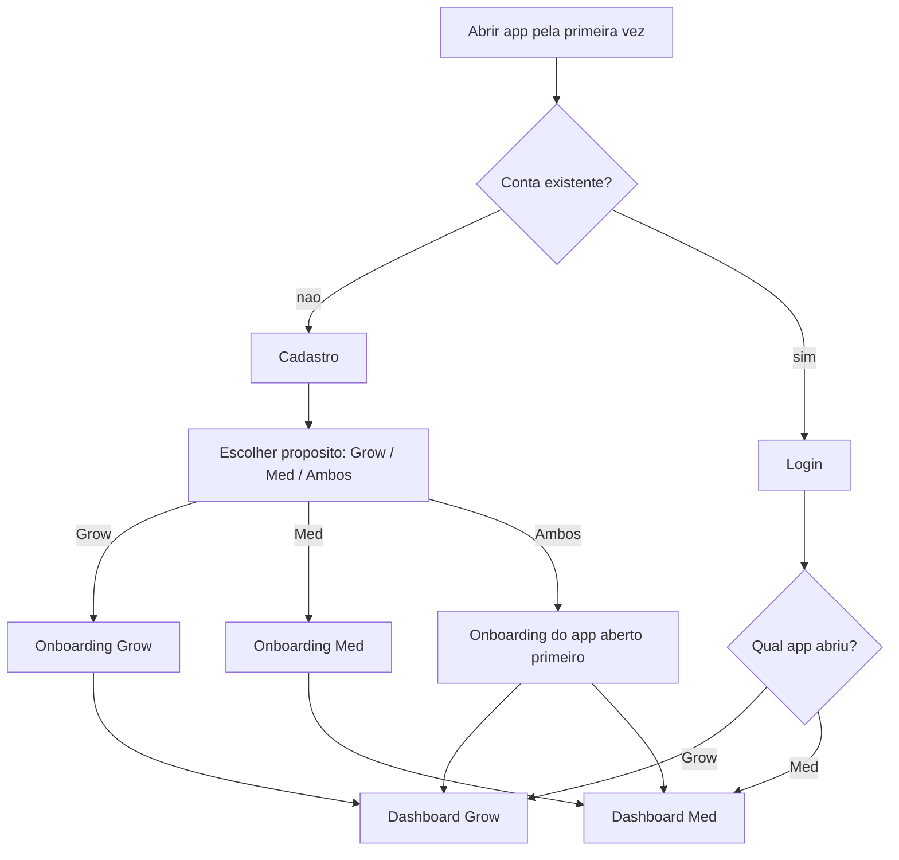
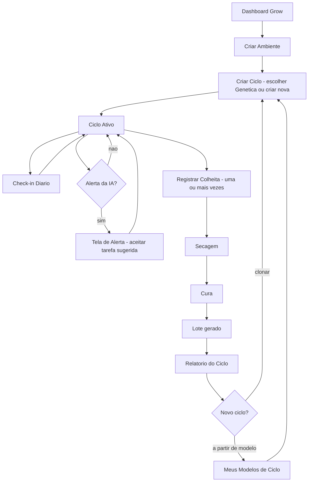
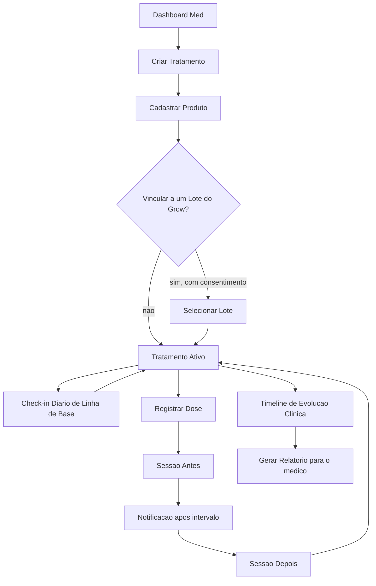
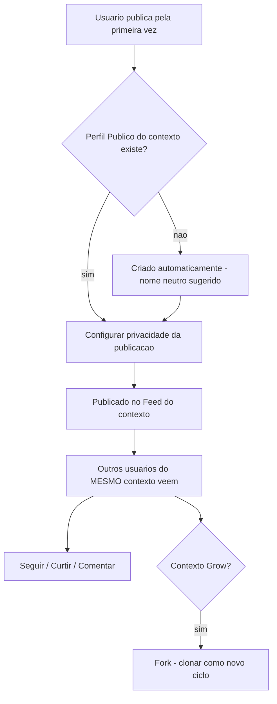
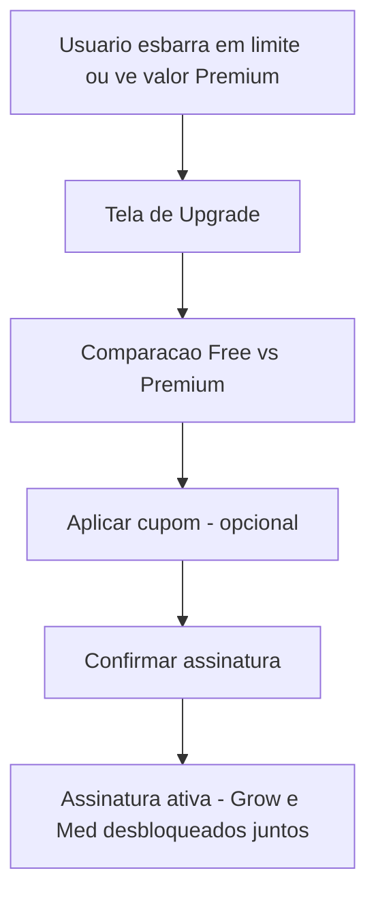
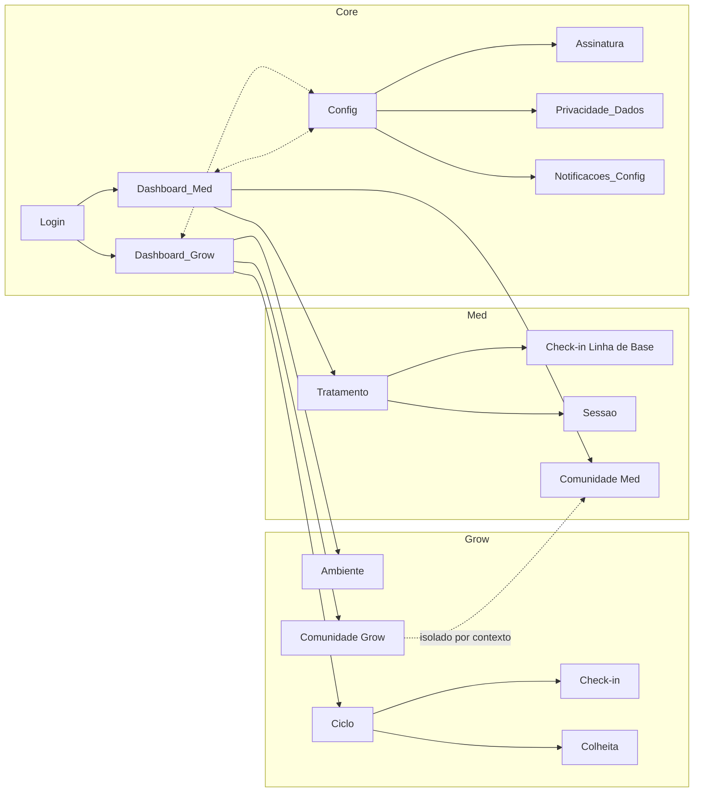

# 10 — Fluxos do Usuário / UX (Documento 100% Completo)

> Status: **Rascunho para validação.** Foco exclusivo em **UX, navegação e comportamento** — nenhuma decisão de aparência visual (cor, tipografia, estilo gráfico), que fica 100% para o doc 11. Depende de todos os docs 00–09; toda tela e todo fluxo aqui foram validados contra eles antes de este documento ser considerado concluído (seção 10).

---

## 1. Objetivos

- Especificar a jornada completa do usuário — navegação, estados, comportamento — para Grow, Med, Comunidade, IA e Premium.
- Entregar dois artefatos, nesta ordem: (1) fluxogramas macro de navegação/estado; (2) wireframes textuais detalhados por tela.
- Validar cada fluxo contra os docs 00–09, corrigindo qualquer inconsistência encontrada antes de finalizar.

---

## 2. Problemas que Resolve

| Problema | Como este documento resolve |
|---|---|
| Telas foram mencionadas nos Artefatos dos docs 02/03/05/06, mas nunca com comportamento/estado/navegação detalhados | Wireframes textuais completos (seção 8) |
| Novas entidades/APIs da revisão 00-09 (Genética, Lote, ModeloDeCiclo, VisualizacaoDePerfil, Consentimento, Trilha de Auditoria, Perfil de Aprendizado) ainda não tinham tela correspondente | Telas novas identificadas e especificadas (seção 10) |
| Risco de estados inconsistentes entre telas (cada uma inventando seu próprio vocabulário de "vazio"/"erro") | Modelo único de estados (seção 5), referenciado por todas |

---

## 3. Escopo

**Incluído**: navegação, estados, ações, permissões, eventos, APIs consumidas e casos de teste por tela — para Core, Grow, Med, Comunidade, IA e Premium.

**Fora de escopo**: cor, tipografia, iconografia, grid visual, animação (doc 11).

---

## 4. Metodologia: Arquétipos de Tela

> Mesmo princípio de composição já usado nos docs 08 (entidades) e 09 (APIs) — evita repetir os 10 campos obrigatórios em ~50 telas. Telas representativas (seção 8) recebem tratamento individual completo; as demais (seção 9) herdam o padrão do arquétipo e só descrevem o que é específico.

| Arquétipo de Tela | Descrição | Estados padrão aplicáveis | Permissão padrão |
|---|---|---|---|
| **T1 — Formulário de Criação/Edição** | Criar ou editar um recurso (Planta, Tratamento, Genética...) | Carregando, Erro, Sucesso, Offline (rascunho local, doc 04 §17) | Dono do recurso |
| **T2 — Listagem/Feed** | Lista paginada (tarefas, feed, busca) | Vazio, Carregando, Erro, Sucesso | Dono ou escopo público conforme privacidade |
| **T3 — Detalhe/Timeline** | Visão consolidada de um recurso ao longo do tempo | Carregando, Erro, Sucesso, Vazio (sem histórico ainda) | Dono do recurso |
| **T4 — Configuração** | Preferências/ajustes | Carregando, Erro, Sucesso | Dono da conta |
| **T5 — Onboarding/Wizard** | Sequência guiada de passos | Carregando, Erro, Sucesso | Autenticado, primeira vez |
| **T6 — Paywall/Upgrade** | Ponto de conversão Premium | Sucesso (é sempre "disponível", nunca "erro" no sentido tradicional) | Autenticado, qualquer plano |
| **T7 — Analítico/Insight (IA)** | Exibe correlação/alerta/recomendação com explicabilidade completa (doc 05 §7) | Carregando, Erro, Sucesso, Vazio (cold-start, doc 05 §8) | Dono do recurso |

---

## 5. Modelo Geral de Estados

> Vocabulário único, referenciado por toda tela deste documento.

| Estado | Significado | Regra transversal |
|---|---|---|
| **Vazio** | Nenhum dado ainda | Sempre com CTA de criação, nunca uma tela em branco sem explicação |
| **Carregando** | Requisição em andamento | Sem bloquear navegação para outras telas (stateless, doc 09 princípio 1) |
| **Erro** | Falha de requisição | Mensagem específica + ação de retry — nunca "algo deu errado" genérico (doc 01, tom de voz) |
| **Sucesso** | Dado carregado / ação concluída | — |
| **Offline** | Sem conectividade | Modelo é online-first (doc 04 §17) — toda tela de escrita preserva **rascunho local** e informa claramente que o envio exige conexão, nunca perde o que já foi digitado |
| **Premium/Bloqueado** | Funcionalidade existe, exige assinatura | Nunca esconde a existência da funcionalidade — mostra o valor + CTA de upgrade (doc 07, princípio "valor primeiro") |
| **Sem Permissão** | Autenticado, mas sem autorização para este recurso | RBAC/política (doc 04 §11) |
| **Modo Discreto** *(variante transversal)* | Qualquer estado acima, com nomes sensíveis ocultos | Nunca um estado exclusivo — uma camada aplicada por cima (doc 01) |

---

## 6. Fluxogramas Macro de Navegação (Artefato 1)

### 6.1 Onboarding da Plataforma

### 6.2 Jornada Grow (ciclo completo)

### 6.3 Jornada Med (tratamento completo)

### 6.4 Jornada de Comunidade (Perfil Público independente por contexto)

### 6.5 Jornada de Upgrade Premium

### 6.6 Mapa Global de Navegação (visão macro)

---

## 7. Detalhamento dos Arquétipos (regras específicas além da tabela da seção 4)

- **T1 (Formulário)**: idempotência client-side — reenvio acidental (duplo toque) não cria dois recursos (doc 09, princípio 6).
- **T2 (Listagem)**: sempre paginada (doc 09 §5); estado Vazio nunca aparece para listagens de dado histórico do próprio usuário sem uma explicação de por que está vazio.
- **T3 (Detalhe/Timeline)**: exibe Correlation ID discretamente em modo de suporte/debug (doc 09, princípio 3) — não visível ao usuário final, mas acessível para diagnóstico.
- **T7 (Analítico/IA)**: nunca omite o template de frase do doc 05 §7.1 — toda tela deste arquétipo mostra dados usados, período, confiança e limitações.

---

## 8. Wireframes Textuais Detalhados — Telas Representativas (Artefato 2)

> Uma por arquétipo/fluxo/módulo relevante — as demais estão na seção 9, herdando o padrão do arquétipo.

### Dashboard Grow *(T2)*
- **Objetivo**: visão geral dos ciclos ativos e ações rápidas do dia.
- **Componentes**: lista de Ciclos ativos (card por ciclo com fase atual), atalho de Check-in Diário, resumo de Tarefas pendentes, indicador de Alertas da IA não vistos.
- **Estados**: Vazio (nenhum ciclo — CTA "Criar primeiro ciclo"), Carregando, Erro, Sucesso, Offline (mostra último dado em cache, com aviso).
- **Ações**: criar ciclo, abrir ciclo, check-in rápido, ver alertas.
- **Navegação de entrada**: login/onboarding, troca de app.
- **Navegação de saída**: Detalhe do Ciclo, Check-in Diário, Tela de Alerta, Ambiente.
- **Permissões**: usuário autenticado, dono dos ciclos exibidos.
- **Eventos consumidos**: `AlertaGerado`, `TarefaCriada`.
- **Eventos publicados**: nenhum (tela de leitura).
- **APIs**: `GET /v1/ciclos`, `GET /v1/ia/alertas`, `GET /v1/tarefas`.
- **Casos de teste**: dashboard vazio mostra CTA correta; alerta não visto aparece com destaque; offline mostra cache com aviso, não tela em branco.
- **Dependências**: Grow, IA, Core (Notificações).

### Criar/Editar Ciclo de Cultivo *(T1)*
- **Objetivo**: iniciar um novo ciclo, do zero, clonado, ou a partir de um Modelo.
- **Componentes**: seletor de Ambiente, seletor de Genética (com atalho "criar nova Genética"), seletor de origem (do zero / clonar ciclo anterior / a partir de Modelo de Ciclo), campo de data de início.
- **Estados**: Carregando, Erro (ex.: limite do plano gratuito atingido → estado **Premium/Bloqueado**, não um erro genérico), Sucesso, Offline (rascunho local preserva o formulário parcialmente preenchido).
- **Ações**: salvar, cancelar, criar Genética inline.
- **Navegação de entrada**: Dashboard Grow, Meus Modelos de Ciclo.
- **Navegação de saída**: Detalhe do Ciclo (novo).
- **Permissões**: dono do Ambiente selecionado.
- **Eventos publicados**: `CicloCriado`.
- **APIs**: `POST /v1/ciclos`, `POST /v1/ciclos/{id}/clonar`, `GET /v1/geneticas`, `GET /v1/ciclos/modelos`.
- **Casos de teste**: criação respeita `LimiteDePlano`; criar a partir de Modelo herda configuração corretamente; reenvio com mesma chave de idempotência não duplica o ciclo (doc 09 princípio 6).
- **Dependências**: Core (Billing — limite), Grow (Genética, Ambiente).

### Check-in Diário (Grow) *(T1, variante rápida)*
- **Objetivo**: registro de parâmetros do dia em segundos (doc 02 §4, diferencial de retenção).
- **Componentes**: campos essenciais por padrão (Complexidade Progressiva, doc 02 §5.0); campos avançados/especialista sob demanda; captura de foto opcional.
- **Estados**: Carregando, Erro, Sucesso (com possível `AlertaGerado` imediato), Offline (rascunho local).
- **Ações**: salvar, expandir para nível avançado/especialista, anexar foto.
- **Navegação de entrada**: Dashboard Grow, notificação de lembrete.
- **Navegação de saída**: volta ao Dashboard; se um alerta for gerado, oferece ir direto à Tela de Alerta.
- **Permissões**: dono do ciclo/planta.
- **Eventos publicados**: `RegistroAmbientalCriado`.
- **Eventos consumidos**: `PreferenciaDeComplexidade` (para decidir quais campos mostrar).
- **APIs**: `POST /v1/registros-ambientais`, `POST /v1/midia`.
- **Casos de teste**: nível essencial não exige campos avançados; idempotência obrigatória (doc 09, Arquétipo API-2) evita duplicar registro em retry de rede.
- **Dependências**: Core (Complexidade Progressiva, Mídia), IA (consumidor do evento).

### Fluxo de Colheita *(T5 — wizard curto)*
- **Objetivo**: guiar o registro de colheita → secagem → cura → lote, suportando colheita escalonada.
- **Componentes**: seletor de subconjunto de Plantas do ciclo a colher agora (doc 04 §25), campo de peso úmido, depois (em etapas subsequentes) condições de secagem/cura.
- **Estados**: Carregando, Erro, Sucesso, Vazio (nenhuma planta pronta ainda — orientação de quando voltar).
- **Ações**: registrar colheita parcial, avançar para secagem, avançar para cura.
- **Navegação de entrada**: Detalhe do Ciclo.
- **Navegação de saída**: Relatório do Ciclo (ao concluir a última etapa de um lote).
- **Permissões**: dono do ciclo.
- **Eventos publicados**: `ColheitaRegistrada`.
- **APIs**: `POST /v1/colheitas`, `POST /v1/secagens`, `POST /v1/curas`.
- **Casos de teste**: colher um subconjunto de plantas não afeta as demais ainda em floração (doc 04 §25, correção validada aqui); múltiplas colheitas no mesmo ciclo geram múltiplos Lotes corretamente.
- **Dependências**: Grow, IA (relatório automático), futuramente Med (Lote referenciado).

### Detalhe do Lote *(T3 — nova, identificada na validação desta seção)*
- **Objetivo**: visão do próprio cultivador sobre um Lote gerado — ausente nos docs anteriores (a única visão de Lote especificada era a interna, para o Med consumir).
- **Componentes**: dados do lote (peso, data, genética/ambiente de origem), indicação se está vinculado a algum Tratamento do Med (sem expor dados do Med, só "vinculado: sim/não" — respeita a fronteira de módulo).
- **Estados**: Carregando, Erro, Sucesso.
- **Ações**: nenhuma ação destrutiva (Lote é Arquétipo B, imutável).
- **Navegação de entrada**: Relatório do Ciclo, Fluxo de Colheita (ao concluir).
- **Permissões**: dono do Lote.
- **APIs**: `GET /v1/lotes/{id}` *(adicionado na revisão 00-09)*.
- **Casos de teste**: lote vinculado ao Med mostra apenas o fato do vínculo, nunca detalhes do tratamento (doc 08 §11, padrão de referência cross-módulo).
- **Dependências**: Grow, Med (referência opt-in).

### Relatório de Ciclo *(T7 — Analítico)*
- **Objetivo**: relatório automático (doc 05 §6.6) com comparação a ciclos anteriores.
- **Componentes**: resumo do ciclo, gráfico simples de parâmetros ao longo do tempo, comparação com ciclos anteriores (mesma genética/ambiente), explicabilidade completa por insight incluído.
- **Estados**: Carregando, Erro, Sucesso, Vazio (histórico insuficiente → cold-start, doc 05 §8, sinalizado explicitamente).
- **Ações**: exportar (Premium), compartilhar na Comunidade.
- **Navegação de entrada**: fim do Fluxo de Colheita, Dashboard.
- **Navegação de saída**: Publicar Growlog, Comparação entre Ciclos.
- **Permissões**: dono do ciclo.
- **Eventos consumidos**: `DigestAnaliticoGerado`.
- **APIs**: `GET /v1/ciclos/{id}/relatorio`, `GET /v1/ia/digest`.
- **Casos de teste**: nenhuma correlação exibida abaixo do volume mínimo de dados (doc 05); exportação em PDF é gate Premium claro, nunca some silenciosamente.
- **Dependências**: IA, Core (Motor de Relatórios, Billing).

### Publicar Growlog *(T1, com Matriz de Privacidade)*
- **Objetivo**: publicar um Ciclo/Planta com controle granular de privacidade (doc 02 §9.1).
- **Componentes**: seletor de dimensões (fotos, resultados, genética, localização, datas, equipamentos, parâmetros técnicos), seletor de escopo (seguidores/link*/público), preset rápido + "personalizar" (melhoria sugerida na auditoria, doc 02).
- **Estados**: Carregando, Erro, Sucesso.
- **Ações**: publicar, editar privacidade depois.
- **Navegação de entrada**: Relatório de Ciclo, Detalhe do Ciclo.
- **Navegação de saída**: Growlog Público (visualização).
- **Permissões**: dono do conteúdo.
- **Eventos publicados**: `ConteudoCompartilhadoAtualizado`, `GrowlogPublicado`, `ConfiguracaoDeCompartilhamentoAlterada`.
- **APIs**: `POST /v1/comunidade/publicacoes`, `PUT /v1/comunidade/publicacoes/{id}/privacidade`.
- **Casos de teste**: nasce privado por padrão; nenhuma dimensão não autorizada aparece na saída (doc 02, caso já previsto); mudança de privacidade gera `TrilhaDeAuditoria`.
- **Dependências**: Core (Privacidade, Comunidade, Auditoria).

### Perfil Público (Grow) *(T3/T4)*
- **Objetivo**: identidade pública do cultivador.
- **Componentes**: nome, avatar, biografia, estatísticas (contadores denormalizados, doc 08), reputação, lista de Growlogs publicados, atalho de Estatísticas Avançadas (Premium).
- **Estados**: Carregando, Erro, Sucesso, Sem Permissão (perfil de terceiro com escopo restrito).
- **Ações**: editar (se for o próprio), seguir/deixar de seguir (se for de terceiro).
- **Navegação de entrada**: Feed, Busca, menu do app.
- **Navegação de saída**: Estatísticas de Perfil, Configuração de Vínculo de Perfis.
- **Permissões**: leitura pública (dimensões autorizadas); edição só pelo dono.
- **Eventos publicados**: `PerfilPublicoCriado` (na primeira vez), `SeguimentoIniciado`.
- **APIs**: `GET/PUT /v1/comunidade/perfis/grow`, `POST/DELETE /v1/comunidade/seguir/{perfilId}`.
- **Casos de teste**: perfil do Grow nunca expõe o Perfil Público do Med da mesma Conta, salvo vínculo opt-in (doc 06 §13).
- **Dependências**: Core (Comunidade, Perfil Público).

### Perfil Público (Med) — variante anônima *(T3/T4)*
- **Objetivo**: mesma função do perfil Grow, mas com anonimato total como opção de primeira classe.
- **Componentes**: nome/avatar/biografia **opcionais** — se não preenchidos, identificador neutro gerado automaticamente (doc 06, regra confirmada; texto exato pendente do doc 11).
- **Estados**: Carregando, Erro, Sucesso.
- **Ações**: editar, optar por permanecer anônimo (padrão).
- **Permissões**: mesmas do Perfil Grow, dentro do contexto Med.
- **Casos de teste**: criação sem nenhum campo preenchido ainda funciona plenamente (doc 06 caso de teste já previsto).
- **Dependências**: Core (Comunidade, Perfil Público, Modo Discreto).

### Criar/Editar Tratamento *(T1)*
- **Objetivo**: registrar um novo tratamento.
- **Componentes**: condição/motivo, objetivo terapêutico, médico responsável (texto livre, opcional), seletor de complexidade (mesma lógica progressiva do Grow, doc 03 §5.0).
- **Estados**: Carregando, Erro, Sucesso, Offline (rascunho local).
- **Ações**: salvar, criar a partir de Modelo de Tratamento.
- **Navegação de saída**: Cadastrar Produto.
- **Permissões**: dono (ou Responsável por um Dependente, Versão 2).
- **Eventos publicados**: `TratamentoCriado`.
- **APIs**: `POST /v1/tratamentos`, `GET /v1/tratamentos/modelos`.
- **Casos de teste**: criação idempotente; terminologia sempre clínica (doc 01).
- **Dependências**: Med, Core (Complexidade).

### Sessão Antes/Depois *(T1, par de telas com estado assíncrono)*
- **Objetivo**: capturar intensidade de sintoma antes e depois do uso (doc 03 §5.4).
- **Componentes — tela "Antes"**: seletor de sintoma-alvo, escala de intensidade.
- **Componentes — tela "Depois"** (aberta via notificação após intervalo): mesma escala, comparação lado a lado com o "antes".
- **Estados**: Carregando, Erro, Sucesso, **Vazio/Pendente** (a tela "Depois" existe num limbo até a notificação chegar — estado específico deste arquétipo: "aguardando registro depois").
- **Ações**: registrar antes, registrar depois (via notificação).
- **Navegação de entrada**: Registrar Dose (antes), notificação (depois).
- **Permissões**: dono do Registro de Uso.
- **Eventos publicados**: `SessaoAntesRegistrada`, `SessaoDepoisRegistrada`.
- **APIs**: `POST /v1/sessoes`, `PUT /v1/sessoes/{id}`.
- **Casos de teste**: notificação "depois" dispara corretamente após o intervalo configurado (risco técnico já identificado no doc 03).
- **Dependências**: Med, Core (Notificações), IA (consumidor).

### Timeline de Evolução Clínica *(T7 — Analítico)*
- **Objetivo**: visão longitudinal cruzando tratamento/produto/sintomas/efeitos.
- **Componentes**: gráfico de série temporal por sintoma/produto, explicabilidade completa por correlação exibida.
- **Estados**: Carregando, Erro, Sucesso, Vazio (cold-start).
- **Ações**: gerar relatório, exportar (Premium — múltiplos formatos).
- **APIs**: `GET /v1/tratamentos/{id}/evolucao`, `GET /v1/ia/insights?contexto=med`.
- **Casos de teste**: nunca linguagem de certeza absoluta (doc 05, princípio 6); disclaimer acessível a qualquer momento.
- **Dependências**: IA, Core (Relatórios, Billing).

### Central de Privacidade e Dados *(T4 — nova, identificada na validação desta seção)*
- **Objetivo**: dar ao usuário o **direito de acesso e controle** sobre consentimentos e dados (LGPD) — nenhuma tela cobria isso explicitamente antes desta validação, apesar dos endpoints já existirem desde a revisão 00-09.
- **Componentes**: lista de consentimentos concedidos/revogados (com data), botão de revogar por tipo, botão de exportar dados (com status/link de download quando pronto), botão de excluir conta (com confirmação em duas etapas).
- **Estados**: Carregando, Erro, Sucesso, **Processando** (exportação/exclusão em andamento — estado específico, já que ambas são assíncronas via evento, doc 04 §21).
- **Ações**: revogar consentimento, solicitar exportação, solicitar exclusão de conta.
- **Navegação de entrada**: Configurações (Core).
- **Permissões**: dono da conta.
- **APIs**: `GET/POST/DELETE /v1/consentimento`, `POST /v1/conta/exportar`, `GET /v1/conta/exportacao/{id}`, `POST /v1/conta/excluir`.
- **Casos de teste**: revogar consentimento de vínculo Grow-Med bloqueia novos vínculos imediatamente, sem afetar vínculos já existentes retroativamente (a menos que a exclusão de conta esteja em curso); status de exportação reflete o progresso real por módulo.
- **Dependências**: Core (Consentimento), Grow, Med, Comunidade, IA (cada um reage ao expurgo/exportação).

### Tela de Insight (IA) *(T7)*
- **Objetivo**: exibir um insight com explicabilidade máxima (doc 05 §7).
- **Componentes**: texto no template obrigatório ("Com base em X registros..."), gráfico simples, seção de limitações, indicador de nível de confiança, botão de feedback (útil/inútil).
- **Estados**: Carregando, Erro, Sucesso, Vazio.
- **Ações**: marcar útil/inútil (alimenta Motor de Aprendizado).
- **APIs**: `GET /v1/ia/insights`, `POST /v1/ia/feedback`.
- **Casos de teste**: nunca exibe insight abaixo do volume mínimo de dados; nunca a frase "a IA acredita que..." (doc 05, proibido).
- **Dependências**: IA.

### Tela de Upgrade Premium *(T6)*
- **Objetivo**: converter para assinatura única da plataforma (doc 07 §5).
- **Componentes**: comparação Free vs. Premium por categoria (doc 07 §8), campo de cupom, seleção de ciclo mensal/anual.
- **Estados**: Sucesso (sempre disponível), Erro (falha de pagamento — nunca um "erro" alarmista, tom orientado a solução).
- **Ações**: assinar, aplicar cupom, cancelar (se já assinante).
- **APIs**: `GET /v1/assinatura`, `POST /v1/assinatura/upgrade`, `POST /v1/assinatura/cupom`.
- **Eventos consumidos**: `PagamentoRecebido`, `PagamentoFalhou`, `AssinaturaAtualizada`.
- **Casos de teste**: upgrade desbloqueia Grow e Med simultaneamente, sem ação adicional (doc 07, caso já previsto).
- **Dependências**: Core (Billing).

---

## 9. Catálogo Consolidado de Telas

> Demais telas (não detalhadas na seção 8), organizadas por módulo, herdando o padrão do arquétipo indicado. Inclui as telas novas identificadas na validação (seção 10).

### Core / Premium
| Tela | Arquétipo | Objetivo |
|---|---|---|
| Cadastro / Login | T5 | Autenticação inicial |
| Escolha de Propósito (Grow/Med/Ambos) | T5 | Onboarding da plataforma |
| Configurações Gerais | T4 | Hub de configuração |
| Central de Notificações | T4 *(nova — identificada na validação, recomendação da Auditoria original)* | Preferências por categoria e horário de silêncio |
| Gestão de Assinatura | T4 | Ver/cancelar assinatura |
| Perfil de Aprendizado (IA) | T4 *(nova — API adicionada na revisão 00-09)* | Ver/resetar personalização |

### Grow
| Tela | Arquétipo | Objetivo |
|---|---|---|
| Detalhe do Ambiente | T3 | Histórico do espaço físico |
| Configuração de Ambiente Outdoor | T4 | Ativar Módulo Outdoor |
| Detalhe da Planta / Timeline | T3 | Histórico individual da planta |
| Criar/Editar Planta | T1 | CRUD de Planta |
| Biblioteca de Genéticas *(nova — endpoint CRUD adicionado na revisão 00-09)* | T2 | Gerenciar Genéticas cadastradas |
| Meus Modelos de Ciclo *(nova — entidade Premium da revisão 00-09)* | T2 | Templates reutilizáveis |
| Registro avançado de Parâmetros Ambientais | T1 (variante Especialista) | Complementa o Check-in |
| Registro de Manejo / Sanidade | T1 | Eventos pontuais |
| Galeria de Fotos / Comparação | T2/T3 | Linha do tempo visual |
| Lista de Tarefas / Detalhe de Tarefa | T2/T3 | Gestão de lembretes |
| Comparação entre Ciclos | T7 | Estatística comparativa |
| Growlog Público (visualização) | T3 | Leitura pública |
| Busca da Comunidade (Grow) | T2 | Busca estruturada |
| Tela de Fork | T1 | Duplicar cultivo de terceiro |
| Configurações do Grow | T4 | Limites, Modo Discreto, complexidade |

### Med
| Tela | Arquétipo | Objetivo |
|---|---|---|
| Onboarding do Med | T5 | Primeiro tratamento |
| Cadastrar/Editar Produto | T1 | Inclui vínculo opt-in a Lote |
| Meus Modelos de Tratamento *(nova)* | T2 | Templates reutilizáveis |
| Registrar Efeito | T1 | Efeitos positivos/adversos |
| Gerar/Visualizar Relatório | T7 | Relatório clínico |
| Busca da Comunidade (Med) | T2 | Por produto/sintoma/concentração |
| Configurações do Med | T4 | Modo Discreto, complexidade |
| Seletor/Gestão de Perfis de Dependente *(Versão 2)* | T4 | Futuro |

### Comunidade
| Tela | Arquétipo | Objetivo |
|---|---|---|
| Configuração de Vínculo de Perfis | T4 | Opt-in reversível (Versão 2) |
| Feed (Grow) / Feed (Med) | T2 | Conteúdo do contexto |
| Estatísticas de Perfil *(nova — entidade Premium da revisão 00-09)* | T7 | Quem visitou, alcance |
| Tela de Moderação | T2/T4 | Uso interno/administrativo, por contexto |

### Painel Administrativo (interno — não faz parte dos apps Grow/Med) *(grupo adicionado na pré-auditoria do doc 11 — 5 endpoints administrativos do doc 09 nunca tinham tela correspondente)*
| Tela | Arquétipo | Objetivo |
|---|---|---|
| Gestão de Limites de Plano | T2/T4 | `GET/PUT /v1/admin/limite-de-plano` |
| Gestão de Preço Regional | T2/T4 | `GET/PUT /v1/admin/preco-regional` |
| Gestão de Cupons e Promoções | T2/T4 | `POST/GET/PUT /v1/admin/cupons` |
| Gestão de Período Gratuito | T4 | `GET/PUT /v1/admin/periodo-gratuito` |
| Consulta de Trilha de Auditoria | T2 | `GET /v1/admin/trilha-auditoria` |
| Gestão de Política de Agregação | T4 | `GET/PUT /v1/admin/politica-agregacao` |

Usa a mesma biblioteca de componentes do restante da plataforma (nenhum sistema visual paralelo) — apenas com permissão restrita a papel Admin (doc 04 §11) e prioridade de polimento visual menor que as telas de usuário final, mas não dispensada de acessibilidade/consistência.

### IA
| Tela | Arquétipo | Objetivo |
|---|---|---|
| Tela de Alerta | T7 | Ação sugerida |
| Tela de Recomendação | T7 | Sugestão baseada em padrão |
| Tela de Digest Analítico | T7 | Relatório periódico consolidado |
| Modal de Disclaimer | — (transversal, primeiro uso) | Texto do doc 05 §10 |

---

## 10. Validação Cruzada contra os Docs 00–09 (obrigatória antes de finalizar)

| Verificação | Achado | Correção aplicada |
|---|---|---|
| Toda entidade/API nova da revisão 00-09 tem tela correspondente? | Não — `Lote` (visão do dono), `Genética` (CRUD), `ModeloDeCiclo`/`ModeloDeTratamento`, `VisualizacaoDePerfil`, `Consentimento`/exportação/exclusão, `PerfilDeAprendizadoDoUsuario` não tinham tela | Telas novas adicionadas: Detalhe do Lote, Biblioteca de Genéticas, Meus Modelos de Ciclo/Tratamento, Estatísticas de Perfil, Central de Privacidade e Dados, Perfil de Aprendizado (seções 8/9) |
| Toda tela sensível respeita Modo Discreto? | Perfis Públicos, notificações e Central de Privacidade já cobertos; nenhuma tela nova viola o princípio | Nenhuma correção necessária |
| Toda tela de escrita crítica é idempotente client-side? | Sim, coberto pelo Arquétipo T1 (seção 7) | — |
| Alguma tela permite navegação entre contextos (Grow↔Med) de forma não sancionada? | Não encontrada — Comunidade permanece isolada por contexto (seção 6.4/6.6) | — |
| Central de Notificações (recomendação da Auditoria original) já tinha tela especificada? | Não | Adicionada (seção 9) |

**Conclusão da validação**: fluxos consistentes com os docs 00–09 após as correções acima.

---

## 11. Boas Práticas

- Nenhuma tela nova entra no catálogo (seção 9) sem antes checar se a entidade/API correspondente já existe no Catálogo de Domínio/doc 09 — e vice-versa (a validação desta seção 10 prova o valor disso).
- Estados seguem sempre o vocabulário único da seção 5 — nenhuma tela inventa um estado próprio.

---

## 12. Riscos

| Risco | Observação |
|---|---|
| Volume de telas (~50) pode gerar inconsistência de estado se implementado por partes/paralelamente | Mitigado pelo modelo único de estados (seção 5) e arquétipos (seção 4) |
| Estado "Processando" (Central de Privacidade) depende de sagas assíncronas multi-módulo (doc 04 §21) — UX precisa comunicar isso sem parecer travado | Fica como atenção para o doc 11 (indicador de progresso) |

---

## 13. Sugestões de Melhorias

- Avaliar, no doc 11, um componente visual único de "explicabilidade" reutilizado em todas as telas T7, para reforçar consistência de confiança.

---

## 14. Classificação de Escopo (MVP / V2 / V3 / Futuro / Pesquisa)

| Item | Classificação |
|---|---|
| Todas as telas de Core/Grow/Med/Comunidade/IA/Premium do MVP (docs 02/03/05/06/07 já classificados) | Herda a classificação de cada funcionalidade subjacente |
| Central de Notificações | **MVP** (correção de gap identificada) |
| Central de Privacidade e Dados | **MVP** (obrigatória por LGPD) |
| Seletor/Gestão de Perfis de Dependente | **Versão 2** (já classificado) |

---

## 15. Revisão Final de Arquitetura

- **Dificulta futuras integrações?** Não.
- **Dificulta internacionalização?** Não — nenhuma tela assume texto fixo; strings seguem o padrão código+tradução (doc 08 §8).
- **Dificulta escalabilidade?** Não.
- **Dificulta integração com novos aplicativos futuros?** Não — os arquétipos de tela (seção 4) são reutilizáveis por qualquer app futuro sem redesenho.

Nenhuma limitação relevante encontrada.

---

## Decisões Consolidadas (validado com o usuário em 2026-07-08)

| # | Tema | Decisão |
|---|---|---|
| 1 | 6 telas novas da validação | Confirmadas no MVP — fecham lacunas arquiteturais entre entidade/API/UX, não são extras adiáveis |
| 2 | Central de Notificações e Central de Privacidade e Dados | Dentro de Configurações (Core), sem destaque na navegação principal — acessíveis, não competindo por espaço primário |

Este documento está **concluído**. Seguimos para o **Documento 11 — Design System**.

---

## Artefatos para Implementação

### Checklist Técnico
- [ ] Implementar as 6 telas novas identificadas na validação (seção 10)
- [ ] Implementar modelo único de estados (seção 5) como componente/lógica compartilhada, não reimplementado por tela
- [ ] Implementar Central de Privacidade e Dados com status assíncrono de exportação/exclusão

### Lista de Módulos
Mesma divisão dos docs 04/08/09 — este documento não introduz módulo novo.

### Lista de Telas
Ver seções 8 e 9 (catálogo completo, ~50 telas).

### Lista de Componentes Reutilizáveis
Componente de Estado (Vazio/Carregando/Erro/Sucesso/Offline/Premium/Sem Permissão/Modo Discreto) · Componente de Explicabilidade (T7) · Componente de Matriz de Privacidade (já previsto no doc 02) · Componente de Progresso Assíncrono (Central de Privacidade) · **Card de Genética**, **Card de Modelo (Ciclo/Tratamento)**, **Painel de Estatísticas de Perfil**, **Card de Lote** *(adicionados na pré-auditoria do doc 11 — entidades/telas já existiam desde a revisão 00-09/doc 10, mas nunca haviam ganhado componente correspondente listado)*.

### Lista de Entidades do Banco
Nenhuma nova — este documento consome o Catálogo de Domínio existente.

### Lista de APIs Necessárias
Nenhuma nova além das já catalogadas no doc 09 — este documento apenas mapeia telas aos endpoints já existentes.

### Lista de Permissões
Nenhuma nova.

### Eventos
Nenhum novo — telas consomem/publicam eventos já catalogados.

### Notificações
Central de Notificações (nova tela) consolida preferências já previstas no doc 04 §15.

### Casos de Teste
Consolidados por tela (seção 8) — ver também seção 10 para os casos gerados pela validação cruzada.

### Dependências com Outros Módulos
Nenhuma nova além das já mapeadas.

### Riscos Técnicos
- Estado "Processando" de operações assíncronas multi-módulo exige um mecanismo de polling ou push de progresso — decisão de implementação para o doc 13.
