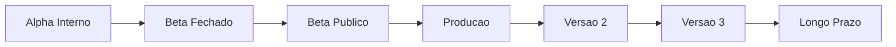
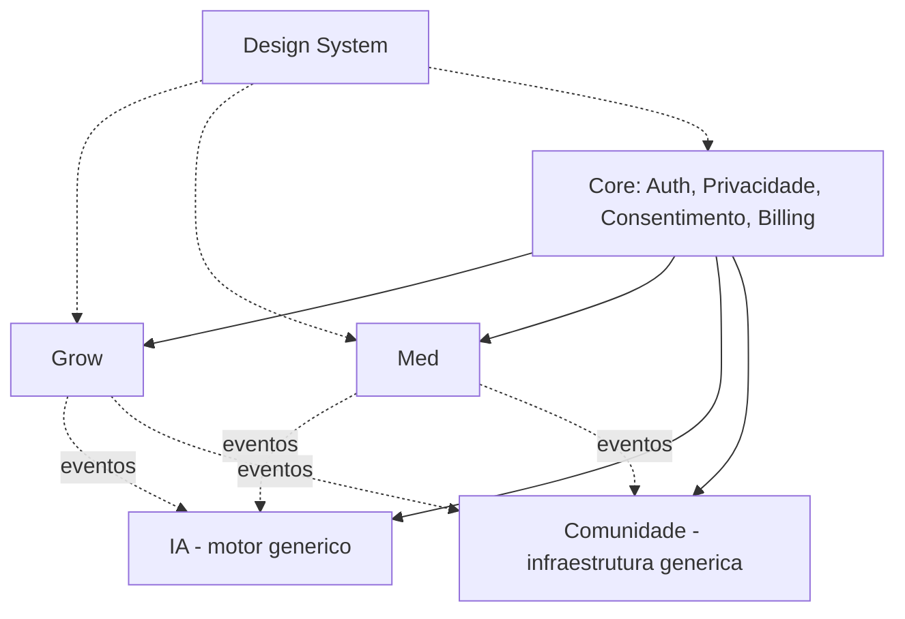
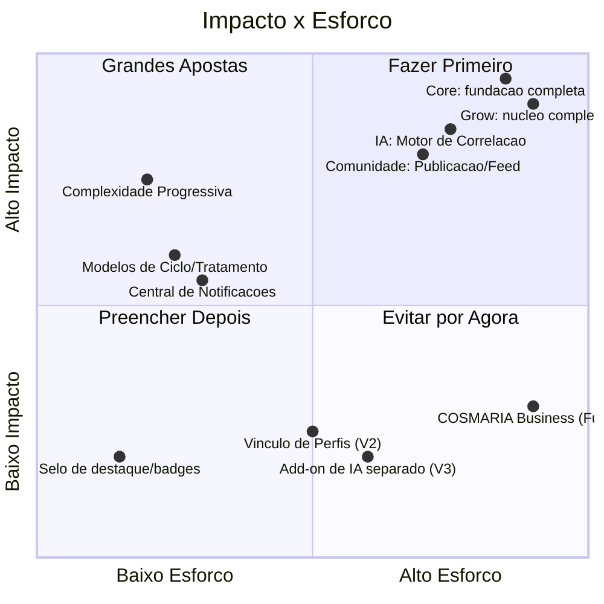

# 12 — Roadmap Executivo + Técnico (Documento 100% Completo)

> Status: **Rascunho para validação.** Sintetiza a classificação de escopo (MVP/V2/V3/Futuro/Pesquisa) já feita em todos os docs 00–11 e em [Ideias Futuras](ideias-futuras.md) num plano real de desenvolvimento. Não estima horas nem data — estimativas são **relativas** (S/M/L/XL) e os critérios de fase são **métricas candidatas**, ajustáveis com dado real, nunca hardcoded como se fossem lei. Não assume stack (doc 13).

---

## 1. Objetivos

- Traduzir tudo que já foi classificado como MVP/V2/V3/Futuro/Pesquisa em um roadmap executável: fases, dependências, caminho crítico, paralelização, marcos, backlog por épico, critérios de fase mensuráveis.
- Confirmar a estratégia de lançamento decidida: **um único MVP**, com Grow mais maduro e Med essencial, ambos integrados desde o dia 1 — nunca dois lançamentos fragmentados.
- Definir critérios objetivos e mensuráveis de Go/No-Go para Alpha Interno, Beta Fechado, Beta Público e Produção — evolução baseada em evidência, não em data.

---

## 2. Problemas que Resolve

| Problema | Como este documento resolve |
|---|---|
| Classificações MVP/V2/V3 estavam corretas, mas espalhadas em 11 documentos, sem visão de conjunto executável | Backlog único por épico (seção 11), com dependências e ordem (seções 6–9) |
| Risco de avançar de fase por calendário, não por qualidade real | Critérios de entrada/saída mensuráveis + Go/No-Go por fase (seção 14) |
| Risco de subestimar o quanto pode ser paralelizado, atrasando o MVP desnecessariamente | Análise de paralelismo (seção 9), habilitada pela arquitetura contract-first já definida (doc 04/05/06/08/09) |

---

## 3. Escopo

**Incluído**: fases, dependências, caminho crítico, paralelismo, marcos, backlog por épico com estimativa relativa, matriz impacto×esforço, Definition of Done, critérios de fase mensuráveis, riscos por fase, mapa de evolução V2/V3/longo prazo, pontos de validação obrigatória com usuários.

**Fora de escopo**: datas de calendário, estimativa em horas/pessoas, escolha de stack (doc 13), estrutura de repositório/código (doc 14).

---

## 4. Estratégia de Lançamento (decisão validada)

**Um único MVP** — Core, Grow, Med, IA, Comunidade e Premium funcionando juntos desde o primeiro lançamento. Grow nasce com maturidade funcional maior (reflete a decisão original do doc 00 e o volume de funcionalidades já classificadas como MVP no doc 02); Med nasce com escopo essencial, mas **totalmente integrado** — mesma Conta, mesma IA, mesma Comunidade, mesmo Premium. Evoluções futuras do Med (Cuidador/Dependente, vínculo Grow↔Med, relatórios avançados — todos já Versão 2) se somam sem exigir mudança de arquitetura, porque a arquitetura (docs 04/08) já foi desenhada para isso desde o início.

**Melhoria identificada e incorporada**: como toda a arquitetura é *contract-first* (eventos catalogados no doc 04/05/06, APIs no doc 09, entidades no doc 08), **Core, o motor genérico da IA e a infraestrutura genérica da Comunidade podem começar a ser construídos em paralelo ao Grow e ao Med**, contra os contratos já definidos — não precisam esperar o Grow/Med estarem prontos para começar a existir, só para serem *conteudo-completos*. Isso é incorporado diretamente na seção 9.

---

## 5. Visão Geral das Fases

| Fase | Definição |
|---|---|
| **Alpha Interno** | Equipe usa a plataforma internamente; MVP funcionalmente completo, ainda instável |
| **Beta Fechado** | Grupo pequeno de usuários reais convidados |
| **Beta Público** | Acesso aberto, escala maior, ainda sinalizado como beta |
| **Produção** | Lançamento oficial, SLA, cobrança real ativa |
| **Versão 2 / 3 / Longo Prazo** | Ondas de evolução já mapeadas (seção 16) |

---

## 6. Dependências entre Módulos (orientadas à construção)

Reforça o doc 04 §24: nenhuma seta "de volta" ao Core; Grow e Med são paralelos entre si (não dependem um do outro no MVP, já que o vínculo Grow↔Med é Versão 2).

---

## 7. Ordem Ótima de Implementação

1. **Core — fundação** (Auth, Autorização, Motor de Privacidade, Consentimento/LGPD, Complexidade Progressiva, Billing esqueleto) — bloqueante para tudo.
2. **Design System — fundações** (tokens, componentes base) — em paralelo ao passo 1, sem dependência real.
3. **Grow — núcleo** e **Med — núcleo** — em paralelo entre si, ambos dependendo só do passo 1.
4. **IA — motor genérico** e **Comunidade — infraestrutura genérica** — em paralelo ao passo 3, contra os contratos de evento já definidos (não precisam esperar Grow/Med "prontos", só "publicando os eventos certos").
5. **Integração fina** (telas consumindo API real, IA reagindo a dado real de Grow/Med, Comunidade exibindo publicações reais).
6. **Premium — gates aplicados** em todos os módulos.
7. **Hardening** (observabilidade, testes de carga, auditoria de segurança) antes do Beta Fechado.

---

## 8. Caminho Crítico (Critical Path)

O caminho crítico passa pelo **Core de identidade/privacidade/consentimento/billing → núcleo do Grow → dado real fluindo → IA consumindo → Comunidade exibindo → telas integradas**. O Med **não está no caminho crítico** (pode progredir em paralelo ao Grow sem atrasar o Alpha, desde que conclua antes da integração fina do passo 5) — uma folga real de cronograma que a equipe pode usar a seu favor.

---

## 9. O que Pode Ser Desenvolvido em Paralelo

| Paralelo A | Paralelo B | Por quê é seguro |
|---|---|---|
| Grow — núcleo | Med — núcleo | Módulos independentes (doc 04 §24), sem dependência mútua no MVP |
| Core — fundação | Design System — fundações | Tokens/componentes não dependem de nenhuma lógica de negócio pronta |
| IA — motor genérico (contra contrato de evento) | Comunidade — infraestrutura genérica (contra contrato de evento) | Ambos consomem eventos já catalogados (doc 04/05/06) — podem ser testados com eventos simulados antes do Grow/Med existirem de verdade |
| Telas do Grow | Telas do Med | Mesma biblioteca de componentes (doc 11), conteúdo diferente |

---

## 10. Marcos (Milestones)

| Marco | Critério de conclusão |
|---|---|
| **M0 — Fundação pronta** | Core (Auth/Privacidade/Consentimento/Billing esqueleto) implementado e testado isoladamente |
| **M1 — Núcleos prontos** | Grow e Med núcleo implementados, cada um funcional isoladamente (sem IA/Comunidade ainda) |
| **M2 — Inteligência conectada** | IA consumindo eventos reais de Grow e Med, gerando insight/alerta real |
| **M3 — Comunidade viva** | Publicação, feed, busca e fork funcionando com dado real |
| **M4 — Premium ativo** | Assinatura única funcional, gates aplicados, webhook de pagamento testado |
| **M5 — Alpha Interno** | Ver Definition of Done (seção 13) |
| **M6 — Beta Fechado, Público, Produção** | Ver critérios mensuráveis (seção 14) |

---

## 11. Backlog por Épicos (com estimativa relativa S/M/L/XL)

> S = poucos dias · M = cerca de uma a duas semanas · L = várias semanas · XL = maior esforço do backlog, considerar quebrar em sub-épicos na implementação (doc 14/15). Estimativa relativa entre épicos deste projeto, não uma unidade de tempo absoluta.

### Core
| Épico | Estimativa | Depende de |
|---|---|---|
| Identidade & Autenticação (Conta, token, `SessaoDeAutenticacao`) | M | — |
| Autorização & Permissões (RBAC + política) | S | Identidade |
| Motor de Privacidade Granular | L | Identidade |
| Consentimento & Conformidade LGPD (+ `TrilhaDeAuditoria`) | L | Identidade |
| Perfil Público por Contexto + Vínculo de Perfis (estrutura, feature desligada) | M | Identidade |
| Billing/Premium (assinatura única, `LimiteDePlano`, webhook) | L | Identidade |
| Notificações (central + despacho) | M | Identidade |
| Armazenamento de Mídia (compartilhado) | S | Identidade |
| Complexidade Progressiva | S | Identidade |

### Grow
| Épico | Estimativa | Depende de |
|---|---|---|
| Genética/Ambiente/Planta/Ciclo (núcleo) | XL | Core: fundação |
| Registro Ambiental + cálculo VPD/PPFD/DLI | M | Núcleo Grow |
| Manejo/Sanidade | S | Núcleo Grow |
| Tarefas | S | Núcleo Grow |
| Colheita/Secagem/Cura/Lote (cardinalidade corrigida) | M | Núcleo Grow |
| Estatísticas/Comparação entre ciclos | M | Registro Ambiental |
| Módulo Outdoor (manual) | S | Núcleo Grow |
| Modelos de Ciclo | S | Núcleo Grow |

### Med (escopo essencial do MVP)
| Épico | Estimativa | Depende de |
|---|---|---|
| Tratamento/Produto/Registro de Uso | M | Core: fundação |
| Sessão Antes/Depois | M | Tratamento/Produto |
| Sintomas Diários/Efeitos | S | Tratamento/Produto |
| Evolução Clínica + Relatório básico | M | Sessão/Sintomas |
| Modelos de Tratamento | S | Núcleo Med |

### IA
| Épico | Estimativa | Depende de |
|---|---|---|
| Motor de Correlação genérico (+ `PoliticaDeAgregacao`) | L | Core: fundação (contrato de evento) |
| Motor de Insights + Explicabilidade | M | Motor de Correlação |
| Motor de Alertas | M | Motor de Correlação |
| Motor de Relatórios (IA) | M | Motor de Insights |
| Motor de Recomendações (básico) | S | Motor de Insights |
| Cold-start/benchmark agregado | S | `PoliticaDeAgregacao` |

### Comunidade
| Épico | Estimativa | Depende de |
|---|---|---|
| Publicação + Projeção de leitura + Feed | L | Core: Privacidade, Perfil Público |
| Busca estruturada | M | Publicação |
| Interações (seguir/curtir/comentar) + eventos de notificação | M | Publicação |
| Fork (Grow) | S | Publicação |
| Reputação por perfil | S | Interações |
| Estatísticas de Perfil (Premium) | S | Interações |

### UX / Design System (transversal)
| Épico | Estimativa | Depende de |
|---|---|---|
| Design Tokens + tema Dark/Light | M | — |
| Biblioteca de componentes base | L | Tokens |
| Telas Core (onboarding, config, privacidade, notificações) | L | Componentes base + Core |
| Telas Grow | XL | Componentes base + Grow |
| Telas Med | L | Componentes base + Med |
| Painel Administrativo | M | Componentes base |

---

## 12. Priorização por Impacto × Esforço

**Fazer primeiro**: Complexidade Progressiva, Modelos de Ciclo/Tratamento, Central de Notificações — alto valor percebido, baixo custo de construção. **Grandes apostas** (não evitáveis, são o próprio MVP): Core, Grow, IA, Comunidade. **Evitar por agora**: tudo já classificado V2/V3/Futuro no [Ideias Futuras](ideias-futuras.md) — alto esforço relativo para o retorno que trazem *nesta fase*.

---

## 13. Definition of Done (por fase)

| Fase | DoD |
|---|---|
| **Épico individual** | Código revisado, testes automatizados cobrindo o caso feliz e os casos de teste já listados no Artefatos de cada doc (02–11), evento(s) de domínio publicados corretamente, nenhuma regra de negócio duplicada (doc 08/09 já validaram isso na especificação) |
| **Marco (M0–M4)** | Todos os épicos do marco concluídos + teste de integração entre eles |
| **Alpha Interno** | Ver seção 14 |

---

## 14. Critérios de Fase (Entrada/Saída, Go/No-Go)

> Métricas propostas como **candidatas mensuráveis** — ajustáveis com dado real da equipe, nunca arbitrárias nem hardcoded.

### Alpha Interno
- **Entrada**: Marcos M0–M4 concluídos (Core+Grow+Med+IA+Comunidade+Premium funcionais).
- **Critérios de saída (Go para Beta Fechado)**:
  - 100% das funcionalidades classificadas **MVP** nos docs 02/03/05/06/07 implementadas e navegáveis ponta a ponta (doc 10).
  - Cobertura de testes automatizados ≥ 70% nos módulos críticos (Auth, Privacidade, Consentimento, Billing — doc 08 §14) e ≥ 50% nos demais.
  - Zero bugs críticos abertos (crítico = perda de dado, falha de autenticação/autorização, vazamento de privacidade entre contextos ou entre Grow/Med).
  - Equipe usa a plataforma internamente por um período mínimo (ex.: 2–4 semanas) sem bloqueio funcional.
- **No-Go se**: qualquer bug crítico em aberto, ou cobertura de teste dos módulos críticos abaixo do mínimo.

### Beta Fechado
- **Entrada**: Go do Alpha Interno.
- **Critérios de saída (Go para Beta Público)**:
  - Grupo de usuários reais convidados (ordem de dezenas, não centenas) usando por um período mínimo (ex.: 4–6 semanas).
  - Retenção mínima observada (ex.: usuários que voltam a registrar dado na segunda semana) — valor exato a calibrar com dado real, não arbitrado aqui.
  - Taxa de erro de requisições de API abaixo de um limite definido (ex.: < 1%).
  - Zero bugs críticos; bugs não-críticos com plano de correção.
  - Nenhum incidente de privacidade/segurança registrado.
- **No-Go se**: retenção muito abaixo do esperado (sinal de problema de produto, não só técnico) ou qualquer incidente de privacidade.

### Beta Público
- **Entrada**: Go do Beta Fechado.
- **Critérios de saída (Go para Produção)**:
  - Escala maior de usuários (ordem de centenas/milhares, conforme capacidade validada).
  - Observabilidade (doc 04 §20) operando com métricas reais de latência/erro por módulo.
  - Moderação de Comunidade testada em volume real, sem backlog crescente.
  - Cobrança real (Premium) processando corretamente em ambiente de testes de pagamento.
- **No-Go se**: instabilidade sob carga real, ou billing com falhas de cobrança recorrentes.

### Produção
- **Entrada**: Go do Beta Público.
- **Critérios**: SLA definido e monitorado; revisão jurídica formal do disclaimer de IA (doc 05 §10) e termos de uso concluída; registro de marca (doc 01) e conformidade LGPD auditada formalmente; app stores aprovadas (risco do doc 00 já mapeado).

---

## 15. Riscos por Fase

| Fase | Risco técnico | Risco de negócio |
|---|---|---|
| Alpha Interno | Subestimar esforço do Core (fundação) atrasa tudo — é o gargalo do caminho crítico (seção 8) | Nenhum ainda (uso interno) |
| Beta Fechado | Bug crítico só aparece com dado real de usuário externo | Feedback negativo de early adopters pode ser amplificado se comunicado sem contexto de "beta" |
| Beta Público | Carga real expõe gargalo de performance não visto no fechado | Moderação de Comunidade não escalar junto com o volume |
| Produção | Falha de billing em escala real (cobrança duplicada/falha) | Políticas de app store (doc 00) podem exigir ajuste de última hora |

---

## 16. Mapa de Evolução — V2, V3, Longo Prazo

Consolida (não recria) as classificações já feitas ao longo do projeto:

| Onda | Itens (já classificados, ver docs de origem) |
|---|---|
| **Versão 2** | Vínculo de Perfis (doc 06), Cuidador/Dependente (doc 03), plano "Plus" intermediário (doc 07), Módulo Outdoor com API climática (doc 02), base pública de genéticas (doc 02), selo "ciclo validado" (doc 02), vínculo opt-in Produto↔Lote (doc 03), IA — insights agregados entre pacientes (doc 05), Motor de Aprendizado do Usuário (doc 05), estatísticas avançadas de perfil já no MVP (doc 06 — nota: **estatísticas de perfil entraram no MVP** por decisão do doc 10; este item permanece aqui só como lembrete de futuras métricas adicionais) |
| **Versão 3** | Add-on de IA separado da assinatura (doc 07) |
| **Longo Prazo** | COSMARIA Business plenamente detalhado (doc 07/09), `Organizacao` (multi-tenancy, doc 08), integrações com IoT/wearables/Apple Health/Google Health Connect/Garmin/Fitbit/exames/clima (doc 05), tradução de catálogos para outros idiomas (doc 08), motor de armazenamento dedicado para séries temporais (doc 08) |

Lista completa e atualizada, com origem de cada item, permanece em [Ideias Futuras](ideias-futuras.md) — este mapa é a síntese executiva, não substitui aquele documento vivo.

---

## 17. Pontos de Validação Obrigatória com Usuários

| Ponto | O que validar | Quando |
|---|---|---|
| Accent Tokens do Med/Core (doc 11 §15) | Percepção de discrição/confiança | Antes de Beta Fechado |
| Disclaimer de IA (doc 05 §10) | Compreensão e revisão jurídica | Antes de Produção |
| Identificador neutro padrão do Perfil Médico (doc 06/10) | Sensação de anonimato real | Antes de Beta Fechado |
| N mínimo de coorte (doc 05 §9) | Se 30/50 é suficiente na prática para gerar insight relevante | Durante Beta Fechado/Público, com dado real |
| Limite de "2 ambientes simultâneos" grátis (doc 07 §9) | Se é generoso/restritivo demais | Durante Beta Público, com dado de conversão real |

---

## 18. Boas Práticas

- Nenhum épico avança de fase (seção 14) por pressão de calendário — só por critério cumprido.
- Todo item do backlog (seção 11) mantém rastreabilidade ao documento de origem — nenhuma funcionalidade "aparece" no roadmap sem uma decisão documentada em 00–11.

---

## 19. Sugestões de Melhorias (propostas adicionais)

- **Feature flags desde o Core**: cada funcionalidade Versão 2/3 já modelada estruturalmente (Vínculo de Perfis, Cuidador/Dependente) deveria nascer atrás de uma flag desde o Alpha — ativação é uma mudança de configuração, não um deploy novo.
- **Estratégia de rollback por marco**: cada Marco (seção 10) deveria ter um plano de reversão testado antes de avançar — reduz o custo de um Go prematuro.
- **Dashboard interno de critérios de fase**: os indicadores da seção 14 (cobertura de teste, taxa de erro, retenção) deveriam ser visíveis em um painel único para a equipe, não apurados manualmente a cada decisão de avançar de fase.

---

## 20. Auditoria/Revisão Cruzada (docs 00–11)

| Verificação | Achado |
|---|---|
| Todo item classificado MVP em qualquer doc está no backlog (seção 11)? | Sim — conferido épico a épico contra as tabelas de classificação de escopo dos docs 02/03/05/06/07/08/09/10/11 |
| Todo item V2/V3/Futuro está refletido no mapa de evolução (seção 16)? | Sim — consolidado a partir do Ideias Futuras |
| A estratégia de "MVP único" está refletida consistentemente (nenhum doc anterior ainda fala em "lançar Med depois")? | Doc 00 §13 e §15 mencionavam a decisão antiga "Grow primeiro, Med em seguida" como se ainda fosse vigente — **corrigido**: ambas as menções no doc 00 agora marcam essa decisão como histórica/substituída, apontando para o MVP único definido aqui |

---

## 21. Revisão Final de Arquitetura

- **Dificulta futuras integrações?** Não.
- **Dificulta internacionalização?** Não.
- **Dificulta escalabilidade?** Não — o paralelismo da seção 9 é, em si, uma resposta de escalabilidade organizacional.
- **Dificulta integração com novos aplicativos futuros?** Não — o caminho crítico (seção 8) já mostra que um novo app seguiria o mesmo padrão (Core pronto → núcleo do app → IA/Comunidade já genéricas).

Nenhuma limitação relevante encontrada.

---

## 22. Teste de Completude

"Uma equipe experiente conseguiria implementar esta parte do sistema utilizando apenas este documento, sem precisar tomar decisões arquiteturais importantes?" — **Sim**, para sequenciamento, dependências e critérios de fase. Os **valores exatos** dos indicadores (seção 14) são candidatos explícitos, mesma lógica já aplicada aos tokens do doc 11 — a estrutura de decisão (o que medir, quando, e o que significa Go/No-Go) está completa; os números serão calibrados com dado real da própria equipe.

---

## Decisões Consolidadas (validado com o usuário em 2026-07-08)

| # | Tema | Decisão |
|---|---|---|
| 1 | Valores da seção 14 | Aprovados como ponto de partida — todos os thresholds (70%/50%, <1%, 2–4 semanas etc.) são **parâmetros calibráveis** conforme dado real do projeto, nunca requisitos rígidos |
| 2 | Doc 00 — prioridade de lançamento | Confirmado: MVP único é a decisão oficial da plataforma. "Grow primeiro, Med depois" passa a constar apenas como histórico, corrigido em todas as menções do doc 00 |

Este documento está **concluído**. Seguimos para o **Documento 13 — Stack Tecnológica**.

---

## Artefatos para Implementação

### Checklist Técnico
- [ ] Configurar rastreamento de backlog por épico (seção 11), com rastreabilidade ao documento de origem
- [ ] Configurar feature flags desde o Core para toda funcionalidade V2/V3 já modelada estruturalmente
- [ ] Configurar dashboard de critérios de fase (seção 14) desde o Alpha Interno

### Lista de Módulos
Todos os já definidos (docs 04/08/09) — este documento apenas sequencia, não adiciona.

### Lista de Telas / Entidades / APIs / Permissões / Eventos
Nenhuma nova — este documento consolida o que já existe.

### Casos de Teste
Critérios de Go/No-Go (seção 14) são, em si, um conjunto de "casos de teste de fase" — cobertura de teste, taxa de erro, ausência de bug crítico, retenção mínima.

### Dependências com Outros Módulos
Ver seção 6.

### Riscos Técnicos
- Estimativas relativas (S/M/L/XL) podem não corresponder linearmente ao esforço real de uma equipe específica — recalibrar após os primeiros épicos concluídos (M0), usando-os como referência de calibração para o resto do backlog.
