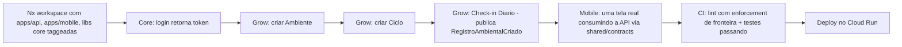

# 15 — Implementação (Documento 100% Completo)

> Status: **Rascunho para validação.** Último documento da sequência 00–15. Não é onde o código de produção é escrito — é o documento-ponte que fecha a documentação e abre a implementação: consolida os Artefatos de todos os documentos anteriores num índice mestre, define a sequência real de bootstrap do repositório, e estabelece a **Fatia Vertical 0** (walking skeleton) que prova a arquitetura inteira antes de multiplicar para os ~40 épicos do doc 12.
>
> **Nota de processo**: seguindo a política vigente (doc 00 §16, item 6a), este documento **não** inclui uma auditoria arquitetural completa dos docs 00–14 — apenas verificação leve das dependências diretas (docs 12 e 14). A auditoria global continua disponível a qualquer momento, mediante solicitação sua.

---

## 1. Objetivos

- Marcar a transição oficial de "documentação" para "código" — do princípio estabelecido no início deste projeto ("não escrever código até que toda a arquitetura esteja planejada").
- Consolidar um **índice mestre** de todos os Artefatos para Implementação (docs 02–14) num único ponto de entrada.
- Definir o **bootstrap real** do monorepo (doc 14) e uma **Fatia Vertical 0** — implementação mínima ponta a ponta que valida toda a arquitetura antes de escalar para o backlog completo (doc 12).
- Estabelecer Definition of Ready por épico, para que a equipe saiba exatamente quando pode começar cada um.

---

## 2. Problemas que Resolve

| Problema | Como este documento resolve |
|---|---|
| 14 documentos, cada um com sua própria seção de Artefatos — sem um ponto único de entrada para começar a codificar | Índice mestre (seção 5) |
| Risco de começar a construir os ~40 épicos do doc 12 sem antes validar que a arquitetura inteira (monorepo, fronteiras, schema, evento, contrato, deploy) realmente funciona ponta a ponta | Fatia Vertical 0 (seção 6) — um walking skeleton mínimo, mas completo em todas as camadas |
| Risco de um épico começar sem que suas dependências reais estejam prontas | Definition of Ready por épico (seção 7) |

---

## 3. Escopo

**Incluído**: índice mestre de artefatos, bootstrap do repositório, Fatia Vertical 0, Definition of Ready, checklist de ambiente de desenvolvimento, critério de encerramento da fase de documentação.

**Fora de escopo**: código de produção em si (a partir daqui, vive no repositório real, não neste conjunto de documentos).

---

## 4. Verificação de Dependências Diretas (leve, conforme política vigente)

- **Doc 12** (Roadmap): backlog por épico, caminho crítico e critérios de fase — consistente, reutilizado diretamente nas seções 6–7.
- **Doc 14** (Estrutura do Código): monorepo Nx, tags/enforcement — consistente, a Fatia Vertical 0 é construída exatamente sobre essa estrutura.

Nenhuma inconsistência encontrada nas dependências diretas.

---

## 5. Índice Mestre de Artefatos para Implementação

> Ponto único de entrada — cada linha aponta para a seção "Artefatos para Implementação" do documento de origem, já completa e não duplicada aqui.

| Módulo/Área | Documento de origem | O que já está pronto |
|---|---|---|
| Core (Identidade, Privacidade, Consentimento, Billing, Notificações) | doc 04, doc 08, doc 09 | Checklist técnico, entidades, APIs, eventos, casos de teste |
| Grow | doc 02 | Checklist, telas, componentes, entidades, APIs, casos de teste |
| Med | doc 03 | Idem |
| IA (7 motores) | doc 05 | Checklist, entidades, APIs, eventos |
| Comunidade | doc 06 | Checklist, telas, entidades, APIs |
| Premium | doc 07 | Checklist, entidades, APIs |
| Banco de Dados (schema completo) | doc 08 | ~48 entidades detalhadas, arquétipos, diagramas ER |
| APIs (catálogo completo) | doc 09 | ~45 endpoints, arquétipos, contratos |
| UX/Telas | doc 10 | ~50 telas, wireframes, estados |
| Design System | doc 11 | Tokens, biblioteca de componentes |
| Backlog/Sequência | doc 12 | Épicos, estimativa relativa, caminho crítico, critérios de fase |
| Stack | doc 13 | Linguagens, frameworks, nuvem |
| Estrutura de Código | doc 14 | Monorepo, tags, enforcement |
| Entidades e Eventos (fonte única) | [Catálogo de Domínio](catalogo-de-dominio.md) | Consultar antes de criar qualquer entidade/evento novo |
| Escopo futuro | [Ideias Futuras](ideias-futuras.md) | Tudo que é V2/V3/Futuro/Pesquisa |

---

## 6. Fatia Vertical 0 (Walking Skeleton)

> Antes de atacar os ~40 épicos do doc 12 em paralelo, uma fatia mínima — mas **completa em todas as camadas** — prova que a arquitetura inteira funciona de ponta a ponta. Isso reduz o risco de descobrir um problema estrutural só depois de várias equipes já estarem construindo em cima dele.

**O que a Fatia Vertical 0 valida, item por item**:
1. Monorepo Nx com tags corretas (doc 14 §5–6) — o enforcement de fronteira já bloqueia import indevido desde o primeiro commit.
2. Schema por módulo no PostgreSQL (doc 08) — `core` e `grow` como schemas reais, não só conceito.
3. Um evento de domínio publicado e persistido (`RegistroAmbientalCriado`) — prova o barramento de eventos (doc 04 §9).
4. Um contrato de API compartilhado (`shared/contracts`) consumido de verdade pelo mobile — prova o maior argumento de produtividade da stack (doc 13 §9).
5. Deploy real no Cloud Run — prova que a arquitetura *stateless* (doc 09) sobe sem ajuste na nuvem escolhida (doc 13 §10).

**Critério de conclusão da Fatia Vertical 0**: os 5 itens acima funcionando, com CI verde. Só então o backlog do doc 12 é atacado em paralelo (Core, Grow, Med, IA, Comunidade conforme o paralelismo já mapeado no doc 12 §9).

---

## 7. Definition of Ready (por épico, antes de começar)

Antes de qualquer épico do backlog (doc 12 §11) ser iniciado:
- Entidades envolvidas já constam no [Catálogo de Domínio](catalogo-de-dominio.md).
- Endpoints envolvidos já constam no doc 09 §7.
- Telas envolvidas já constam no doc 10 §8/§9.
- Dependências do épico (doc 12 §11, coluna "Depende de") estão concluídas.
- A Fatia Vertical 0 (seção 6) está com CI verde.

---

## 8. Checklist de Ambiente de Desenvolvimento

- Docker Compose local com PostgreSQL + Redis (espelhando Cloud SQL/Memorystore, doc 13 §10) para desenvolvimento sem depender da nuvem a cada iteração.
- Variáveis de ambiente para credenciais de GCP/Anthropic Claude nunca commitadas — seguem o padrão de porta/adaptador (doc 13 §16.1), injetadas só em `infrastructure`.
- Nx configurado com cache local desde o primeiro dia (velocidade de CI/build para a equipe pequena, doc 14 §4).

---

## 9. Ordem de Execução Recomendada

Reaproveita diretamente o caminho crítico do doc 12 §8: **Fatia Vertical 0 (seção 6) → Core completo → Grow núcleo e Med núcleo em paralelo → IA e Comunidade em paralelo (contra os contratos de evento) → integração fina → Premium → hardening → Alpha Interno** (critérios de fase no doc 12 §14).

---

## 10. Critério de Encerramento da Fase de Documentação

A sequência 00–15 está completa: visão, identidade, dois produtos (Grow/Med) 100% especificados, arquitetura, IA, comunidade, premium, banco de dados, APIs, UX, design system, roadmap, stack e estrutura de código — cada um com Artefatos para Implementação, e os dois documentos companion (Catálogo de Domínio, Ideias Futuras) mantidos vivos ao longo de todo o processo. A partir da aprovação deste documento, **a implementação de código passa a ser conduzida no repositório real**, não mais neste conjunto de documentos — que permanece como a referência viva, consultada (não recriada) a cada nova decisão.

---

## 11. Boas Práticas para a Fase de Implementação

- Todo código novo referencia o documento de origem da decisão (comentário mínimo ou rastreabilidade em PR), nunca reinventando uma regra já decidida em 00–14.
- Toda mudança de escopo durante a implementação passa pela mesma disciplina já estabelecida: classificar (MVP/V2/V3/Futuro/Pesquisa), registrar no Ideias Futuras se não for MVP, nunca simplesmente "aparecer" no código.

---

## 12. Riscos

| Risco | Observação |
|---|---|
| Fatia Vertical 0 revelar um problema estrutural não previsto | Objetivo explícito dela é justamente encontrar isso agora, com o menor custo possível — não é falha do processo, é o processo funcionando |
| Equipe pequena tentar paralelizar demais antes da Fatia Vertical 0 estar pronta | Mitigado pela Definition of Ready (seção 7), que trava isso |

---

## 13. Sugestões de Melhorias

- Repetir o exercício de "Fatia Vertical" para o primeiro fluxo do Med (não só Grow), antes de considerar o MVP verdadeiramente pronto para o Alpha Interno — dado que Grow e Med são módulos independentes, a Fatia Vertical 0 do Grow não garante sozinha que o Med também funciona ponta a ponta.

---

## 14. Classificação de Escopo

Este documento é, em si, 100% MVP — é o que viabiliza todo o resto.

---

## 15. Revisão Final de Arquitetura

Nenhuma limitação encontrada nas dependências diretas verificadas (seção 4).

---

## 16. Teste de Completude

"Uma equipe experiente conseguiria implementar esta parte do sistema utilizando apenas este documento?" — **Sim**: o índice mestre (seção 5) aponta exatamente onde está cada especificação, e a Fatia Vertical 0 (seção 6) dá o primeiro passo concreto e verificável.

---

## Documento Concluído — Sequência 00–15 Completa

Não há próximo documento na sequência original. Como não há mais perguntas de confirmação pendentes (política vigente, doc 00 §16 item 6h) e nenhuma bifurcação real em aberto neste documento, a documentação da COSMARIA está, com sua aprovação, **pronta para a implementação**.

Se quiser, neste momento — ou a qualquer momento futuro — posso executar a auditoria arquitetural global (docs 00–15) que ficou reservada para quando você solicitasse explicitamente.

---

## Artefatos para Implementação (meta — aponta para todos os demais)

Ver seção 5 (Índice Mestre). Nenhum artefato novo é introduzido por este documento — ele consolida, aponta e sequencia o que os 14 documentos anteriores já produziram.
